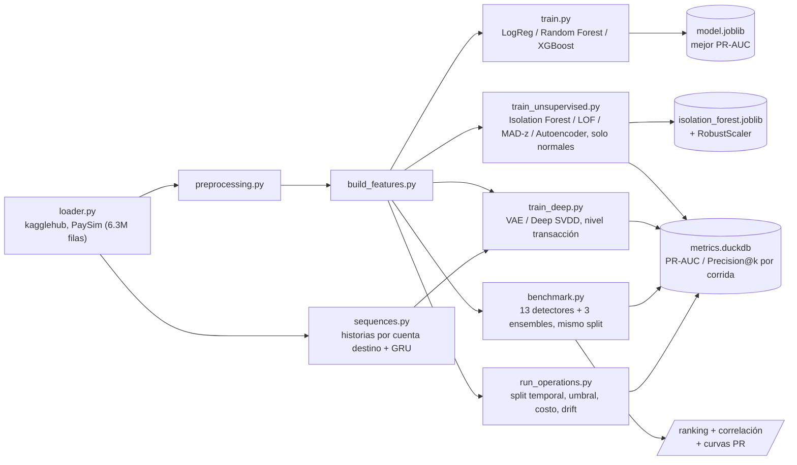

[ 🇺🇸 [Read in English](README.md) ] | [ 🇨🇱 Español ]

# Bank Anomaly Detection


Sistema de detección de fraude y anomalías en transacciones bancarias móviles, construido sobre el dataset sintético **PaySim** ([`ealaxi/paysim1`](https://www.kaggle.com/datasets/ealaxi/paysim1) en Kaggle), que simula transacciones financieras a partir de un mes de datos de un servicio real de dinero móvil en África.

## Nota honesta sobre validación

Los números de este README **provienen de una corrida real** del pipeline sobre el dataset PaySim completo (6.362.620 filas descargadas vía `kagglehub`), no de estimaciones: `python -m src.unsupervised.train_unsupervised` para el Módulo 2, `python -m src.unsupervised.benchmark` para el Módulo 3 `python -m src.deep.train_deep` para el Módulo 4 y `python -m src.operations.run_operations` para el Módulo 5, más **123/123 tests unitarios pasando** (`pytest tests/`, con datos sintéticos, sin necesitar la descarga). Los tiempos de ajuste y scoring se midieron en esa misma máquina (Windows 10, CPU) y sirven para comparar detectores *entre sí*, no como referencia absoluta de hardware.

Dos advertencias necesarias para leer bien las métricas:

- **El conjunto de prueba está enriquecido a propósito.** Contiene 50.000 transacciones normales más *todas* las 8.213 fraudulentas disponibles, o sea un 14,1% de fraude frente al ~0,13% real de PaySim. Es la única forma de tener suficientes anomalías para medir Precision@k con estabilidad, pero implica que estos PR-AUC **no son trasladables** a la prevalencia de producción: en el mundo real la precisión sería sustancialmente menor con el mismo modelo. El Módulo 5 mide exactamente eso: split temporal y prevalencia real del 0,23%.
- **El Módulo 1 (supervisado) no se re-ejecutó en esta sesión.** Sus métricas no se reportan como números aquí; quien clone el repo puede generarlas con `python -m src.models.train`.

## Objetivo

Identificar transacciones fraudulentas dentro de un dataset altamente desbalanceado (la clase `isFraud` representa una fracción mínima del total de transacciones), evaluando distintos enfoques de modelado supervisado y técnicas de balanceo de clases para maximizar la detección de fraude minimizando falsos positivos.

## Arquitectura del proyecto



El proyecto sigue una arquitectura modular que separa claramente la ingesta de datos, el preprocesamiento, la ingeniería de características y el modelado, favoreciendo la reproducibilidad y la testabilidad del código:

```
bank-anomaly-detection/
├── data/
│   ├── raw/              # Datos originales descargados de Kaggle (no versionados)
│   └── processed/        # Datos transformados listos para modelado (no versionados)
├── notebooks/
│   ├── 01_eda_paysim.ipynb                     # Análisis exploratorio del dataset PaySim
│   ├── 02_unsupervised_anomaly_detection.ipynb # Módulo 2: detección de fraude zero-day
│   ├── 03_benchmark_familias_anomalias.ipynb   # Módulo 3: benchmark de familias + ensembles
│   ├── 04_modelos_profundos_y_secuencias.ipynb # Módulo 4: VAE, Deep SVDD y detector secuencial
│   └── 05_umbral_costo_y_drift.ipynb           # Módulo 5: umbral, dinero y validación temporal
├── src/
│   ├── data/
│   │   ├── loader.py           # Descarga (kagglehub) y carga del dataset PaySim
│   │   └── preprocessing.py    # Limpieza y transformación de datos crudos
│   ├── features/
│   │   └── build_features.py   # Ingeniería de características para el modelo
│   ├── models/
│   │   ├── train.py            # Entrenamiento, comparación y selección de modelos
│   │   ├── visualize.py        # Curvas ROC/PR y matrices de confusión comparativas
│   │   └── predict.py          # Inferencia sobre datos nuevos
│   ├── unsupervised/            # Módulos 2 y 3: detección no supervisada de anomalías
│   │   ├── loader.py            # Datos de entrenamiento (solo normales) y prueba (mixta)
│   │   ├── models.py            # Isolation Forest, LOF, baseline estadístico MAD-z
│   │   ├── autoencoder.py       # Autoencoder PyTorch (activaciones ReLU/GELU/Swish)
│   │   ├── families.py          # Módulo 3: PCA, GMM, Mahalanobis (MCD), kNN, OC-SVM, HBOS, ECOD
│   │   ├── ensemble.py          # Módulo 3: combinación de scores (rangos, z, máximo z)
│   │   ├── benchmark.py         # Módulo 3: comparación de las 11 familias en el mismo split
│   │   ├── metrics_store.py     # Persistencia de métricas comparativas (DuckDB)
│   │   ├── style.py             # Paleta y estilo compartido de las figuras
│   │   └── train_unsupervised.py  # Entrenamiento, evaluación (Precision@k) y gráficas
│   ├── deep/                    # Módulo 4: modelos profundos y detección secuencial
│   │   ├── one_class.py         # VAE (ELBO) y Deep SVDD, nivel transacción
│   │   ├── sequences.py         # Historias por cuenta destino + autoencoder GRU
│   │   └── train_deep.py        # Entrenamiento, diagnóstico y gráficas del módulo 4
│   ├── operations/              # Módulo 5: del score a la decisión operativa
│   │   ├── temporal.py          # Split temporal, evaluación por período y drift
│   │   ├── thresholds.py        # Umbral por cuantil, por capacidad y óptimo en costo
│   │   ├── costs.py             # Métricas en pesos y costo de revisión de equilibrio
│   │   └── run_operations.py    # Corrida completa del módulo 5 y sus gráficas
│   └── utils/                  # Funciones auxiliares compartidas
├── tests/                 # Pruebas unitarias (pytest): preprocessing, features, baseline
│                           # MAD, autoencoder, metrics store, familias, ensembles,
│                           # modelos profundos, secuencias, umbrales, costos, temporal
├── requirements.txt
├── LICENSE
├── README.md
└── README.es.md
```

Cada módulo bajo `src/` expone funciones puras y documentadas, pensadas para ser importadas tanto desde notebooks (exploración) como desde scripts (pipeline productivo), evitando duplicar lógica entre ambos contextos.

## Dataset

**PaySim** es un simulador de transacciones financieras móviles basado en datos agregados de un proveedor real de servicios de dinero móvil, extendido para incluir comportamiento fraudulento inyectado. Incluye tipos de transacción como `CASH-IN`, `CASH-OUT`, `DEBIT`, `PAYMENT` y `TRANSFER`, junto con los saldos de origen y destino antes y después de cada operación.

La columna objetivo `isFraud` indica si una transacción fue fraudulenta, mientras que `isFlaggedFraud` marca transferencias masivas ilegítimas detectadas por las reglas de negocio simuladas.

## Instalación

```bash
python3 -m venv .venv
source .venv/bin/activate      # En Windows: .venv\Scripts\activate
pip install -r requirements.txt
```

## Uso

Descarga y carga inicial del dataset:

```bash
python -m src.data.loader
```

Esto descargará el dataset desde Kaggle mediante `kagglehub` (requiere credenciales de Kaggle configuradas), lo copiará a `data/raw/paysim.csv` e imprimirá un resumen de las dimensiones, primeras filas y distribución porcentual de la clase `isFraud`.

Entrenamiento y comparación de modelos:

```bash
python -m src.models.train
```

Ejecuta el pipeline completo (carga → limpieza → features → split) y entrena tres modelos candidatos (Regresión Logística, Random Forest y XGBoost), cada uno con manejo de clases desbalanceadas (`class_weight="balanced"` / `scale_pos_weight`). Imprime `classification_report`, matriz de confusión, ROC-AUC y PR-AUC por modelo, guarda el de mejor PR-AUC (la métrica más informativa en fraude, dado el desbalance extremo de clases) en `data/processed/model.joblib`, y genera curvas ROC/Precision-Recall y matrices de confusión comparativas en `data/processed/figures/`.

Pruebas unitarias:

```bash
pytest tests/
```

Detección no supervisada de anomalías (Módulo 2):

```bash
python -m src.unsupervised.train_unsupervised
```

Benchmark comparativo de familias de detectores (Módulo 3):

```bash
python -m src.unsupervised.benchmark
```

Entrena los 13 detectores sobre el mismo split y escalado, construye los tres ensembles encima de sus scores, imprime la tabla comparativa con métricas y tiempos, reporta los pares de detectores redundantes y guarda ranking, curvas PR y matriz de correlación en `data/processed/figures/`, además de una fila por detector en la tabla `benchmark_metrics` de `data/processed/metrics.duckdb`.

Modelos profundos y detector secuencial (Módulo 4):

```bash
python -m src.deep.train_deep
```

Entrena el VAE y Deep SVDD sobre el mismo split del Módulo 3, más el autoencoder GRU sobre las historias de las cuentas destino. Imprime la cobertura del truncado y la comparación de agregaciones del error por paso —los dos diagnósticos que permiten interpretar el resultado del detector secuencial— y guarda las métricas en tablas separadas por unidad de análisis.

Operación: umbral, costo y validación temporal (Módulo 5):

```bash
python -m src.operations.run_operations
```

Reentrena los 13 detectores sobre un split **temporal** con prevalencia real, calcula el costo de revisión de equilibrio, compara el ranking por PR-AUC contra el ranking por dinero salvado, mide cuánto se aleja la tasa de falsos positivos real de la prometida por el umbral, y evalúa la degradación día a día filtrando los períodos sin volumen suficiente.

## Módulo 2: Detección de fraude desconocido / zero-day (no supervisado)

El Módulo 1 entrena con fraude ya etiquetado, así que solo puede reconocer patrones parecidos a fraude que ya ocurrió antes. El Módulo 2 cubre el caso complementario: un esquema de fraude genuinamente nuevo ("zero-day") no se parece a nada visto en el entrenamiento, y un modelo supervisado no tiene por qué detectarlo. El enfoque aquí es aprender únicamente la forma de lo normal y señalar como anómalo cualquier caso que se aleje de ese patrón, sin usar una sola etiqueta de fraude durante el ajuste.

**Datos**: en vez de descargar `mlg-ulb/creditcardfraud` vía `kagglehub` (requeriría credenciales de Kaggle adicionales que este entorno no tiene configuradas), `src/unsupervised/loader.py` reutiliza el PaySim ya presente en `data/raw/paysim.csv` — mismas funciones `clean_data`/`build_features` del Módulo 1 — y separa:
- **Train**: una muestra de transacciones normales (`isFraud == 0`); el modelo nunca ve un fraude al ajustarse.
- **Test**: una muestra de normales + *todas* las transacciones fraudulentas disponibles, para tener suficientes anomalías reales con las que medir desempeño.

El tamaño de la muestra de entrenamiento se mantiene acotado (30k filas) a propósito: Local Outlier Factor en modo *novelty* necesita construir un índice de vecinos y consultarlo por cada predicción, algo que no escala a los 6.3M de filas del dataset completo.

**Modelos** (`src/unsupervised/models.py`, `src/unsupervised/autoencoder.py`):
- **Isolation Forest** (`sklearn.ensemble.IsolationForest`) — aísla puntos con particiones aleatorias; las anomalías requieren menos particiones para quedar aisladas.
- **Local Outlier Factor** (`sklearn.neighbors.LocalOutlierFactor`, `novelty=True`) — compara la densidad local de un punto contra la de sus vecinos más cercanos.
- **Baseline estadístico MAD-z** (`MADBaseline`) — baseline no iterativo: memoriza la mediana y la Median Absolute Deviation (MAD) por feature al ajustarse, y puntúa cada fila por el z-score robusto máximo entre sus features. Robusto a la cola pesada de montos/saldos, a diferencia de un z-score de media/desviación estándar clásico.
- **Autoencoder** (`src/unsupervised/autoencoder.py`, PyTorch) — encoder/decoder simétrico totalmente conectado con cuello de botella central, entrenado solo con transacciones normales para minimizar el MSE de reconstrucción; el anomaly score es el propio error de reconstrucción (`reconstruction_error()`), más alto = más anómalo. Entrenado y comparado con tres funciones de activación sobre la misma arquitectura — **ReLU**, **GELU** y **Swish** (`nn.SiLU`) — para ilustrar su efecto en la calidad de la reconstrucción sobre este dataset tabular.

Las cuatro familias exponen un **Anomaly Score** continuo homogéneo (valores más altos = más anómalo), sobre features escaladas con `RobustScaler` (ajustado solo con datos de entrenamiento) por la fuerte asimetría de montos y saldos.

**Evaluación** (`src/unsupervised/train_unsupervised.py`): PR-AUC y Precision@k/Recall@k (k = 50, 100, 200 — "de las k transacciones más anómalas señaladas, ¿cuántas son fraude real?", la pregunta que le importa a un analista con capacidad de revisión limitada). Genera `data/processed/figures/unsupervised_scores.png` (distribución del Anomaly Score por clase, Isolation Forest / LOF / baseline MAD), `data/processed/figures/unsupervised_pr_curve.png` (curva Precision-Recall comparativa entre todos los modelos) y `data/processed/figures/autoencoder_activations.png` (PR-AUC por función de activación). Serializa Isolation Forest junto con su `RobustScaler` en `data/processed/isolation_forest.joblib`, y persiste PR-AUC/Precision@k/Recall@k por modelo y por corrida en un archivo DuckDB local (`data/processed/metrics.duckdb`, vía `src/unsupervised/metrics_store.py`) para comparar entre corridas.

### Comparación de modelos (Módulo 2)

| Modelo | Tipo | Anomaly score | Notas |
|---|---|---|---|
| Isolation Forest | Ensamble basado en árboles | `-score_samples` | Maneja bien fronteras no lineales, rápido de entrenar |
| Local Outlier Factor | Basado en densidad (modo novelty) | `-score_samples` | Sensible a variaciones de densidad local |
| Baseline MAD-z | Estadístico, no iterativo | z-score robusto máximo | Sin hiperparámetros, rápido, interpretable por feature |
| Autoencoder (ReLU / GELU / Swish) | Deep learning (PyTorch) | MSE de reconstrucción | Captura interacciones no lineales; la activación afecta la calidad de reconstrucción |

### Resultados medidos (Módulo 2)

| Modelo | PR-AUC | Precision@50 | Precision@100 | Precision@200 |
|---|---|---|---|---|
| Local Outlier Factor | **0.802** | 1.000 | 1.000 | 1.000 |
| Autoencoder (ReLU) | 0.581 | 0.960 | 0.970 | 0.975 |
| Autoencoder (Swish) | 0.574 | 0.980 | 0.990 | 0.995 |
| Autoencoder (GELU) | 0.573 | 1.000 | 1.000 | 1.000 |
| Isolation Forest | 0.549 | 0.440 | 0.550 | 0.640 |
| Baseline MAD-z | 0.140 | 0.240 | 0.140 | 0.100 |

Local Outlier Factor domina claramente con este conjunto de features. Las tres activaciones del autoencoder quedan a menos de 0.01 de PR-AUC entre sí (0.581 / 0.574 / 0.573): sobre datos tabulares de 15 columnas, la elección de activación es marginal comparada con la elección de familia de detector — el Módulo 3 desarrolla ese punto.

PR-AUC, Precision@k y Recall@k de cada modelo/corrida se persisten en `data/processed/metrics.duckdb` (consultable con `duckdb.connect(...)` o `src.unsupervised.metrics_store.load_latest_metrics()`).


## Módulo 3: Benchmark de familias de detección (no supervisado)

El Módulo 2 cubre tres enfoques más el autoencoder. El Módulo 3 cierra el mapa: agrega las familias que faltaban (`src/unsupervised/families.py`), las compara a todas en el mismo split con el mismo escalado (`src/unsupervised/benchmark.py`) y prueba si combinarlas mejora algo (`src/unsupervised/ensemble.py`).

La motivación no es acumular modelos. Sin etiquetas no se puede elegir el mejor detector *antes* de desplegarlo, así que las preguntas accionables son otras dos: **qué familias son realmente complementarias** (si dos ordenan las transacciones casi igual, tener las dos no aporta nada) y **cuánto cuesta cada punto de PR-AUC** (en producción el scoring corre por transacción y el ajuste una vez al día, así que un detector lento de entrenar pero rápido de puntuar es viable — y al revés no).

### Las siete familias agregadas

| Detector | Familia | Qué anomalía detecta bien |
|---|---|---|
| **PCA (reconstrucción)** | Reconstrucción lineal | Filas fuera del subespacio principal — es la **ablación** del autoencoder |
| **Gaussian Mixture** | Densidad paramétrica | Huecos de baja probabilidad entre modos de la distribución |
| **Mahalanobis robusto (MCD)** | Covarianza robusta | Correlaciones rotas entre features, invisibles columna a columna |
| **kNN (k-ésima distancia)** | Distancia global | Puntos lejos de cualquier vecindario denso |
| **One-Class SVM (Nyström)** | Frontera con kernel | Filas fuera de la envolvente aprendida de lo normal |
| **HBOS** | Histogramas por feature | Valores raros en columnas individuales; score descomponible por feature |
| **ECOD** | Colas de la CDF empírica | Colas extremas, sin un solo hiperparámetro que ajustar |

`HBOS` y `ECOD` están implementados desde cero (coste lineal, sin dependencias extra); el resto se apoya en scikit-learn. El `OneClassSVM` exacto es O(n²)–O(n³) y no termina en un set de 30k filas, así que se usa la aproximación de kernel de Nyström + `SGDOneClassSVM`, que resuelve el mismo problema en tiempo lineal.

Los tres **ensembles** resuelven el problema de que los scores viven en escalas incompatibles (una distancia de Mahalanobis no se puede promediar con una log-verosimilitud): promedio de rangos, promedio de scores estandarizados, y máximo de scores estandarizados.

### Resultados

| Detector | Familia | PR-AUC | ROC-AUC | Precision@100 | fit (s) | score (s) |
|---|---|---|---|---|---|---|
| Gaussian Mixture | Densidad paramétrica | **0.807** | 0.948 | 0.99 | 6.62 | 0.19 |
| Local Outlier Factor | Densidad local | 0.802 | 0.932 | **1.00** | 0.64 | 1.09 |
| Deep SVDD | Una clase profunda | 0.702 | 0.860 | **1.00** | 6.58 | 0.005 |
| Mahalanobis robusto (MCD) | Covarianza robusta | 0.698 | 0.896 | 0.94 | 1.92 | 0.02 |
| Ensemble — promedio de rangos | Ensemble | 0.639 | 0.876 | **1.00** | — | 0.03 |
| Autoencoder (ReLU) | Reconstrucción no lineal | 0.581 | 0.850 | 0.97 | 7.53 | 0.01 |
| kNN (k-ésima distancia) | Distancia global | 0.552 | 0.853 | 0.85 | 0.13 | 1.25 |
| Isolation Forest | Aislamiento | 0.549 | 0.850 | 0.55 | 0.56 | 0.41 |
| One-Class SVM (Nyström) | Frontera con kernel | 0.494 | 0.830 | 0.86 | 0.43 | 0.56 |
| Ensemble — promedio z | Ensemble | 0.491 | 0.833 | 0.94 | — | 0.03 |
| PCA (reconstrucción) | Reconstrucción lineal | 0.487 | 0.822 | 0.76 | 0.003 | 0.01 |
| HBOS | Estadístico por feature | 0.480 | 0.800 | 0.59 | 0.01 | 0.04 |
| Ensemble — máximo z | Ensemble | 0.459 | 0.835 | 0.80 | — | 0.03 |
| VAE (ELBO) | Densidad profunda | 0.446 | 0.731 | 0.90 | 14.90 | 0.06 |
| ECOD | Colas de la CDF empírica | 0.273 | 0.672 | 0.52 | 0.07 | 0.27 |
| MAD-z (baseline) | Estadístico por feature | 0.140 | 0.383 | 0.14 | 0.01 | 0.01 |


**Lo que dicen los números:**

- **Gaussian Mixture (0.807) y LOF (0.802) empatan arriba, pero por razones distintas.** Su correlación de Spearman es apenas 0.41, y sus curvas PR se cruzan: LOF domina entre recall 0.4 y 0.8, GMM lo supera por encima de 0.85. Cuál conviene depende de la capacidad de revisión del equipo, no del PR-AUC agregado.
- **La ablación lineal justifica al autoencoder, pero apenas.** El autoencoder (0.581) supera al PCA (0.487) — la no-linealidad aporta ~0.09 de PR-AUC real. El costo de esos 0.09: 9.6 s de ajuste contra 0.002 s, y una dependencia de PyTorch. Ninguno de los dos se acerca a GMM.
- **El baseline MAD-z no es solo débil, es anti-informativo** (ROC-AUC 0.383, por debajo del 0.5 del azar). Mirar cada columna por separado falla aquí porque el fraude de PaySim es un vaciado completo del saldo de origen: cada valor individual queda dentro del rango observado, mientras que las colas pesadas de las transacciones legítimas sí producen z-scores extremos. Es exactamente el argumento a favor de los métodos multivariados — y la razón de incluir Mahalanobis (0.698), que ve la misma información pero con la covarianza completa.
- **Los ensembles no ganan, y eso también es un resultado.** El mejor (promedio de rangos, 0.639) queda por debajo de GMM y LOF: promediar 13 detectores donde la mayoría son mediocres arrastra hacia abajo a los dos buenos. Un ensemble ayuda cuando sus miembros son de calidad comparable, no cuando hay una diferencia de 0.67 de PR-AUC entre el mejor y el peor. Con una excepción operativa relevante: **Precision@100 = 1.00** para el promedio de rangos — en la cabeza del ranking sí hay consenso perfecto, que es justo donde mira un analista.

### ¿Qué detectores son redundantes?


Correlación de Spearman entre los *rankings* de anomalía. **Ningún par supera 0.9**: las trece familias ordenan las transacciones de forma distinta, así que ninguna es descartable por redundancia pura. Entre los detectores del Módulo 3 los pares más parecidos son Mahalanobis ↔ kNN (0.88) y Mahalanobis ↔ Autoencoder (0.87); los más complementarios, MAD-z ↔ LOF (−0.04) y MAD-z ↔ GMM (−0.42).


### Costo computacional

Los detectores de coste lineal (HBOS, ECOD, MAD-z, PCA) puntúan las 58.213 filas de prueba en centésimas de segundo y no mantienen nada en memoria más allá de unos vectores por feature. Los basados en distancias (LOF, kNN) pagan ~1.1 s porque cada predicción consulta un índice de vecinos contra las 30.000 filas de entrenamiento — el factor que decide si son viables en un flujo transaccional en línea. El autoencoder invierte la relación: es el más lento de ajustar (9.6 s) y de los más rápidos de puntuar (0.01 s), que es el perfil correcto para producción.

## Módulo 4: Modelos profundos de una clase y detección secuencial

Tres modelos, cada uno nacido de una limitación concreta que dejó a la vista el benchmark del Módulo 3 — no de la idea de agregar arquitecturas por agregarlas.

| Modelo | Limitación que ataca | Unidad evaluada |
|---|---|---|
| **VAE** | El mejor detector fue un modelo de densidad (GMM); el autoencoder solo reconstruye | Transacción |
| **Deep SVDD** | El autoencoder apenas superó su ablación lineal (0.581 vs 0.487) — ¿el problema es la profundidad o el objetivo? | Transacción |
| **Autoencoder GRU** | Los trece detectores tratan cada fila como independiente; una cuenta mula es anómala por su *historia* | **Cuenta destino** |

Los dos primeros comparten split, escalado y métricas con el Módulo 3, así que están en la tabla del benchmark de arriba. El tercero cambia la unidad de análisis y se reporta aparte: comparar un PR-AUC por cuenta con uno por transacción sería comparar dos problemas distintos, no dos modelos.

### Nivel transacción: el objetivo importa más que la profundidad

**Deep SVDD (0.702) supera al autoencoder (0.581)** con la misma arquitectura, los mismos datos y el mismo escalado. Lo único que cambia es qué optimiza: en vez de reconstruir la entrada, aprende una proyección que comprime lo normal dentro de una esfera y puntúa por distancia al centro. Ese salto de +0.12 es mayor que el que separaba al autoencoder de su ablación lineal con PCA (+0.09) — el margen estaba en la función objetivo, no en agregar capas. Y sale barato: 6.6 s de ajuste y **5 ms** de scoring para las 58.213 filas de prueba, el más rápido de puntuar de todo el repositorio. Queda tercero en el ranking general, sobre Mahalanobis.

Deep SVDD tiene un modo de falla silencioso: si la red aprende a mapear *toda* entrada al centro, minimiza el objetivo perfectamente y queda inútil — todos los puntos a la misma distancia, sin capacidad de ordenar. Se evita con capas **sin término de sesgo** (la solución constante se vuelve inalcanzable) y alejando del origen las componentes del centro. Hay una prueba unitaria que verifica que el score no colapsa a una desviación estándar nula.

**El VAE (0.446) pierde contra el autoencoder simple** y es el más caro de los tres (14.9 s). Ser la contraparte profunda del mejor detector clásico no le alcanzó para heredar su ventaja: el término KL empuja la latente hacia una normal estándar, lo que sobre features de colas muy pesadas termina normalizando justo la región que interesa distinguir.


### Estabilidad numérica: el VAE falló con NaN antes de funcionar

Vale documentarlo porque es el tipo de problema que solo aparece con datos reales. Tras el `RobustScaler`, las colas de `errorBalanceDest` llegan a ~1900 y la suma de cuadrados por fila alcanza 3.7e6. Con el término de reconstrucción **sumado** sobre las 15 columnas, la pérdida arranca en millones, los gradientes explotan y los pesos se vuelven `NaN` en la primera época. La primera corrida sobre PaySim murió exactamente así, después de haber pasado sin problemas con datos sintéticos.

Tres decisiones lo corrigen, todas en `src/deep/one_class.py`: el error de reconstrucción se **promedia** sobre las features en vez de sumarse (lo deja en la misma escala que el autoencoder del Módulo 2, que sí converge), la log-varianza se acota a [-10, 10] para que `exp()` no se desborde, y se recorta la norma del gradiente a 5.

### Nivel cuenta: el detector secuencial

Aquí cambia la representación de los datos, no solo el modelo. Se reconstruye la historia ordenada de cada cuenta destino y se puntúa completa con un autoencoder GRU entrenado solo con cuentas limpias. Dos decisiones sobre los datos condicionan todo lo demás:

- **Se agrupa por `nameDest`, no por `nameOrig`.** En PaySim el 99,85% de las cuentas de origen aparece una sola vez y ninguna llega a cinco transacciones: no hay historia que modelar del lado emisor. Las cuentas destino sí acumulan — 280.200 tienen cinco o más transacciones, cubriendo el 56,5% del dataset.
- **Se descartan las cuentas de comercio (`M`).** Las 8.213 transacciones fraudulentas van todas a cuentas `C`. Dejar los comercios adentro le regalaría al modelo la regla "todo `M` es normal" y una métrica inflada que no mide detección de fraude.

La señal que solo existe en la secuencia es `delta_step`: las horas entre transacciones consecutivas hacia la misma cuenta. Es la cadencia, y no se puede calcular fila a fila — el repositorio la estaba descartando al eliminar `nameDest`.

**Resultado: PR-AUC 0.099 contra un azar de 0.087.** En la práctica, no detecta nada.


### Por qué ese resultado negativo es del dataset y no del método

Un mal número no significa nada hasta descartar las explicaciones que dependen de decisiones propias. Hay dos, y las dos se miden en código (`src/deep/sequences.py`), no se suponen:

**¿El truncado deja el fraude fuera de la ventana?** Si al quedarme con las 20 transacciones más recientes descartara la transacción fraudulenta, el modelo nunca habría visto lo que debe detectar. `fraud_window_coverage()` responde: **3.451 de 3.838 (89,9%)** quedan dentro, con posición mediana 7 desde el final. No es eso.

**¿La agregación diluye la señal?** Una cuenta puede tener una única transacción anómala entre veinte, y promediar el error sobre toda la secuencia la aplasta. `aggregate_step_errors()` compara cuatro formas de resumir los mismos errores por paso, sobre el mismo modelo entrenado:

| Agregación | PR-AUC | ROC-AUC |
|---|---|---|
| media (la usada) | 0.099 | 0.547 |
| máximo por paso | 0.105 | 0.564 |
| media de los 3 peores | 0.107 | 0.569 |
| último paso | 0.102 | 0.546 |

Todas dentro del ruido, todas apenas por encima del azar. Tampoco es eso.

Descartadas ambas, queda la explicación del dataset: **PaySim inyecta el fraude con una regla fija y elige la cuenta destino sin modelar comportamiento de mula**, así que las historias de cuenta no contienen el patrón temporal que el modelo busca. Es una limitación del simulador, no del enfoque. Sobre transacciones reales de AML —donde las cuentas mula sí tienen una firma de comportamiento— esta es la familia que más aportaría, y la arquitectura queda construida y probada para ese dato.

Las métricas van a **tablas separadas** en `data/processed/metrics.duckdb`: `benchmark_metrics` para nivel transacción, `sequence_metrics` para nivel cuenta. La separación es estructural a propósito, para que un `ORDER BY` descuidado no termine comparando dos problemas distintos.

## Módulo 5: Del ranking a la operación — umbral, dinero y envejecimiento

Los módulos 2 a 4 dejan 13 detectores y un ranking por PR-AUC. Nada de eso es desplegable: en producción no llega un conjunto de prueba para ordenar, llega una transacción y hay que decir *sí* o *no*. Este módulo cubre lo que falta entre "tengo un score" y "tengo un sistema", y empieza corrigiendo una debilidad metodológica de los módulos anteriores.

| | Módulos 2-4 | Módulo 5 |
|---|---|---|
| Split | aleatorio sobre datos con orden cronológico | **temporal**: entrena con el pasado, evalúa con el futuro |
| Prevalencia en prueba | 14,1% (enriquecida) | **0,23%** (la real del período) |
| Qué se mide | PR-AUC, Precision@k | umbral, alertas por día, **pesos** |

El corte cae en `step=323`: 30.000 normales tempranas para ajustar, 30.000 más retenidas para calibrar, y 300.000 transacciones posteriores para evaluar. La prueba **no se enriquece**, porque el módulo calcula umbrales, volúmenes de alerta y dinero: sobre un conjunto enriquecido al 14% esas cantidades no significarían nada.

### Resultados

| Detector | PR-AUC | ROC-AUC | Recall (conteo) | Recall (monto) | Ahorro neto óptimo | FPR real prometiendo 1% |
|---|---|---|---|---|---|---|
| Deep SVDD | **0.368** | 0.917 | 0.387 | 0.810 | 833 M | **0.544** |
| Gaussian Mixture | 0.263 | **0.961** | **0.464** | **0.931** | **944 M** | 0.014 |
| Mahalanobis robusto (MCD) | 0.159 | 0.893 | 0.348 | 0.871 | 912 M | 0.012 |
| kNN (k-ésima distancia) | 0.056 | 0.867 | 0.227 | 0.749 | 854 M | 0.011 |
| VAE (ELBO) | 0.052 | 0.776 | 0.215 | 0.720 | 813 M | 0.012 |
| Autoencoder (ReLU) | 0.046 | 0.883 | 0.199 | 0.710 | 868 M | 0.018 |
| One-Class SVM (Nyström) | 0.022 | 0.853 | 0.230 | 0.744 | 815 M | 0.011 |
| PCA (reconstrucción) | 0.017 | 0.840 | 0.102 | 0.508 | 805 M | 0.020 |
| Isolation Forest | 0.016 | 0.798 | 0.075 | 0.348 | 792 M | 0.019 |
| HBOS | 0.006 | 0.671 | 0.067 | 0.246 | 636 M | 0.015 |
| Local Outlier Factor | 0.005 | 0.767 | 0.000 | 0.000 | 529 M | 0.428 |
| ECOD | 0.005 | 0.649 | 0.025 | 0.147 | 546 M | 0.127 |
| MAD-z (baseline) | 0.002 | 0.391 | 0.003 | 0.019 | 18 M | 0.009 |


**Lo que dicen los números:**

- **El que mejor rankea no es el que más plata salva.** Deep SVDD lidera el PR-AUC (0.368) pero Gaussian Mixture recupera más dinero (944 M contra 833 M) y atrapa el 93% del monto defraudado contra el 81%. Con el 10% de los fraudes concentrando el 50,2% del monto, ordenar bien por conteo y ordenar bien por pesos son dos cosas distintas. El matiz está en la figura: con presupuestos muy chicos (menos de ~300 alertas) Deep SVDD recupera más dinero, y GMM lo pasa recién a partir de ahí — la respuesta depende de cuánto alcanza a revisar el equipo.
- **PR-AUC y ROC-AUC se contradicen, y no es un error.** Deep SVDD gana en PR-AUC y pierde en ROC-AUC (0.917 contra 0.961). PR-AUC premia la cabeza del ranking; ROC-AUC mira el orden completo. Cuál importa depende de si el equipo revisa las primeras 100 alertas o barre un umbral.
- **Local Outlier Factor colapsa.** Era segundo en el Módulo 3 y acá queda con recall 0 en el punto de operación y ahorro negativo. Su ROC-AUC cae de 0.932 a 0.767: es el único detector que se rompe de verdad al pasar a validación temporal.

### Comparar contra el Módulo 3 sin hacer trampa

Es tentador poner el PR-AUC de esta tabla al lado del Módulo 3 (GMM: 0.807 → 0.263) y anunciar un derrumbe. **Sería incorrecto:** PR-AUC depende de la prevalencia, y acá pasó del 14,1% al 0,23%. Buena parte de esa caída es puramente mecánica.

Lo comparable es el ROC-AUC, que no depende de la prevalencia. Ahí el panorama es otro: la mayoría de los detectores se mantiene o mejora (GMM 0.948 → 0.961, Deep SVDD 0.860 → 0.917, PCA 0.822 → 0.840), y solo dos se degradan de forma marcada — **LOF (0.932 → 0.767) y HBOS (0.800 → 0.671)**. El split aleatorio no inflaba todo por igual: inflaba selectivamente a los detectores basados en densidad local.

### El umbral: lo prometido contra lo cumplido

`quantile_threshold` es la única regla aplicable el día del despliegue: como el ajuste usa solo transacciones normales, el cuantil (1-α) debería dejar fuera una fracción α del tráfico legítimo. **α es la tasa de falsos positivos prometida.**


GMM, Mahalanobis y kNN caen sobre la diagonal: prometen 1% y entregan entre 1,1% y 1,4%. **Deep SVDD promete 0,1% y entrega 35%** — tres órdenes de magnitud. El mejor detector por PR-AUC es, tal cual está, indesplegable.

La hipótesis natural es el sobreajuste: Deep SVDD *minimiza explícitamente* la distancia al centro sobre los puntos de entrenamiento, así que sus scores ahí serían optimistas por construcción. Si fuera eso, calibrar sobre las normales retenidas lo arreglaría.

**No lo arregla** — 0.389 desde el entrenamiento contra 0.354 desde el conjunto retenido, prácticamente lo mismo (línea punteada y línea llena superpuestas en la figura). Y esa falta de diferencia es el dato: como ambos conjuntos vienen del período temprano, descarta el sobreajuste y deja una sola explicación en pie, el desplazamiento de la **escala** del score entre el período de ajuste y el de evaluación.

Lo que vuelve interesante al caso es que ese mismo detector tiene el ranking más estable de los cuatro a lo largo del mes. **Estabilidad del orden y estabilidad de la escala son propiedades distintas**, y se puede tener la primera sin la segunda — en cuyo caso ningún umbral fijo aprendido del pasado sirve, y hay que recalibrar contra tráfico reciente.

### Antes de optimizar un umbral, calcular el costo de equilibrio

`break_even_review_cost` devuelve la pérdida esperada por transacción: **3.375** en este período. Si revisar una alerta cuesta menos que eso, el óptimo económico degenera en "revisar absolutamente todo" y el umbral deja de ser una decisión de modelado — el problema pasa a ser de capacidad del equipo, no de economía.

La primera corrida usaba un costo de 1.000, por debajo del equilibrio, y el óptimo de varios detectores salía en 300.000 alertas: revisar el 100% del tráfico. Ese número no medía la calidad del detector, medía el supuesto de costo. El análisis reportado usa 5.000 (1,5x el equilibrio) para que el óptimo sea interior y la curva diga algo.

### ¿El detector envejece?


**No, al menos no en 17 días.** El ROC-AUC diario es plano para los cuatro detectores y el orden entre ellos se mantiene.

Llegar a esa respuesta requirió dos correcciones de medición. La primera versión usaba PR-AUC por día y mostraba una mejora espectacular: **PR-AUC de 1.0000 para los cuatro detectores el último día**. Era un artefacto — el volumen diario de PaySim se derrumba de 61.859 transacciones a **23**, y sobre 23 filas con la prevalencia disparada cualquier detector saca métricas perfectas.

Las dos correcciones, ambas necesarias:

- **filtrar los períodos con poco volumen** (`min_samples`), que deja 17 días evaluables de los 18;
- **usar ROC-AUC en vez de PR-AUC**, porque la prevalencia diaria varía y el PR-AUC la sigue: una curva de PR-AUC por día mide el cambio de prevalencia, no la degradación del detector.

## Stack técnico

- **pandas / numpy** — manipulación y análisis de datos
- **scikit-learn** — pipelines de preprocesamiento y modelos base
- **xgboost** — modelo de gradient boosting para clasificación de fraude
- **imbalanced-learn** — técnicas de resampling (SMOTE, undersampling) para el desbalance de clases
- **matplotlib / seaborn** — visualización exploratoria
- **pytorch** — Autoencoder para detección de anomalías por error de reconstrucción
- **scipy** — correlación de Spearman y rangos para los ensembles de detectores
- **duckdb** — persistencia local de métricas comparativas entre corridas
- **pytest** — pruebas unitarias
- **kagglehub** — descarga programática del dataset desde Kaggle

## Licencia

MIT — ver [LICENSE](LICENSE).

## Autor

**Pablo Reyes** — [github.com/Rxyxs](https://github.com/Rxyxs)
