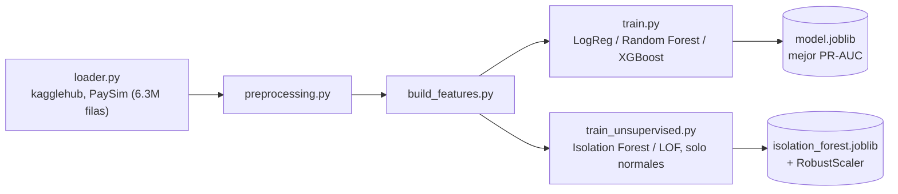

[ 🇺🇸 [Read in English](README.md) ] | [ 🇨🇱 Español ]

# Bank Anomaly Detection


Sistema de detección de fraude y anomalías en transacciones bancarias móviles, construido sobre el dataset sintético **PaySim** ([`ealaxi/paysim1`](https://www.kaggle.com/datasets/ealaxi/paysim1) en Kaggle), que simula transacciones financieras a partir de un mes de datos de un servicio real de dinero móvil en África.

## Nota honesta sobre validación

Este README documenta la arquitectura, el diseño y el razonamiento del proyecto en detalle, pero **la corrida completa del pipeline (Módulo 1 supervisado y Módulo 2 no supervisado) requiere descargar el dataset PaySim vía `kagglehub`, que a su vez requiere credenciales de Kaggle configuradas** — no disponibles en el entorno donde se preparó esta actualización de documentación. Lo que sí se verificó directamente en este entorno: **8/8 tests unitarios pasando** (`pytest tests/`, que cubren `preprocessing.py` y `build_features.py` con datos sintéticos, sin necesitar la descarga real). Las métricas de modelo (ROC-AUC, PR-AUC, Precision@k) mencionadas en el código no se reportan aquí como números porque no fueron re-ejecutadas en esta sesión — quien clone el repo y configure sus propias credenciales de Kaggle puede generarlas siguiendo los pasos de Uso más abajo.

## Objetivo

Identificar transacciones fraudulentas dentro de un dataset altamente desbalanceado (la clase `isFraud` representa una fracción mínima del total de transacciones), evaluando distintos enfoques de modelado supervisado y técnicas de balanceo de clases para maximizar la detección de fraude minimizando falsos positivos.

## Arquitectura del proyecto



El proyecto sigue una arquitectura modular que separa claramente la ingesta de datos, el preprocesamiento, la ingeniería de características y el modelado, favoreciendo la reproducibilidad y la testabilidad del código:

```
bank-anomaly-detection/
├── data/
│   ├── raw/              # Datos originales descargados de Kaggle (no versionados)
│   └── processed/        # Datos transformados listos para modelado (no versionados)
├── notebooks/
│   ├── 01_eda_paysim.ipynb                     # Análisis exploratorio del dataset PaySim
│   └── 02_unsupervised_anomaly_detection.ipynb # Módulo 2: detección de fraude zero-day
├── src/
│   ├── data/
│   │   ├── loader.py           # Descarga (kagglehub) y carga del dataset PaySim
│   │   └── preprocessing.py    # Limpieza y transformación de datos crudos
│   ├── features/
│   │   └── build_features.py   # Ingeniería de características para el modelo
│   ├── models/
│   │   ├── train.py            # Entrenamiento, comparación y selección de modelos
│   │   ├── visualize.py        # Curvas ROC/PR y matrices de confusión comparativas
│   │   └── predict.py          # Inferencia sobre datos nuevos
│   ├── unsupervised/            # Módulo 2: detección no supervisada de anomalías
│   │   ├── loader.py            # Datos de entrenamiento (solo normales) y prueba (mixta)
│   │   ├── models.py            # Isolation Forest y Local Outlier Factor
│   │   └── train_unsupervised.py  # Entrenamiento, evaluación (Precision@k) y gráficas
│   └── utils/                  # Funciones auxiliares compartidas
├── tests/                 # Pruebas unitarias (pytest) para preprocessing y build_features
├── requirements.txt
├── LICENSE
├── README.md
└── README.es.md
```

Cada módulo bajo `src/` expone funciones puras y documentadas, pensadas para ser importadas tanto desde notebooks (exploración) como desde scripts (pipeline productivo), evitando duplicar lógica entre ambos contextos.

## Dataset

**PaySim** es un simulador de transacciones financieras móviles basado en datos agregados de un proveedor real de servicios de dinero móvil, extendido para incluir comportamiento fraudulento inyectado. Incluye tipos de transacción como `CASH-IN`, `CASH-OUT`, `DEBIT`, `PAYMENT` y `TRANSFER`, junto con los saldos de origen y destino antes y después de cada operación.

La columna objetivo `isFraud` indica si una transacción fue fraudulenta, mientras que `isFlaggedFraud` marca transferencias masivas ilegítimas detectadas por las reglas de negocio simuladas.

## Instalación

```bash
python3 -m venv .venv
source .venv/bin/activate      # En Windows: .venv\Scripts\activate
pip install -r requirements.txt
```

## Uso

Descarga y carga inicial del dataset:

```bash
python -m src.data.loader
```

Esto descargará el dataset desde Kaggle mediante `kagglehub` (requiere credenciales de Kaggle configuradas), lo copiará a `data/raw/paysim.csv` e imprimirá un resumen de las dimensiones, primeras filas y distribución porcentual de la clase `isFraud`.

Entrenamiento y comparación de modelos:

```bash
python -m src.models.train
```

Ejecuta el pipeline completo (carga → limpieza → features → split) y entrena tres modelos candidatos (Regresión Logística, Random Forest y XGBoost), cada uno con manejo de clases desbalanceadas (`class_weight="balanced"` / `scale_pos_weight`). Imprime `classification_report`, matriz de confusión, ROC-AUC y PR-AUC por modelo, guarda el de mejor PR-AUC (la métrica más informativa en fraude, dado el desbalance extremo de clases) en `data/processed/model.joblib`, y genera curvas ROC/Precision-Recall y matrices de confusión comparativas en `data/processed/figures/`.

Pruebas unitarias:

```bash
pytest tests/
```

Detección no supervisada de anomalías (Módulo 2):

```bash
python -m src.unsupervised.train_unsupervised
```

## Módulo 2: Detección de fraude desconocido / zero-day (no supervisado)

El Módulo 1 entrena con fraude ya etiquetado, así que solo puede reconocer patrones parecidos a fraude que ya ocurrió antes. El Módulo 2 cubre el caso complementario: un esquema de fraude genuinamente nuevo ("zero-day") no se parece a nada visto en el entrenamiento, y un modelo supervisado no tiene por qué detectarlo. El enfoque aquí es aprender únicamente la forma de lo normal y señalar como anómalo cualquier caso que se aleje de ese patrón, sin usar una sola etiqueta de fraude durante el ajuste.

**Datos**: en vez de descargar `mlg-ulb/creditcardfraud` vía `kagglehub` (requeriría credenciales de Kaggle adicionales que este entorno no tiene configuradas), `src/unsupervised/loader.py` reutiliza el PaySim ya presente en `data/raw/paysim.csv` — mismas funciones `clean_data`/`build_features` del Módulo 1 — y separa:
- **Train**: una muestra de transacciones normales (`isFraud == 0`); el modelo nunca ve un fraude al ajustarse.
- **Test**: una muestra de normales + *todas* las transacciones fraudulentas disponibles, para tener suficientes anomalías reales con las que medir desempeño.

El tamaño de la muestra de entrenamiento se mantiene acotado (30k filas) a propósito: Local Outlier Factor en modo *novelty* necesita construir un índice de vecinos y consultarlo por cada predicción, algo que no escala a los 6.3M de filas del dataset completo.

**Modelos** (`src/unsupervised/models.py`):
- **Isolation Forest** (`sklearn.ensemble.IsolationForest`) — aísla puntos con particiones aleatorias; las anomalías requieren menos particiones para quedar aisladas.
- **Local Outlier Factor** (`sklearn.neighbors.LocalOutlierFactor`, `novelty=True`) — compara la densidad local de un punto contra la de sus vecinos más cercanos.

Ambos exponen un **Anomaly Score** continuo homogéneo (`anomaly_score()`, valores más altos = más anómalo) derivado de `score_samples`, sobre features escaladas con `RobustScaler` (ajustado solo con datos de entrenamiento) por la fuerte asimetría de montos y saldos.

**Evaluación** (`src/unsupervised/train_unsupervised.py`): PR-AUC y Precision@k/Recall@k (k = 50, 100, 200 — "de las k transacciones más anómalas señaladas, ¿cuántas son fraude real?", la pregunta que le importa a un analista con capacidad de revisión limitada). Genera `data/processed/figures/unsupervised_scores.png` (distribución del Anomaly Score por clase) y `data/processed/figures/unsupervised_pr_curve.png` (curva Precision-Recall comparativa), y serializa Isolation Forest junto con su `RobustScaler` en `data/processed/isolation_forest.joblib`.

## Stack técnico

- **pandas / numpy** — manipulación y análisis de datos
- **scikit-learn** — pipelines de preprocesamiento y modelos base
- **xgboost** — modelo de gradient boosting para clasificación de fraude
- **imbalanced-learn** — técnicas de resampling (SMOTE, undersampling) para el desbalance de clases
- **matplotlib / seaborn** — visualización exploratoria
- **pytest** — pruebas unitarias
- **kagglehub** — descarga programática del dataset desde Kaggle

## Licencia

MIT — ver [LICENSE](LICENSE).

## Autor

**Pablo Reyes** — [github.com/Rxyxs](https://github.com/Rxyxs)
