[ 🇺🇸 [Read in English](README.md) ] | [ 🇨🇱 Español ]

# Bank Anomaly Detection


Sistema de detección de fraude y anomalías en transacciones bancarias móviles, construido sobre el dataset sintético **PaySim** ([`ealaxi/paysim1`](https://www.kaggle.com/datasets/ealaxi/paysim1) en Kaggle), que simula transacciones financieras a partir de un mes de datos de un servicio real de dinero móvil en África.

## Resumen: qué se aprendió

Seis módulos, 15 detectores a nivel de transacción, uno a nivel de cuenta y tres ensembles, todos medidos sobre el PaySim completo. Los hallazgos que sobrevivieron a la verificación:

| Hallazgo | Dónde |
|---|---|
| El baseline estadístico más simple no es débil, es **anti-informativo**: ROC-AUC 0.383, por debajo del azar. Mirar cada columna por separado falla cuando el fraude vacía saldos sin producir valores extremos individuales. | [Módulo 3](#módulo-3-benchmark-de-familias-de-detección-no-supervisado) |
| **Los ensembles no ganan.** Promediar 15 detectores donde la mayoría es mediocre arrastra a los buenos. Sirven en la cabeza del ranking, donde el consenso es perfecto. | [Módulo 3](#resultados) |
| **El objetivo importa más que la profundidad.** Deep SVDD supera al autoencoder en +0.12 de PR-AUC con la misma arquitectura y datos; solo cambia qué optimiza. | [Módulo 4](#nivel-transacción-el-objetivo-importa-más-que-la-profundidad) |
| El detector secuencial **no encuentra señal**, y dos diagnósticos descartan que sea culpa del método: es PaySim, que elige destinos de fraude sin modelar comportamiento de mula. | [Módulo 4](#por-qué-ese-resultado-negativo-es-del-dataset-y-no-del-método) |
| **El que mejor rankea no es el que más plata salva.** Con el 10% de los fraudes concentrando la mitad del monto, contar casos y contar pesos ordenan distinto. | [Módulo 5](#resultados-1) |
| El mejor detector por PR-AUC es **indesplegable**: promete 0,1% de falsas alarmas y entrega 35%. Estabilidad del ranking y estabilidad de la escala son propiedades distintas. | [Módulo 5](#el-umbral-lo-prometido-contra-lo-cumplido) |
| La **garantía conforme** arregla el umbral cuando hay intercambiabilidad y se rompe igual que el cuantil cuando no la hay. Su aporte es volver el supuesto explícito, no eliminarlo. | [Módulo 6](#módulo-6-métodos-nuevos-y-garantías-de-cobertura) |
| Agregar métodos **no siempre agrega cobertura**: los dos detectores nuevos producen los primeros pares redundantes del repositorio (ρ hasta 0.99). | [Módulo 6](#agregar-detectores-no-es-lo-mismo-que-agregar-cobertura) |
| **Cincuenta etiquetas bien gastadas valen más que mil al azar**: con prevalencia del 0,08%, muestrear al azar no encuentra un solo positivo hasta las 500. | [Módulo 7](#cincuenta-etiquetas-bien-gastadas-valen-más-que-mil-al-azar) |
| Los detectores de **estructura aleatoria se diluyen** con features irrelevantes. Un mecanismo explica el desempeño flojo de LODA y de Half-Space Trees a la vez. | [Módulo 7](#por-qué-es-flojo-y-por-qué-eso-explica-también-a-loda) |

Ocho errores de método aparecieron en el camino y quedaron documentados con su corrección en [una sección propia](#errores-de-método-encontrados-y-corregidos), junto con dos hipótesis propias que los datos refutaron.

## Mapa de módulos

| Módulo | Pregunta que responde | Punto de entrada | Notebook |
|---|---|---|---|
| **1 — Supervisado** | ¿Se puede clasificar fraude ya etiquetado? | `src/models/train.py` | — |
| **2 — No supervisado** | ¿Y si el fraude es nuevo y no hay etiquetas? | `src/unsupervised/train_unsupervised.py` | [02](notebooks/02_unsupervised_anomaly_detection.ipynb) |
| **3 — Benchmark** | ¿Qué familias de detección son complementarias y cuánto cuesta cada una? | `src/unsupervised/benchmark.py` | [03](notebooks/03_benchmark_familias_anomalias.ipynb) |
| **4 — Profundo y secuencial** | ¿El margen está en la profundidad o en el objetivo? ¿Y si se mira la historia de la cuenta? | `src/deep/train_deep.py` | [04](notebooks/04_modelos_profundos_y_secuencias.ipynb) |
| **5 — Operación** | ¿Dónde corto el score, cuánta plata salva y sigue funcionando el mes que viene? | `src/operations/run_operations.py` | [05](notebooks/05_umbral_costo_y_drift.ipynb) |
| **6 — Garantías** | ¿Se puede *garantizar* la tasa de falsas alarmas en vez de estimarla? | `src/conformal/run_conformal.py` | [06](notebooks/06_metodos_nuevos_y_conformal.ipynb) |
| **7 — Deriva y etiquetas** | ¿Cómo se adapta un detector solo, y qué hago cuando aparecen unas pocas etiquetas? | `src/adaptive/run_adaptive.py` | [07](notebooks/07_deriva_y_etiquetas.ipynb) |

## Nota honesta sobre validación

Los números de este README **provienen de una corrida real** del pipeline sobre el dataset PaySim completo (6.362.620 filas descargadas vía `kagglehub`), no de estimaciones: `python -m src.unsupervised.train_unsupervised` para el Módulo 2, `python -m src.unsupervised.benchmark` para el Módulo 3 `python -m src.deep.train_deep` para el Módulo 4 `python -m src.operations.run_operations` para el Módulo 5 `python -m src.conformal.run_conformal` para el Módulo 6 y `python -m src.adaptive.run_adaptive` para el Módulo 7, más **185/185 tests unitarios pasando** (`pytest tests/`, con datos sintéticos, sin necesitar la descarga). Los tiempos de ajuste y scoring se midieron en esa misma máquina (Windows 10, CPU) y sirven para comparar detectores *entre sí*, no como referencia absoluta de hardware.

Dos advertencias necesarias para leer bien las métricas:

- **El conjunto de prueba está enriquecido a propósito.** Contiene 50.000 transacciones normales más *todas* las 8.213 fraudulentas disponibles, o sea un 14,1% de fraude frente al ~0,13% real de PaySim. Es la única forma de tener suficientes anomalías para medir Precision@k con estabilidad, pero implica que estos PR-AUC **no son trasladables** a la prevalencia de producción: en el mundo real la precisión sería sustancialmente menor con el mismo modelo. El Módulo 5 mide exactamente eso: split temporal y prevalencia real del 0,23%.
- **El Módulo 1 (supervisado) no se re-ejecutó en esta sesión.** Sus métricas no se reportan como números aquí; quien clone el repo puede generarlas con `python -m src.models.train`.

## Objetivo

Identificar transacciones fraudulentas dentro de un dataset altamente desbalanceado (la clase `isFraud` representa una fracción mínima del total de transacciones), evaluando distintos enfoques de modelado supervisado y técnicas de balanceo de clases para maximizar la detección de fraude minimizando falsos positivos.

## Arquitectura del proyecto

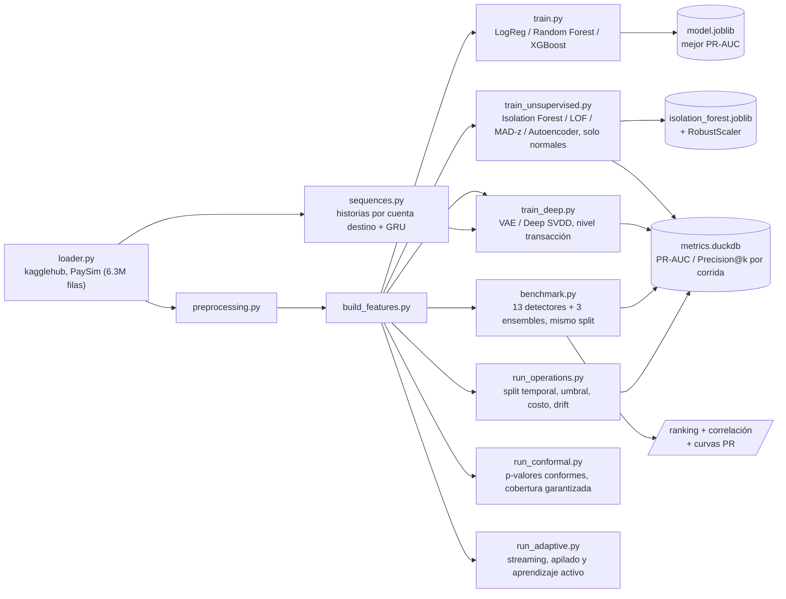

El proyecto sigue una arquitectura modular que separa claramente la ingesta de datos, el preprocesamiento, la ingeniería de características y el modelado, favoreciendo la reproducibilidad y la testabilidad del código:

```
bank-anomaly-detection/
├── data/
│   ├── raw/              # Datos originales descargados de Kaggle (no versionados)
│   └── processed/        # Datos transformados listos para modelado (no versionados)
├── notebooks/
│   ├── 01_eda_paysim.ipynb                     # Análisis exploratorio del dataset PaySim
│   ├── 02_unsupervised_anomaly_detection.ipynb # Módulo 2: detección de fraude zero-day
│   ├── 03_benchmark_familias_anomalias.ipynb   # Módulo 3: benchmark de familias + ensembles
│   ├── 04_modelos_profundos_y_secuencias.ipynb # Módulo 4: VAE, Deep SVDD y detector secuencial
│   ├── 05_umbral_costo_y_drift.ipynb           # Módulo 5: umbral, dinero y validación temporal
│   ├── 06_metodos_nuevos_y_conformal.ipynb     # Módulo 6: LODA, FastABOD y detección conforme
│   └── 07_deriva_y_etiquetas.ipynb             # Módulo 7: streaming, apilado y activo
├── src/
│   ├── data/
│   │   ├── loader.py           # Descarga (kagglehub) y carga del dataset PaySim
│   │   └── preprocessing.py    # Limpieza y transformación de datos crudos
│   ├── features/
│   │   └── build_features.py   # Ingeniería de características para el modelo
│   ├── models/
│   │   ├── train.py            # Entrenamiento, comparación y selección de modelos
│   │   ├── visualize.py        # Curvas ROC/PR y matrices de confusión comparativas
│   │   └── predict.py          # Inferencia sobre datos nuevos
│   ├── unsupervised/            # Módulos 2 y 3: detección no supervisada de anomalías
│   │   ├── loader.py            # Datos de entrenamiento (solo normales) y prueba (mixta)
│   │   ├── models.py            # Isolation Forest, LOF, baseline estadístico MAD-z
│   │   ├── autoencoder.py       # Autoencoder PyTorch (activaciones ReLU/GELU/Swish)
│   │   ├── families.py          # Módulo 3: PCA, GMM, Mahalanobis (MCD), kNN, OC-SVM, HBOS, ECOD
│   │   ├── ensemble.py          # Módulo 3: combinación de scores (rangos, z, máximo z)
│   │   ├── benchmark.py         # Módulo 3: comparación de las 11 familias en el mismo split
│   │   ├── metrics_store.py     # Persistencia de métricas comparativas (DuckDB)
│   │   ├── style.py             # Paleta y estilo compartido de las figuras
│   │   └── train_unsupervised.py  # Entrenamiento, evaluación (Precision@k) y gráficas
│   ├── deep/                    # Módulo 4: modelos profundos y detección secuencial
│   │   ├── one_class.py         # VAE (ELBO) y Deep SVDD, nivel transacción
│   │   ├── sequences.py         # Historias por cuenta destino + autoencoder GRU
│   │   └── train_deep.py        # Entrenamiento, diagnóstico y gráficas del módulo 4
│   ├── operations/              # Módulo 5: del score a la decisión operativa
│   │   ├── temporal.py          # Split temporal, evaluación por período y drift
│   │   ├── thresholds.py        # Umbral por cuantil, por capacidad y óptimo en costo
│   │   ├── costs.py             # Métricas en pesos y costo de revisión de equilibrio
│   │   └── run_operations.py    # Corrida completa del módulo 5 y sus gráficas
│   ├── conformal/               # Módulo 6: p-valores con garantía de cobertura
│   │   ├── conformal.py         # P-valores conformes, umbral y reporte de cobertura
│   │   └── run_conformal.py     # Experimento de intercambiabilidad contra deriva
│   ├── adaptive/                # Módulo 7: deriva y etiquetas escasas
│   │   ├── hs_trees.py          # Half-Space Trees con ventana deslizante
│   │   ├── stacking.py          # Scores de los 16 detectores como features
│   │   ├── active.py            # Estrategias de selección para revisar
│   │   └── run_adaptive.py      # Los tres experimentos del módulo 7
│   └── utils/                  # Funciones auxiliares compartidas
├── tests/                 # Pruebas unitarias (pytest): preprocessing, features, baseline
│                           # MAD, autoencoder, metrics store, familias, ensembles,
│                           # modelos profundos, secuencias, umbrales, costos, temporal,
│                           # detección conforme, streaming, apilado, activo
├── requirements.txt
├── LICENSE
├── README.md
└── README.es.md
```

Cada módulo bajo `src/` expone funciones puras y documentadas, pensadas para ser importadas tanto desde notebooks (exploración) como desde scripts (pipeline productivo), evitando duplicar lógica entre ambos contextos.

## Dataset

**PaySim** es un simulador de transacciones financieras móviles basado en datos agregados de un proveedor real de servicios de dinero móvil, extendido para incluir comportamiento fraudulento inyectado. Incluye tipos de transacción como `CASH-IN`, `CASH-OUT`, `DEBIT`, `PAYMENT` y `TRANSFER`, junto con los saldos de origen y destino antes y después de cada operación.

La columna objetivo `isFraud` indica si una transacción fue fraudulenta, mientras que `isFlaggedFraud` marca transferencias masivas ilegítimas detectadas por las reglas de negocio simuladas.

### Esquema del dataset

| Columna | Tipo | Descripción | Uso en el repositorio |
|---|---|---|---|
| `step` | entero | Hora simulada, de 1 a 743 (31 días) | Corte temporal del Módulo 5, cadencia del detector secuencial |
| `type` | categórica | `CASH_IN`, `CASH_OUT`, `DEBIT`, `PAYMENT`, `TRANSFER` | Se convierte en cinco dummies |
| `amount` | real | Monto de la transacción | Feature, y base de todas las métricas en pesos |
| `nameOrig` | texto | Cuenta de origen | **Descartada**: el 99,85% aparece una sola vez |
| `oldbalanceOrg` / `newbalanceOrig` | real | Saldo de origen antes y después | Features, y base de `errorBalanceOrig` |
| `nameDest` | texto | Cuenta de destino | Descartada en los Módulos 1-3; **recuperada** en el 4 para las secuencias |
| `oldbalanceDest` / `newbalanceDest` | real | Saldo de destino antes y después | Features, y base de `errorBalanceDest` |
| `isFraud` | binaria | Etiqueta objetivo | Nunca se usa al ajustar detectores no supervisados |
| `isFlaggedFraud` | binaria | Marca de las reglas de negocio simuladas | Descartada: es la salida de otro sistema, no una feature |

A eso se le agregan cuatro features construidas en `build_features.py`. Dos de ellas concentran casi toda la señal del dataset, y por eso los detectores de estructura aleatoria (LODA, Half-Space Trees) rinden mal:

- `errorBalanceOrig` = `newbalanceOrig + amount - oldbalanceOrg` — cuánto no cierra el saldo de origen;
- `errorBalanceDest` = `oldbalanceDest + amount - newbalanceDest` — lo mismo del lado del destino;
- `origBalanceZero` / `destBalanceZero` — indicadores de saldo en cero antes de la operación.

## Instalación

```bash
python3 -m venv .venv
source .venv/bin/activate      # En Windows: .venv\Scripts\activate
pip install -r requirements.txt
```

## Uso

Descarga y carga inicial del dataset:

```bash
python -m src.data.loader
```

Esto descargará el dataset desde Kaggle mediante `kagglehub` (requiere credenciales de Kaggle configuradas), lo copiará a `data/raw/paysim.csv` e imprimirá un resumen de las dimensiones, primeras filas y distribución porcentual de la clase `isFraud`.

Entrenamiento y comparación de modelos:

```bash
python -m src.models.train
```

Ejecuta el pipeline completo (carga → limpieza → features → split) y entrena tres modelos candidatos (Regresión Logística, Random Forest y XGBoost), cada uno con manejo de clases desbalanceadas (`class_weight="balanced"` / `scale_pos_weight`). Imprime `classification_report`, matriz de confusión, ROC-AUC y PR-AUC por modelo, guarda el de mejor PR-AUC (la métrica más informativa en fraude, dado el desbalance extremo de clases) en `data/processed/model.joblib`, y genera curvas ROC/Precision-Recall y matrices de confusión comparativas en `data/processed/figures/`.

Pruebas unitarias:

```bash
pytest tests/
```

Detección no supervisada de anomalías (Módulo 2):

```bash
python -m src.unsupervised.train_unsupervised
```

Benchmark comparativo de familias de detectores (Módulo 3):

```bash
python -m src.unsupervised.benchmark
```

Entrena los 16 detectores sobre el mismo split y escalado, construye los tres ensembles encima de sus scores, imprime la tabla comparativa con métricas y tiempos, reporta los pares de detectores redundantes y guarda ranking, curvas PR y matriz de correlación en `data/processed/figures/`, además de una fila por detector en la tabla `benchmark_metrics` de `data/processed/metrics.duckdb`.

Modelos profundos y detector secuencial (Módulo 4):

```bash
python -m src.deep.train_deep
```

Entrena el VAE y Deep SVDD sobre el mismo split del Módulo 3, más el autoencoder GRU sobre las historias de las cuentas destino. Imprime la cobertura del truncado y la comparación de agregaciones del error por paso —los dos diagnósticos que permiten interpretar el resultado del detector secuencial— y guarda las métricas en tablas separadas por unidad de análisis.

Operación: umbral, costo y validación temporal (Módulo 5):

```bash
python -m src.operations.run_operations
```

Reentrena los 13 detectores sobre un split **temporal** con prevalencia real, calcula el costo de revisión de equilibrio, compara el ranking por PR-AUC contra el ranking por dinero salvado, mide cuánto se aleja la tasa de falsos positivos real de la prometida por el umbral, y evalúa la degradación día a día filtrando los períodos sin volumen suficiente.

Métodos nuevos y garantías de cobertura (Módulo 6):

```bash
python -m src.conformal.run_conformal
```

Envuelve los detectores en un calibrador conforme y compara la tasa de falsas alarmas observada contra la garantizada en dos escenarios: uno donde la intercambiabilidad se cumple por construcción y otro donde la evaluación pasa al período posterior. LODA y FastABOD se agregan al benchmark del Módulo 3, que pasa de 13 a 15 detectores.

Deriva y etiquetas escasas (Módulo 7):

```bash
python -m src.adaptive.run_adaptive
```

Compara Half-Space Trees con ventana fija contra ventana refrescada cada día, mide cuánto aportan los scores de los 16 detectores como features de un clasificador según el presupuesto de etiquetado, y simula el circuito de revisión con cinco estrategias de selección.

## Módulo 2: Detección de fraude desconocido / zero-day (no supervisado)

El Módulo 1 entrena con fraude ya etiquetado, así que solo puede reconocer patrones parecidos a fraude que ya ocurrió antes. El Módulo 2 cubre el caso complementario: un esquema de fraude genuinamente nuevo ("zero-day") no se parece a nada visto en el entrenamiento, y un modelo supervisado no tiene por qué detectarlo. El enfoque aquí es aprender únicamente la forma de lo normal y señalar como anómalo cualquier caso que se aleje de ese patrón, sin usar una sola etiqueta de fraude durante el ajuste.

**Datos**: en vez de descargar `mlg-ulb/creditcardfraud` vía `kagglehub` (requeriría credenciales de Kaggle adicionales que este entorno no tiene configuradas), `src/unsupervised/loader.py` reutiliza el PaySim ya presente en `data/raw/paysim.csv` — mismas funciones `clean_data`/`build_features` del Módulo 1 — y separa:
- **Train**: una muestra de transacciones normales (`isFraud == 0`); el modelo nunca ve un fraude al ajustarse.
- **Test**: una muestra de normales + *todas* las transacciones fraudulentas disponibles, para tener suficientes anomalías reales con las que medir desempeño.

El tamaño de la muestra de entrenamiento se mantiene acotado (30k filas) a propósito: Local Outlier Factor en modo *novelty* necesita construir un índice de vecinos y consultarlo por cada predicción, algo que no escala a los 6.3M de filas del dataset completo.

**Modelos** (`src/unsupervised/models.py`, `src/unsupervised/autoencoder.py`):
- **Isolation Forest** (`sklearn.ensemble.IsolationForest`) — aísla puntos con particiones aleatorias; las anomalías requieren menos particiones para quedar aisladas.
- **Local Outlier Factor** (`sklearn.neighbors.LocalOutlierFactor`, `novelty=True`) — compara la densidad local de un punto contra la de sus vecinos más cercanos.
- **Baseline estadístico MAD-z** (`MADBaseline`) — baseline no iterativo: memoriza la mediana y la Median Absolute Deviation (MAD) por feature al ajustarse, y puntúa cada fila por el z-score robusto máximo entre sus features. Robusto a la cola pesada de montos/saldos, a diferencia de un z-score de media/desviación estándar clásico.
- **Autoencoder** (`src/unsupervised/autoencoder.py`, PyTorch) — encoder/decoder simétrico totalmente conectado con cuello de botella central, entrenado solo con transacciones normales para minimizar el MSE de reconstrucción; el anomaly score es el propio error de reconstrucción (`reconstruction_error()`), más alto = más anómalo. Entrenado y comparado con tres funciones de activación sobre la misma arquitectura — **ReLU**, **GELU** y **Swish** (`nn.SiLU`) — para ilustrar su efecto en la calidad de la reconstrucción sobre este dataset tabular.

Las cuatro familias exponen un **Anomaly Score** continuo homogéneo (valores más altos = más anómalo), sobre features escaladas con `RobustScaler` (ajustado solo con datos de entrenamiento) por la fuerte asimetría de montos y saldos.

**Evaluación** (`src/unsupervised/train_unsupervised.py`): PR-AUC y Precision@k/Recall@k (k = 50, 100, 200 — "de las k transacciones más anómalas señaladas, ¿cuántas son fraude real?", la pregunta que le importa a un analista con capacidad de revisión limitada). Genera `data/processed/figures/unsupervised_scores.png` (distribución del Anomaly Score por clase, Isolation Forest / LOF / baseline MAD), `data/processed/figures/unsupervised_pr_curve.png` (curva Precision-Recall comparativa entre todos los modelos) y `data/processed/figures/autoencoder_activations.png` (PR-AUC por función de activación). Serializa Isolation Forest junto con su `RobustScaler` en `data/processed/isolation_forest.joblib`, y persiste PR-AUC/Precision@k/Recall@k por modelo y por corrida en un archivo DuckDB local (`data/processed/metrics.duckdb`, vía `src/unsupervised/metrics_store.py`) para comparar entre corridas.

### Comparación de modelos (Módulo 2)

| Modelo | Tipo | Anomaly score | Notas |
|---|---|---|---|
| Isolation Forest | Ensamble basado en árboles | `-score_samples` | Maneja bien fronteras no lineales, rápido de entrenar |
| Local Outlier Factor | Basado en densidad (modo novelty) | `-score_samples` | Sensible a variaciones de densidad local |
| Baseline MAD-z | Estadístico, no iterativo | z-score robusto máximo | Sin hiperparámetros, rápido, interpretable por feature |
| Autoencoder (ReLU / GELU / Swish) | Deep learning (PyTorch) | MSE de reconstrucción | Captura interacciones no lineales; la activación afecta la calidad de reconstrucción |

### Resultados medidos (Módulo 2)

| Modelo | PR-AUC | Precision@50 | Precision@100 | Precision@200 |
|---|---|---|---|---|
| Local Outlier Factor | **0.802** | 1.000 | 1.000 | 1.000 |
| Autoencoder (ReLU) | 0.581 | 0.960 | 0.970 | 0.975 |
| Autoencoder (Swish) | 0.574 | 0.980 | 0.990 | 0.995 |
| Autoencoder (GELU) | 0.573 | 1.000 | 1.000 | 1.000 |
| Isolation Forest | 0.549 | 0.440 | 0.550 | 0.640 |
| Baseline MAD-z | 0.140 | 0.240 | 0.140 | 0.100 |

Local Outlier Factor domina claramente con este conjunto de features. Las tres activaciones del autoencoder quedan a menos de 0.01 de PR-AUC entre sí (0.581 / 0.574 / 0.573): sobre datos tabulares de 15 columnas, la elección de activación es marginal comparada con la elección de familia de detector — el Módulo 3 desarrolla ese punto.

PR-AUC, Precision@k y Recall@k de cada modelo/corrida se persisten en `data/processed/metrics.duckdb` (consultable con `duckdb.connect(...)` o `src.unsupervised.metrics_store.load_latest_metrics()`).

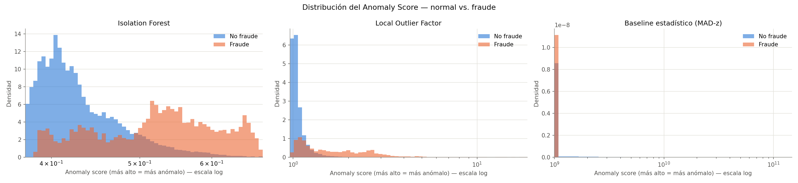
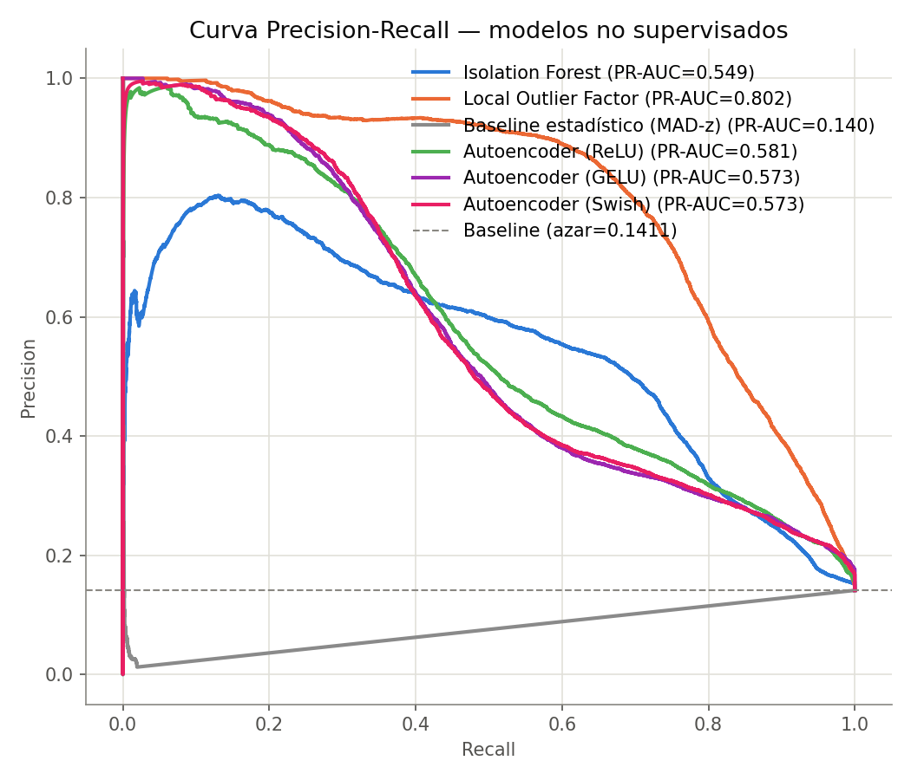
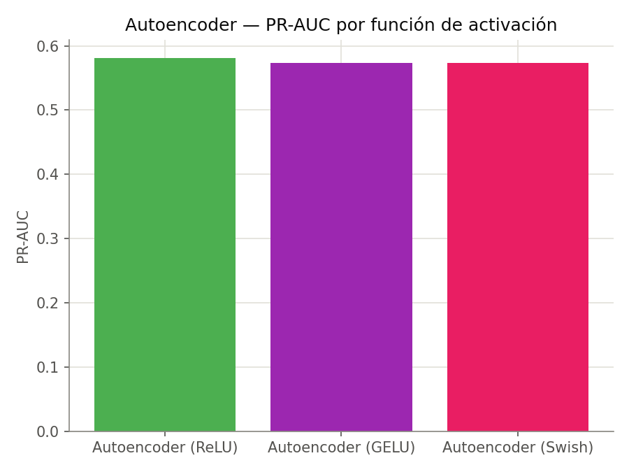

## Módulo 3: Benchmark de familias de detección (no supervisado)

El Módulo 2 cubre tres enfoques más el autoencoder. El Módulo 3 cierra el mapa: agrega las familias que faltaban (`src/unsupervised/families.py`), las compara a todas en el mismo split con el mismo escalado (`src/unsupervised/benchmark.py`) y prueba si combinarlas mejora algo (`src/unsupervised/ensemble.py`).

La motivación no es acumular modelos. Sin etiquetas no se puede elegir el mejor detector *antes* de desplegarlo, así que las preguntas accionables son otras dos: **qué familias son realmente complementarias** (si dos ordenan las transacciones casi igual, tener las dos no aporta nada) y **cuánto cuesta cada punto de PR-AUC** (en producción el scoring corre por transacción y el ajuste una vez al día, así que un detector lento de entrenar pero rápido de puntuar es viable — y al revés no).

### Las siete familias agregadas en este módulo

| Detector | Familia | Qué anomalía detecta bien |
|---|---|---|
| **PCA (reconstrucción)** | Reconstrucción lineal | Filas fuera del subespacio principal — es la **ablación** del autoencoder |
| **Gaussian Mixture** | Densidad paramétrica | Huecos de baja probabilidad entre modos de la distribución |
| **Mahalanobis robusto (MCD)** | Covarianza robusta | Correlaciones rotas entre features, invisibles columna a columna |
| **kNN (k-ésima distancia)** | Distancia global | Puntos lejos de cualquier vecindario denso |
| **One-Class SVM (Nyström)** | Frontera con kernel | Filas fuera de la envolvente aprendida de lo normal |
| **HBOS** | Histogramas por feature | Valores raros en columnas individuales; score descomponible por feature |
| **ECOD** | Colas de la CDF empírica | Colas extremas, sin un solo hiperparámetro que ajustar |

`HBOS` y `ECOD` están implementados desde cero (coste lineal, sin dependencias extra); el resto se apoya en scikit-learn. El `OneClassSVM` exacto es O(n²)–O(n³) y no termina en un set de 30k filas, así que se usa la aproximación de kernel de Nyström + `SGDOneClassSVM`, que resuelve el mismo problema en tiempo lineal.

Los tres **ensembles** resuelven el problema de que los scores viven en escalas incompatibles (una distancia de Mahalanobis no se puede promediar con una log-verosimilitud): promedio de rangos, promedio de scores estandarizados, y máximo de scores estandarizados.

### Resultados

| Detector | Familia | PR-AUC | ROC-AUC | Precision@100 | fit (s) | score (s) |
|---|---|---|---|---|---|---|
| Gaussian Mixture | Densidad paramétrica | **0.807** | 0.948 | 0.99 | 4.63 | 0.11 |
| Local Outlier Factor | Densidad local | 0.802 | 0.932 | **1.00** | 0.61 | 1.07 |
| Deep SVDD | Una clase profunda | 0.702 | 0.860 | **1.00** | 5.56 | 0.004 |
| Mahalanobis robusto (MCD) | Covarianza robusta | 0.698 | 0.896 | 0.94 | 1.18 | 0.007 |
| FastABOD | Geometría angular | 0.682 | 0.888 | **1.00** | 0.09 | 1.62 |
| Ensemble — promedio de rangos | Ensemble | 0.626 | 0.875 | **1.00** | — | 0.03 |
| Autoencoder (ReLU) | Reconstrucción no lineal | 0.581 | 0.850 | 0.97 | 6.66 | 0.007 |
| kNN (k-ésima distancia) | Distancia global | 0.552 | 0.853 | 0.85 | 0.09 | 1.01 |
| Isolation Forest | Aislamiento | 0.549 | 0.850 | 0.55 | 0.51 | 0.36 |
| One-Class SVM (Nyström) | Frontera con kernel | 0.494 | 0.830 | 0.86 | 0.31 | 0.36 |
| Ensemble — promedio z | Ensemble | 0.493 | 0.837 | 0.94 | — | 0.03 |
| PCA (reconstrucción) | Reconstrucción lineal | 0.487 | 0.822 | 0.76 | 0.002 | 0.01 |
| HBOS | Estadístico por feature | 0.480 | 0.800 | 0.59 | 0.005 | 0.02 |
| Ensemble — máximo z | Ensemble | 0.472 | 0.854 | 0.80 | — | 0.03 |
| Half-Space Trees | Streaming adaptativo | 0.458 | 0.788 | 0.60 | 0.13 | 0.25 |
| VAE (ELBO) | Densidad profunda | 0.446 | 0.731 | 0.90 | 10.21 | 0.05 |
| LODA | Proyecciones aleatorias | 0.354 | 0.776 | 0.36 | 0.04 | 0.15 |
| ECOD | Colas de la CDF empírica | 0.273 | 0.672 | 0.52 | 0.01 | 0.11 |
| MAD-z (baseline) | Estadístico por feature | 0.140 | 0.383 | 0.14 | 0.01 | 0.007 |

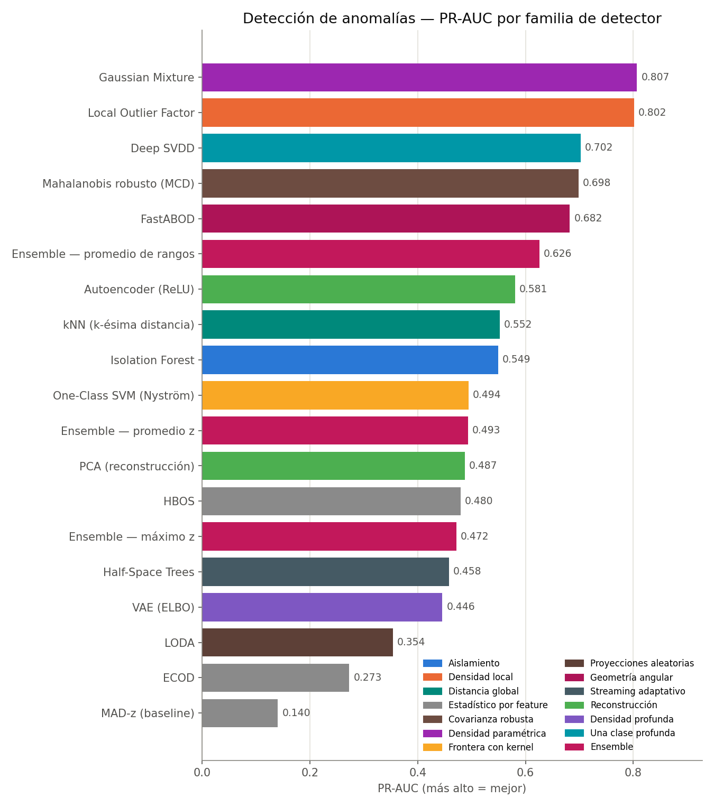

**Lo que dicen los números:**

- **Gaussian Mixture (0.807) y LOF (0.802) empatan arriba, pero por razones distintas.** Su correlación de Spearman es apenas 0.41, y sus curvas PR se cruzan: LOF domina entre recall 0.4 y 0.8, GMM lo supera por encima de 0.85. Cuál conviene depende de la capacidad de revisión del equipo, no del PR-AUC agregado.
- **La ablación lineal justifica al autoencoder, pero apenas.** El autoencoder (0.581) supera al PCA (0.487) — la no-linealidad aporta ~0.09 de PR-AUC real. El costo de esos 0.09: 9.6 s de ajuste contra 0.002 s, y una dependencia de PyTorch. Ninguno de los dos se acerca a GMM.
- **El baseline MAD-z no es solo débil, es anti-informativo** (ROC-AUC 0.383, por debajo del 0.5 del azar). Mirar cada columna por separado falla aquí porque el fraude de PaySim es un vaciado completo del saldo de origen: cada valor individual queda dentro del rango observado, mientras que las colas pesadas de las transacciones legítimas sí producen z-scores extremos. Es exactamente el argumento a favor de los métodos multivariados — y la razón de incluir Mahalanobis (0.698), que ve la misma información pero con la covarianza completa.
- **Los ensembles no ganan, y eso también es un resultado.** El mejor (promedio de rangos, 0.639) queda por debajo de GMM y LOF: promediar 16 detectores donde la mayoría son mediocres arrastra hacia abajo a los dos buenos. Un ensemble ayuda cuando sus miembros son de calidad comparable, no cuando hay una diferencia de 0.67 de PR-AUC entre el mejor y el peor. Con una excepción operativa relevante: **Precision@100 = 1.00** para el promedio de rangos — en la cabeza del ranking sí hay consenso perfecto, que es justo donde mira un analista.

### ¿Qué detectores son redundantes?

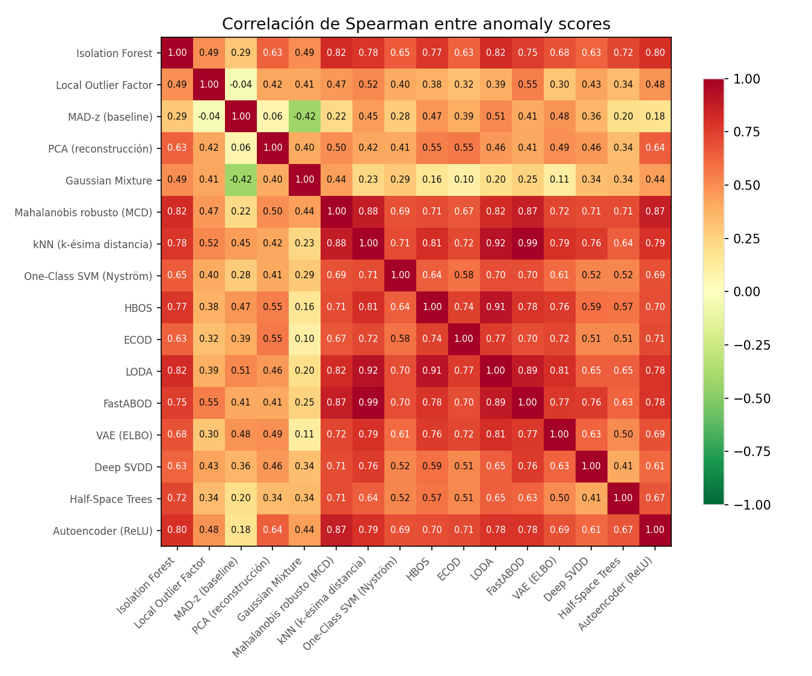

Correlación de Spearman entre los *rankings* de anomalía. Entre los trece detectores de los Módulos 2 a 5, **ningún par supera 0.9**: cada familia ordena las transacciones de forma distinta y ninguna es descartable por redundancia pura. Los pares más parecidos son Mahalanobis ↔ kNN (0.88) y Mahalanobis ↔ Autoencoder (0.87); los más complementarios, MAD-z ↔ LOF (−0.04) y MAD-z ↔ GMM (−0.42).

Eso cambia con los dos detectores que agrega el Módulo 6: FastABOD replica a kNN con ρ = 0.99. El detalle está en [Agregar detectores no es lo mismo que agregar cobertura](#agregar-detectores-no-es-lo-mismo-que-agregar-cobertura).

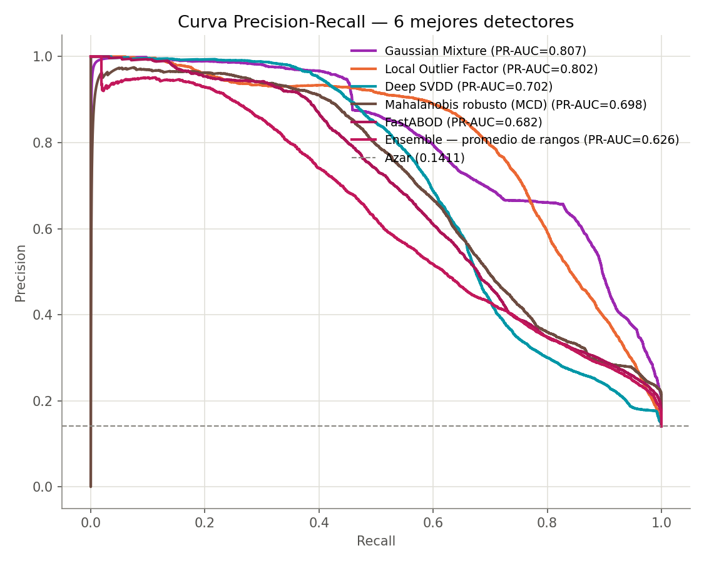

### Costo computacional

Los detectores de coste lineal (HBOS, ECOD, MAD-z, PCA) puntúan las 58.213 filas de prueba en centésimas de segundo y no mantienen nada en memoria más allá de unos vectores por feature. Los basados en distancias (LOF, kNN) pagan ~1.1 s porque cada predicción consulta un índice de vecinos contra las 30.000 filas de entrenamiento — el factor que decide si son viables en un flujo transaccional en línea. El autoencoder invierte la relación: es el más lento de ajustar (9.6 s) y de los más rápidos de puntuar (0.01 s), que es el perfil correcto para producción.

## Módulo 4: Modelos profundos de una clase y detección secuencial

Tres modelos, cada uno nacido de una limitación concreta que dejó a la vista el benchmark del Módulo 3 — no de la idea de agregar arquitecturas por agregarlas.

| Modelo | Limitación que ataca | Unidad evaluada |
|---|---|---|
| **VAE** | El mejor detector fue un modelo de densidad (GMM); el autoencoder solo reconstruye | Transacción |
| **Deep SVDD** | El autoencoder apenas superó su ablación lineal (0.581 vs 0.487) — ¿el problema es la profundidad o el objetivo? | Transacción |
| **Autoencoder GRU** | Los trece detectores tratan cada fila como independiente; una cuenta mula es anómala por su *historia* | **Cuenta destino** |

Los dos primeros comparten split, escalado y métricas con el Módulo 3, así que están en la tabla del benchmark de arriba. El tercero cambia la unidad de análisis y se reporta aparte: comparar un PR-AUC por cuenta con uno por transacción sería comparar dos problemas distintos, no dos modelos.

### Nivel transacción: el objetivo importa más que la profundidad

**Deep SVDD (0.702) supera al autoencoder (0.581)** con la misma arquitectura, los mismos datos y el mismo escalado. Lo único que cambia es qué optimiza: en vez de reconstruir la entrada, aprende una proyección que comprime lo normal dentro de una esfera y puntúa por distancia al centro. Ese salto de +0.12 es mayor que el que separaba al autoencoder de su ablación lineal con PCA (+0.09) — el margen estaba en la función objetivo, no en agregar capas. Y sale barato: 6.6 s de ajuste y **5 ms** de scoring para las 58.213 filas de prueba, el más rápido de puntuar de todo el repositorio. Queda tercero en el ranking general, sobre Mahalanobis.

Deep SVDD tiene un modo de falla silencioso: si la red aprende a mapear *toda* entrada al centro, minimiza el objetivo perfectamente y queda inútil — todos los puntos a la misma distancia, sin capacidad de ordenar. Se evita con capas **sin término de sesgo** (la solución constante se vuelve inalcanzable) y alejando del origen las componentes del centro. Hay una prueba unitaria que verifica que el score no colapsa a una desviación estándar nula.

**El VAE (0.446) pierde contra el autoencoder simple** y es el más caro de los tres (14.9 s). Ser la contraparte profunda del mejor detector clásico no le alcanzó para heredar su ventaja: el término KL empuja la latente hacia una normal estándar, lo que sobre features de colas muy pesadas termina normalizando justo la región que interesa distinguir.

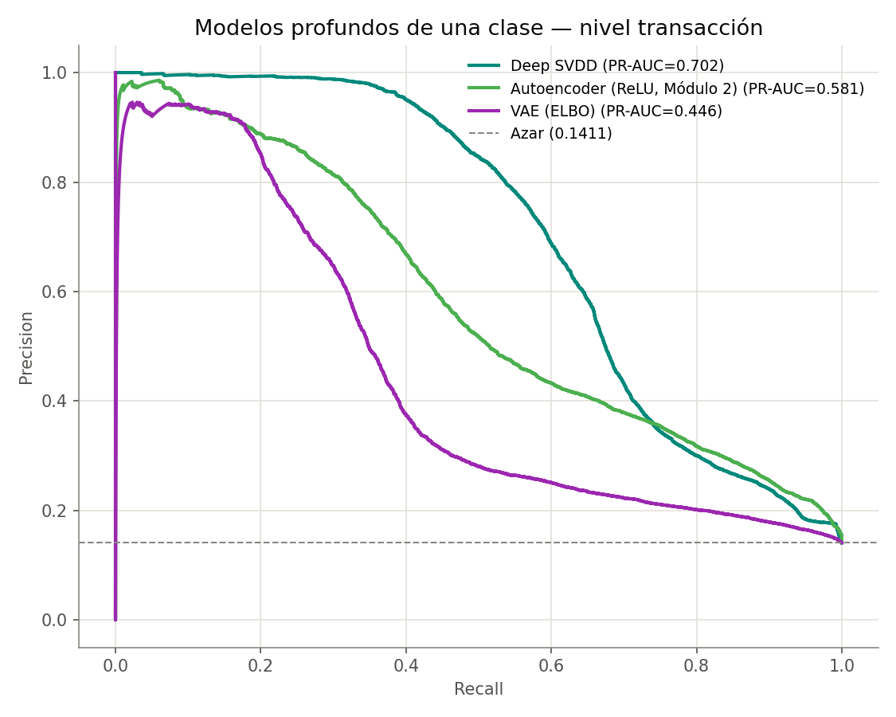

### Estabilidad numérica: el VAE falló con NaN antes de funcionar

Vale documentarlo porque es el tipo de problema que solo aparece con datos reales. Tras el `RobustScaler`, las colas de `errorBalanceDest` llegan a ~1900 y la suma de cuadrados por fila alcanza 3.7e6. Con el término de reconstrucción **sumado** sobre las 15 columnas, la pérdida arranca en millones, los gradientes explotan y los pesos se vuelven `NaN` en la primera época. La primera corrida sobre PaySim murió exactamente así, después de haber pasado sin problemas con datos sintéticos.

Tres decisiones lo corrigen, todas en `src/deep/one_class.py`: el error de reconstrucción se **promedia** sobre las features en vez de sumarse (lo deja en la misma escala que el autoencoder del Módulo 2, que sí converge), la log-varianza se acota a [-10, 10] para que `exp()` no se desborde, y se recorta la norma del gradiente a 5.

### Nivel cuenta: el detector secuencial

Aquí cambia la representación de los datos, no solo el modelo. Se reconstruye la historia ordenada de cada cuenta destino y se puntúa completa con un autoencoder GRU entrenado solo con cuentas limpias. Dos decisiones sobre los datos condicionan todo lo demás:

- **Se agrupa por `nameDest`, no por `nameOrig`.** En PaySim el 99,85% de las cuentas de origen aparece una sola vez y ninguna llega a cinco transacciones: no hay historia que modelar del lado emisor. Las cuentas destino sí acumulan — 280.200 tienen cinco o más transacciones, cubriendo el 56,5% del dataset.
- **Se descartan las cuentas de comercio (`M`).** Las 8.213 transacciones fraudulentas van todas a cuentas `C`. Dejar los comercios adentro le regalaría al modelo la regla "todo `M` es normal" y una métrica inflada que no mide detección de fraude.

La señal que solo existe en la secuencia es `delta_step`: las horas entre transacciones consecutivas hacia la misma cuenta. Es la cadencia, y no se puede calcular fila a fila — el repositorio la estaba descartando al eliminar `nameDest`.

**Resultado: PR-AUC 0.099 contra un azar de 0.087.** En la práctica, no detecta nada.

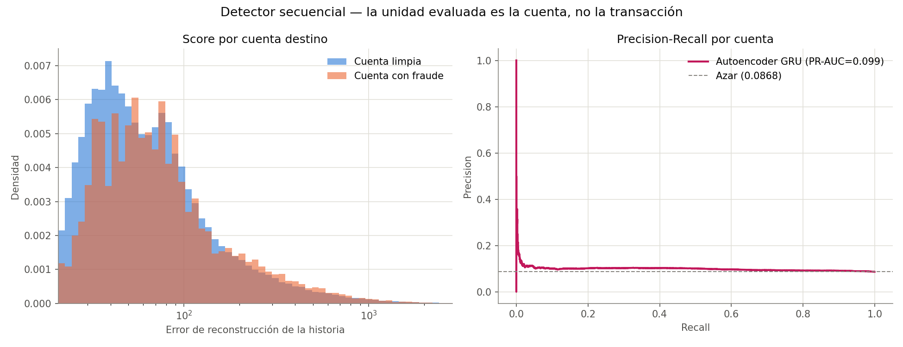

### Por qué ese resultado negativo es del dataset y no del método

Un mal número no significa nada hasta descartar las explicaciones que dependen de decisiones propias. Hay dos, y las dos se miden en código (`src/deep/sequences.py`), no se suponen:

**¿El truncado deja el fraude fuera de la ventana?** Si al quedarme con las 20 transacciones más recientes descartara la transacción fraudulenta, el modelo nunca habría visto lo que debe detectar. `fraud_window_coverage()` responde: **3.451 de 3.838 (89,9%)** quedan dentro, con posición mediana 7 desde el final. No es eso.

**¿La agregación diluye la señal?** Una cuenta puede tener una única transacción anómala entre veinte, y promediar el error sobre toda la secuencia la aplasta. `aggregate_step_errors()` compara cuatro formas de resumir los mismos errores por paso, sobre el mismo modelo entrenado:

| Agregación | PR-AUC | ROC-AUC |
|---|---|---|
| media (la usada) | 0.099 | 0.547 |
| máximo por paso | 0.105 | 0.564 |
| media de los 3 peores | 0.107 | 0.569 |
| último paso | 0.102 | 0.546 |

Todas dentro del ruido, todas apenas por encima del azar. Tampoco es eso.

Descartadas ambas, queda la explicación del dataset: **PaySim inyecta el fraude con una regla fija y elige la cuenta destino sin modelar comportamiento de mula**, así que las historias de cuenta no contienen el patrón temporal que el modelo busca. Es una limitación del simulador, no del enfoque. Sobre transacciones reales de AML —donde las cuentas mula sí tienen una firma de comportamiento— esta es la familia que más aportaría, y la arquitectura queda construida y probada para ese dato.

Las métricas van a **tablas separadas** en `data/processed/metrics.duckdb`: `benchmark_metrics` para nivel transacción, `sequence_metrics` para nivel cuenta. La separación es estructural a propósito, para que un `ORDER BY` descuidado no termine comparando dos problemas distintos.

## Módulo 5: Del ranking a la operación — umbral, dinero y envejecimiento

Los módulos 2 a 4 dejan 13 detectores y un ranking por PR-AUC. Nada de eso es desplegable: en producción no llega un conjunto de prueba para ordenar, llega una transacción y hay que decir *sí* o *no*. Este módulo cubre lo que falta entre "tengo un score" y "tengo un sistema", y empieza corrigiendo una debilidad metodológica de los módulos anteriores.

| | Módulos 2-4 | Módulo 5 |
|---|---|---|
| Split | aleatorio sobre datos con orden cronológico | **temporal**: entrena con el pasado, evalúa con el futuro |
| Prevalencia en prueba | 14,1% (enriquecida) | **0,23%** (la real del período) |
| Qué se mide | PR-AUC, Precision@k | umbral, alertas por día, **pesos** |

El corte cae en `step=323`: 30.000 normales tempranas para ajustar, 30.000 más retenidas para calibrar, y 300.000 transacciones posteriores para evaluar. La prueba **no se enriquece**, porque el módulo calcula umbrales, volúmenes de alerta y dinero: sobre un conjunto enriquecido al 14% esas cantidades no significarían nada.

### Resultados

| Detector | PR-AUC | ROC-AUC | Recall (conteo) | Recall (monto) | Ahorro neto óptimo | FPR real prometiendo 1% |
|---|---|---|---|---|---|---|
| Deep SVDD | **0.368** | 0.917 | 0.387 | 0.810 | 833 M | **0.544** |
| Gaussian Mixture | 0.263 | **0.961** | **0.464** | **0.931** | **944 M** | 0.014 |
| Mahalanobis robusto (MCD) | 0.159 | 0.893 | 0.348 | 0.871 | 912 M | 0.012 |
| kNN (k-ésima distancia) | 0.056 | 0.867 | 0.227 | 0.749 | 854 M | 0.011 |
| VAE (ELBO) | 0.052 | 0.776 | 0.215 | 0.720 | 813 M | 0.012 |
| Autoencoder (ReLU) | 0.046 | 0.883 | 0.199 | 0.710 | 868 M | 0.018 |
| One-Class SVM (Nyström) | 0.022 | 0.853 | 0.230 | 0.744 | 815 M | 0.011 |
| PCA (reconstrucción) | 0.017 | 0.840 | 0.102 | 0.508 | 805 M | 0.020 |
| Isolation Forest | 0.016 | 0.798 | 0.075 | 0.348 | 792 M | 0.019 |
| HBOS | 0.006 | 0.671 | 0.067 | 0.246 | 636 M | 0.015 |
| Local Outlier Factor | 0.005 | 0.767 | 0.000 | 0.000 | 529 M | 0.428 |
| ECOD | 0.005 | 0.649 | 0.025 | 0.147 | 546 M | 0.127 |
| MAD-z (baseline) | 0.002 | 0.391 | 0.003 | 0.019 | 18 M | 0.009 |

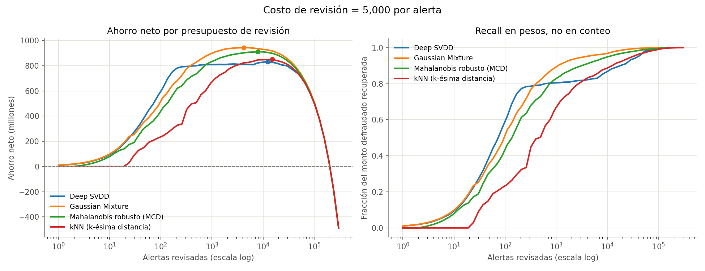

**Lo que dicen los números:**

- **El que mejor rankea no es el que más plata salva.** Deep SVDD lidera el PR-AUC (0.368) pero Gaussian Mixture recupera más dinero (944 M contra 833 M) y atrapa el 93% del monto defraudado contra el 81%. Con el 10% de los fraudes concentrando el 50,2% del monto, ordenar bien por conteo y ordenar bien por pesos son dos cosas distintas. El matiz está en la figura: con presupuestos muy chicos (menos de ~300 alertas) Deep SVDD recupera más dinero, y GMM lo pasa recién a partir de ahí — la respuesta depende de cuánto alcanza a revisar el equipo.
- **PR-AUC y ROC-AUC se contradicen, y no es un error.** Deep SVDD gana en PR-AUC y pierde en ROC-AUC (0.917 contra 0.961). PR-AUC premia la cabeza del ranking; ROC-AUC mira el orden completo. Cuál importa depende de si el equipo revisa las primeras 100 alertas o barre un umbral.
- **Local Outlier Factor colapsa.** Era segundo en el Módulo 3 y acá queda con recall 0 en el punto de operación y ahorro negativo. Su ROC-AUC cae de 0.932 a 0.767: es el único detector que se rompe de verdad al pasar a validación temporal.

### Comparar contra el Módulo 3 sin hacer trampa

Es tentador poner el PR-AUC de esta tabla al lado del Módulo 3 (GMM: 0.807 → 0.263) y anunciar un derrumbe. **Sería incorrecto:** PR-AUC depende de la prevalencia, y acá pasó del 14,1% al 0,23%. Buena parte de esa caída es puramente mecánica.

Lo comparable es el ROC-AUC, que no depende de la prevalencia. Ahí el panorama es otro: la mayoría de los detectores se mantiene o mejora (GMM 0.948 → 0.961, Deep SVDD 0.860 → 0.917, PCA 0.822 → 0.840), y solo dos se degradan de forma marcada — **LOF (0.932 → 0.767) y HBOS (0.800 → 0.671)**. El split aleatorio no inflaba todo por igual: inflaba selectivamente a los detectores basados en densidad local.

### El umbral: lo prometido contra lo cumplido

`quantile_threshold` es la única regla aplicable el día del despliegue: como el ajuste usa solo transacciones normales, el cuantil (1-α) debería dejar fuera una fracción α del tráfico legítimo. **α es la tasa de falsos positivos prometida.**

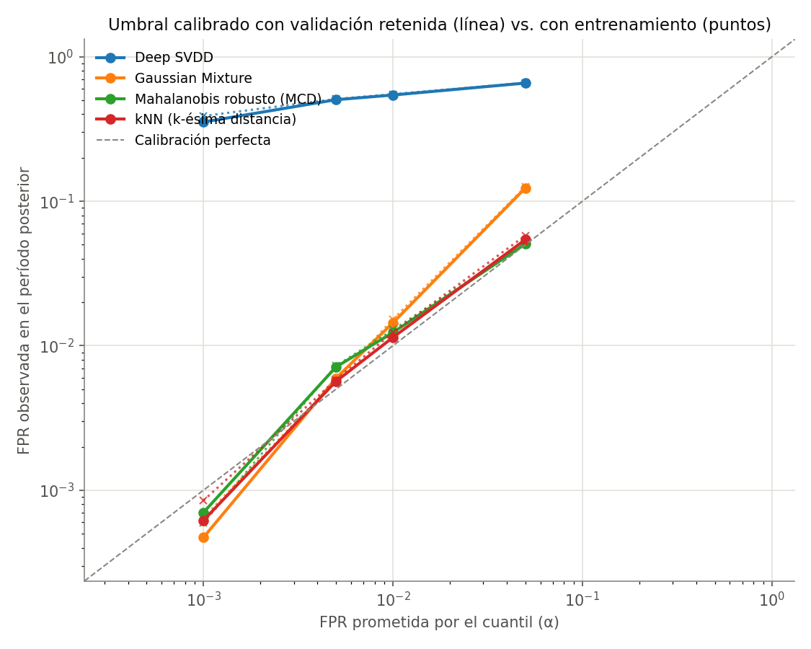

GMM, Mahalanobis y kNN caen sobre la diagonal: prometen 1% y entregan entre 1,1% y 1,4%. **Deep SVDD promete 0,1% y entrega 35%** — tres órdenes de magnitud. El mejor detector por PR-AUC es, tal cual está, indesplegable.

La hipótesis natural es el sobreajuste: Deep SVDD *minimiza explícitamente* la distancia al centro sobre los puntos de entrenamiento, así que sus scores ahí serían optimistas por construcción. Si fuera eso, calibrar sobre las normales retenidas lo arreglaría.

**No lo arregla** — 0.389 desde el entrenamiento contra 0.354 desde el conjunto retenido, prácticamente lo mismo (línea punteada y línea llena superpuestas en la figura). Y esa falta de diferencia es el dato: como ambos conjuntos vienen del período temprano, descarta el sobreajuste y deja una sola explicación en pie, el desplazamiento de la **escala** del score entre el período de ajuste y el de evaluación.

Lo que vuelve interesante al caso es que ese mismo detector tiene el ranking más estable de los cuatro a lo largo del mes. **Estabilidad del orden y estabilidad de la escala son propiedades distintas**, y se puede tener la primera sin la segunda — en cuyo caso ningún umbral fijo aprendido del pasado sirve, y hay que recalibrar contra tráfico reciente.

### Antes de optimizar un umbral, calcular el costo de equilibrio

`break_even_review_cost` devuelve la pérdida esperada por transacción: **3.375** en este período. Si revisar una alerta cuesta menos que eso, el óptimo económico degenera en "revisar absolutamente todo" y el umbral deja de ser una decisión de modelado — el problema pasa a ser de capacidad del equipo, no de economía.

La primera corrida usaba un costo de 1.000, por debajo del equilibrio, y el óptimo de varios detectores salía en 300.000 alertas: revisar el 100% del tráfico. Ese número no medía la calidad del detector, medía el supuesto de costo. El análisis reportado usa 5.000 (1,5x el equilibrio) para que el óptimo sea interior y la curva diga algo.

### ¿El detector envejece?

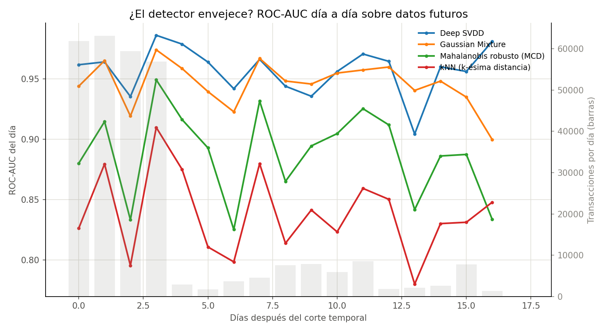

**No, al menos no en 17 días.** El ROC-AUC diario es plano para los cuatro detectores y el orden entre ellos se mantiene.

Llegar a esa respuesta requirió dos correcciones de medición. La primera versión usaba PR-AUC por día y mostraba una mejora espectacular: **PR-AUC de 1.0000 para los cuatro detectores el último día**. Era un artefacto — el volumen diario de PaySim se derrumba de 61.859 transacciones a **23**, y sobre 23 filas con la prevalencia disparada cualquier detector saca métricas perfectas.

Las dos correcciones, ambas necesarias:

- **filtrar los períodos con poco volumen** (`min_samples`), que deja 17 días evaluables de los 18;
- **usar ROC-AUC en vez de PR-AUC**, porque la prevalencia diaria varía y el PR-AUC la sigue: una curva de PR-AUC por día mide el cambio de prevalencia, no la degradación del detector.

## Módulo 6: Métodos nuevos y garantías de cobertura

Tres métodos, elegidos por lo que le faltaba al repositorio y no por acumular nombres. Dos son detectores de familias todavía no representadas; el tercero es la respuesta principiada al problema que dejó abierto el Módulo 5.

| Método | Familia | Qué aporta que no había |
|---|---|---|
| **LODA** | Ensemble de proyecciones aleatorias | Histogramas sobre combinaciones lineales aleatorias: capta dependencias entre columnas, que es justo lo que HBOS no puede |
| **FastABOD** | Geometría angular | Mide la varianza de los ángulos en vez de distancias, que es lo que se degrada en dimensión alta |
| **Detección conforme** | Calibración con garantía | Convierte el score de *cualquier* detector en un p-valor con cota de falsas alarmas en muestra finita |

Los tres están implementados desde cero: `src/unsupervised/families.py` para los detectores y `src/conformal/conformal.py` para el envoltorio conforme.

### LODA: un ensemble de detectores deliberadamente malos

Cada miembro proyecta los datos sobre un vector aleatorio **disperso** (~√d entradas no nulas) y estima la densidad de esa proyección unidimensional con un histograma. Ninguno detecta gran cosa por separado; el promedio de cien aproxima la densidad conjunta a coste lineal.

La ventaja sobre HBOS es conceptual: HBOS arma sus histogramas sobre las features originales y por lo tanto asume independencia entre columnas. LODA los arma sobre combinaciones lineales, así que ve dependencias — sin estimar una covarianza ni calcular una sola distancia. Trae además atribución por feature de regalo (`feature_importance`): se compara el score de las proyecciones que usan la feature *j* contra el de las que no, lo que permite explicarle una alerta a un analista sin ningún método externo.

**Resultado: PR-AUC 0.354**, el tercero peor. La razón es visible en el propio diseño: la señal de PaySim está concentrada en unas pocas features construidas a mano (`errorBalanceOrig`, `errorBalanceDest`), y mezclarlas aleatoriamente con las demás la diluye. LODA brilla cuando la señal está repartida; acá está concentrada, y HBOS, que mira cada columna por separado, la encuentra mejor.

### FastABOD: ángulos en vez de distancias

Todos los detectores de distancia del repositorio comparten un problema teórico: en dimensión alta las distancias se concentran y el contraste que necesitan se desvanece. Los ángulos aguantan mejor. La intuición es geométrica — parado en un punto interior a la nube, el resto se ve en todas las direcciones y los ángulos varían mucho; parado en el borde, todo se ve hacia el mismo lado y la varianza se desploma.

La versión exacta es O(n³). Se usa la aproximación del paper, restringida a los *k* vecinos más cercanos, que la baja a O(n·k²) y la vuelve utilizable: **0,11 s de ajuste y 1,8 s para puntuar 58.213 filas**.

**Resultado: PR-AUC 0.682, quinto puesto**, por encima del autoencoder y de kNN, con Precision@100 perfecta. Buen detector en términos absolutos — y sin embargo el hallazgo interesante no es ese.

### Agregar detectores no es lo mismo que agregar cobertura

Los Módulos 3, 4 y 5 nunca encontraron un par de detectores con correlación de Spearman superior a 0.9: cada familia ordenaba las transacciones a su manera. Los dos métodos nuevos producen **tres pares redundantes de golpe**:

| Par | Spearman |
|---|---|
| kNN ↔ **FastABOD** | **0.989** |
| kNN ↔ **LODA** | 0.916 |
| HBOS ↔ **LODA** | 0.910 |

Eso no es un fracaso del análisis, es el análisis funcionando. FastABOD replica a kNN casi punto por punto porque **su motivación no aplica acá**: la concentración de distancias es un fenómeno de dimensión alta, y con 15 features no hay nada que corregir — el detector angular termina ordenando igual que el de distancias. LODA queda a medio camino entre kNN y HBOS por la misma razón que explica su PR-AUC bajo.

La lectura práctica: **desplegar FastABOD junto a kNN duplica el costo sin agregar cobertura.** Es exactamente la pregunta que la matriz de correlación del Módulo 3 se construyó para responder, y esta es la primera vez que dispara.


### Detección conforme: convertir una esperanza en una garantía

El Módulo 5 dejó un problema sin resolver. El umbral por cuantil *estima* que una fracción α del tráfico legítimo superará el corte, y sobre PaySim esa estimación falla por dos órdenes de magnitud. La detección conforme cambia la estimación por una garantía en muestra finita. En vez de comparar el score contra un cuantil, lo compara contra un conjunto de calibración:

```
p(x) = (1 + #{scores de calibración >= score de x}) / (n_calibración + 1)
```

El +1 arriba y abajo no es cosmético: es lo que hace válida la cota sin supuestos asintóticos. Si la calibración y el punto nuevo son **intercambiables**, entonces para una transacción legítima `P(p(x) <= α) <= α`, sin suponer nada sobre la distribución ni sobre el detector. Envuelve a cualquiera de los 15.

`run_conformal.py` aísla el supuesto con dos escenarios que comparten detector, ajuste y calibración, y difieren solo en de dónde salen las transacciones evaluadas: uno donde la intercambiabilidad se cumple por construcción, y otro donde la evaluación pasa al período posterior.

**El resultado, en una línea: la calibración conforme arregla el umbral cuando la intercambiabilidad se cumple, y se rompe igual que el cuantil cuando no.**

Razón entre la tasa de falsas alarmas observada y la garantizada (1.0 = la garantía se cumple exactamente; el ruido muestral la mueve un ~10-20%):

| Detector | α | Mismo período | Período posterior |
|---|---|---|---|
| Gaussian Mixture | 0.001 | 0.73 | 0.34 |
| Gaussian Mixture | 0.010 | 0.85 | 1.37 |
| **Deep SVDD** | 0.001 | **1.07** | **353.6** |
| **Deep SVDD** | 0.010 | 0.93 | 54.2 |
| Mahalanobis robusto | 0.010 | 0.89 | 1.18 |
| LODA | 0.010 | 1.10 | 2.91 |

La fila de Deep SVDD es la que importa. Con calibración y evaluación del **mismo período**, la garantía se cumple con precisión: razón 1.07 donde el umbral por cuantil del Módulo 5 daba 350. O sea que el método de calibración no era el problema — el p-valor conforme lo resuelve limpiamente. Con evaluación en el **período posterior**, la razón vuelve a 353.

Eso confirma por una vía independiente el diagnóstico del Módulo 5: lo que falla no es cómo se calcula el umbral, es que la escala del score de Deep SVDD se desplaza entre períodos. Los demás detectores mantienen razones de un dígito en los dos escenarios.

El aporte de la detección conforme no es entonces eliminar el supuesto, es **volverlo explícito y medible**: se pasa de "ojalá el cuantil siga sirviendo" a "la garantía vale si y solo si hay intercambiabilidad, y acá está exactamente cuánto se pierde cuando no la hay".

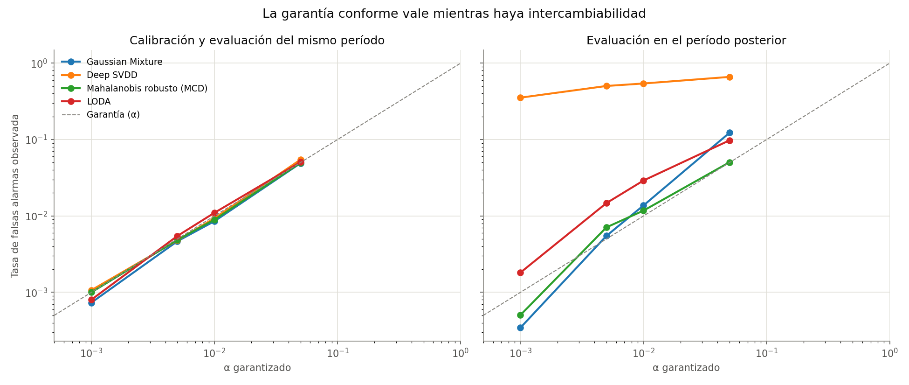

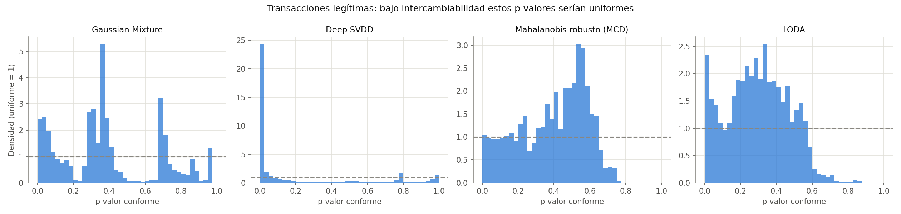

Bajo intercambiabilidad los p-valores de las transacciones legítimas son **uniformes en [0,1]** — ese es el contenido estadístico de la garantía. Cuánto se aparta el histograma de la uniforme mide la deriva **sin necesidad de una sola etiqueta**, que es la propiedad realmente útil en producción: da un monitor de drift gratis.

Ninguno de los cuatro es perfectamente uniforme, así que hay deriva en todos. Lo que separa a Deep SVDD del resto no es la forma global sino la masa acumulada **cerca de cero**: su primer bin concentra una densidad de 24 contra la de 1 que tendría una uniforme, y esa cola izquierda es exactamente la que determina la tasa de falsas alarmas con α chico.

## Módulo 7: Deriva y etiquetas — los dos problemas que quedaron abiertos

Los Módulos 5 y 6 llegaron a la misma conclusión por caminos independientes: **ningún umbral fijo aprendido del pasado sobrevive**. Ninguno propuso qué hacer al respecto.

Y hay un segundo hueco, más grande. El repositorio vive en dos extremos: el Módulo 1 usa las 6,3 millones de etiquetas del dataset, los Módulos 2 a 6 no usan ninguna. El caso real no se parece a ninguno de los dos — un equipo de fraude tiene un puñado de casos confirmados y millones de transacciones sin revisar.

| Método | Qué problema ataca | Implementado en |
|---|---|---|
| **Half-Space Trees** | Un detector que se actualiza solo, sin reentrenar ni etiquetar | `adaptive/hs_trees.py` |
| **Apilado semi-supervisado** | Los 16 detectores como features de un clasificador con pocas etiquetas | `adaptive/stacking.py` |
| **Aprendizaje activo** | La capacidad de revisión produce etiquetas: ¿en qué gastarla? | `adaptive/active.py` |

### Half-Space Trees: adaptarse cuesta una pasada lineal

Los otros dieciséis detectores comparten un supuesto: se ajustan una vez y se usan para siempre. Half-Space Trees (Tan, Ting y Liu, 2011) está diseñado al revés — mantiene un **perfil de masa** de una ventana reciente que se refresca sola.

La idea es astuta y barata: los árboles se construyen **antes de ver un solo dato**. Cada nodo parte el espacio por la mitad en una dimensión al azar, así que la estructura no depende de la muestra; lo único que se aprende es cuántos puntos caen en cada nodo. Actualizar el modelo es recontar —una pasada lineal— en vez de reajustar, y **no necesita una sola etiqueta**.

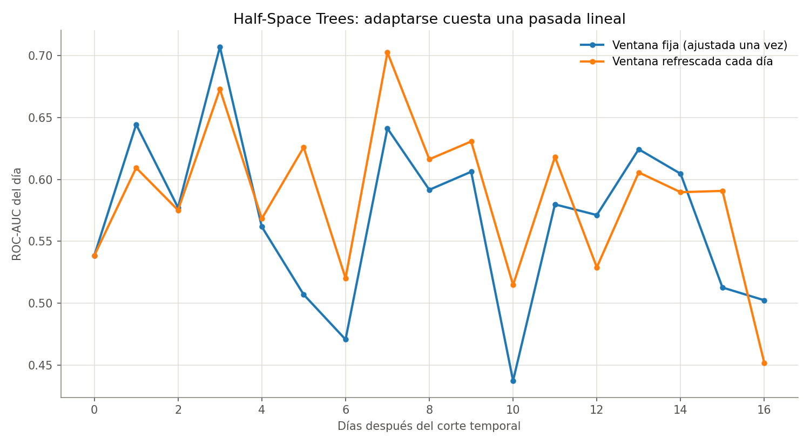

Sobre el split temporal, refrescando la ventana con el tráfico de cada día: **0.586 de ROC-AUC promedio contra 0.569 con ventana fija**. Ayuda, pero poco. Y en términos absolutos es un detector flojo — Gaussian Mixture llega a 0.96 sobre el mismo split, y en el benchmark batch HS-Trees queda 15.º con PR-AUC 0.458.

### Por qué es flojo, y por qué eso explica también a LODA

Mi primera hipótesis fue la misma que rompió al VAE en el Módulo 4: las colas pesadas. HS-Trees normaliza por el min/max de la ventana, y con valores hasta ±1900 el 99% de los datos queda aplastado en una franja mínima.

**La hipótesis resultó falsa.** Sobre datos sintéticos con colas igual de pesadas —87% de las filas dentro del 1% del rango— HS-Trees mantiene ROC-AUC 0.985. La causa es otra, y se aísla con un experimento controlado: fijar la señal en dos features y agregar columnas irrelevantes.

| Dimensiones de ruido | HS-Trees | LODA | Gaussian Mixture |
|---|---|---|---|
| 0 | 1.000 | 1.000 | 1.000 |
| 10 | 0.999 | 0.999 | 1.000 |
| 20 | 0.963 | — | 0.998 |
| 30 | **0.904** | **0.937** | **0.9995** |

**HS-Trees y LODA construyen su estructura al azar, sin mirar los datos**, así que reparten su capacidad entre todas las dimensiones por igual. Si la señal vive en unas pocas features —en PaySim está en `errorBalanceOrig` y `errorBalanceDest`— agregar columnas irrelevantes la diluye. Un modelo que estima la densidad a partir de los datos no se mueve.

Es la misma causa detrás del PR-AUC flojo de LODA en el Módulo 6. Dos módulos, un solo mecanismo, verificado con un experimento en vez de asumido — y hay una prueba unitaria que lo fija (`test_la_estructura_aleatoria_se_diluye_con_features_irrelevantes`).

### Cincuenta etiquetas bien gastadas valen más que mil al azar

La idea de XGBOD (Zhao y Hryniewicki, 2018): usar los scores de los dieciséis detectores como **features adicionales** de un clasificador supervisado. Los detectores ya destilaron la estructura de "lo normal" sin gastar una etiqueta; el clasificador solo tiene que aprender a combinarlos, que es un problema mucho más chico.

Pero antes que el modelo importa cómo se gasta el presupuesto. Etiquetar 50 transacciones al azar sobre una prevalencia del 0,08% da **0,04 fraudes esperados**: nada con qué entrenar. Un equipo real etiqueta la cola de alertas que revisa, y ese sesgo hacia scores altos es lo que vuelve utilizable al conjunto.

| Etiquetas | Fraudes hallados | Solo features | Features + scores |
|---|---|---|---|
| 50 | 10 | 0.153 | **0.220** |
| 100 | 16 | 0.165 | **0.194** |
| 200 | 25 | 0.225 | **0.236** |
| 500 | 51 | **0.502** | 0.445 |
| 1.000 | 65 | 0.458 | **0.715** |
| 5.000 | 91 | 0.712 | **0.935** |

*(PR-AUC sobre el período tardío; referencia sin etiquetas — Gaussian Mixture — 0.263.)*

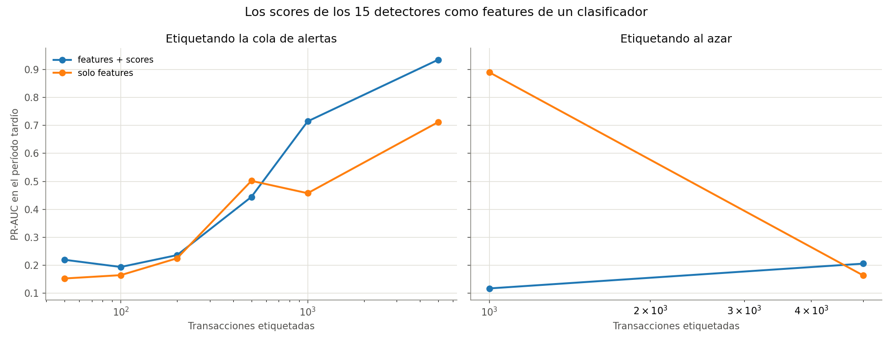

Con **50 transacciones revisadas** el modelo apilado ya casi iguala al detector no supervisado que ordenó esa misma cola. Con 5.000 llega a 0.935, más de **tres veces** la referencia. Los quince detectores de los módulos anteriores valen como features aunque ninguno se despliegue solo.

Etiquetando al azar, en cambio, **no aparece un solo fraude hasta las 500 etiquetas** y no hay clasificador que entrenar. Una advertencia sobre ese bloque: la fila de 1.000 etiquetas al azar con un único positivo marca 0.89 de PR-AUC, y no es un resultado — con un solo ejemplo positivo la varianza es enorme y ese número es ruido.

### Un experimento mal diseñado, y su corrección

La capacidad de revisión produce etiquetas, así que la pregunta operativa cambia: ya no es solo "qué alertas reviso hoy" sino "qué alertas conviene revisar para detectar mejor mañana".

La primera versión de este experimento comparaba tres estrategias: `random`, `top_score` (explotar la cola de alertas) y `uncertainty` (explorar donde el modelo duda). El resultado parecía claro y contraintuitivo — explorar ganaba, y además encontraba el doble de fraude.

**Era un experimento mal diseñado.** `top_score` ordenaba siempre por el score no supervisado, una cola estática, mientras que `uncertainty` consultaba el modelo supervisado que iba mejorando ronda a ronda. La comparación mezclaba dos variables: explotar contra explorar, **y** ranker fijo contra ranker que aprende. La corrección es agregar `top_model`: la misma explotación, ordenando por el modelo que se reentrena.

| Estrategia | PR-AUC con 400 etiquetas | Fraudes hallados |
|---|---|---|
| `random` | — (nunca encuentra un positivo) | **0** |
| `top_score` (cola estática) | 0.641 | 45 |
| `top_model` (cola que aprende) | **0.941** | **97** |
| `uncertainty` (explorar) | **0.959** | 91 |
| `hybrid` (mitad y mitad) | 0.952 | 96 |

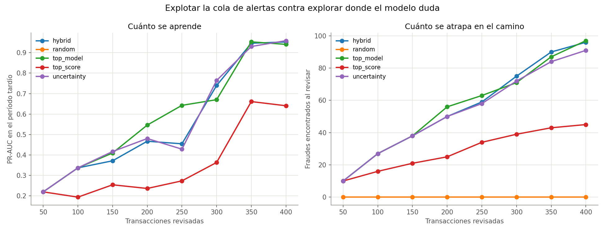

Con la variable aislada, la conclusión se da vuelta:

- **El salto grande está en dejar que la cola aprenda**, no en explorar: 0.641 → 0.941.
- **Explorar agrega poco encima de eso**: 0.959 contra 0.941, una diferencia dentro del ruido de una sola semilla.
- Y **casi no hay tensión entre explorar y explotar** en este dataset: `top_model` encuentra *más* fraude que `uncertainty` (97 contra 91) mientras aprende prácticamente lo mismo.

Sin la estrategia de control habría publicado "explorar le gana a explotar", que es falso.

## Los 16 detectores de un vistazo

Todos entrenados solo con transacciones normales, todos con la convención `fit` / `score_samples` de scikit-learn (más bajo = más anómalo), todos comparables entre sí sobre el mismo split del Módulo 3.

| Detector | Familia | Módulo | PR-AUC | ROC-AUC | Implementado en |
|---|---|---|---|---|---|
| Gaussian Mixture | Densidad paramétrica | 3 | 0.807 | 0.948 | `unsupervised/families.py` |
| Local Outlier Factor | Densidad local | 2 | 0.802 | 0.932 | `unsupervised/models.py` |
| Deep SVDD | Una clase profunda | 4 | 0.702 | 0.860 | `deep/one_class.py` |
| Mahalanobis robusto (MCD) | Covarianza robusta | 3 | 0.698 | 0.896 | `unsupervised/families.py` |
| FastABOD | Geometría angular | 6 | 0.682 | 0.888 | `unsupervised/families.py` |
| Autoencoder (ReLU/GELU/Swish) | Reconstrucción no lineal | 2 | 0.581 | 0.850 | `unsupervised/autoencoder.py` |
| kNN (k-ésima distancia) | Distancia global | 3 | 0.552 | 0.853 | `unsupervised/families.py` |
| Isolation Forest | Aislamiento | 2 | 0.549 | 0.850 | `unsupervised/models.py` |
| One-Class SVM (Nyström) | Frontera con kernel | 3 | 0.494 | 0.830 | `unsupervised/families.py` |
| PCA (reconstrucción) | Reconstrucción lineal | 3 | 0.487 | 0.822 | `unsupervised/families.py` |
| HBOS | Estadístico por feature | 3 | 0.480 | 0.800 | `unsupervised/families.py` |
| Half-Space Trees | Streaming adaptativo | 7 | 0.458 | 0.788 | `adaptive/hs_trees.py` |
| VAE (ELBO) | Densidad profunda | 4 | 0.446 | 0.731 | `deep/one_class.py` |
| LODA | Proyecciones aleatorias | 6 | 0.354 | 0.776 | `unsupervised/families.py` |
| ECOD | Colas de la CDF empírica | 3 | 0.273 | 0.672 | `unsupervised/families.py` |
| MAD-z | Estadístico por feature | 2 | 0.140 | 0.383 | `unsupervised/models.py` |

Además: tres estrategias de **ensemble** (`unsupervised/ensemble.py`), un **autoencoder GRU por cuenta destino** (`deep/sequences.py`, evaluado sobre cuentas y por lo tanto fuera de esta tabla) y un envoltorio **conforme** aplicable a cualquiera de los dieciséis (`conformal/conformal.py`) y un **clasificador apilado** que los usa a todos como features (`adaptive/stacking.py`).

## Convenciones que hacen comparables a dieciséis detectores

Que un Isolation Forest, un autoencoder de PyTorch, una mezcla de gaussianas y un ensemble de árboles de streaming se puedan poner en la misma tabla no es gratis. Son cuatro decisiones sostenidas a lo largo de todos los módulos:

- **Una sola convención de score.** Todo detector expone `fit` y `score_samples` a la manera de scikit-learn, donde **más bajo = más anómalo**. `anomaly_score()` invierte el signo una vez y de ahí en adelante todo el repositorio habla el mismo idioma. Los modelos de PyTorch se envuelven para respetarla; FastABOD la cumple sin invertir nada, porque su varianza de ángulos ya es baja para lo anómalo.
- **Entrenamiento solo con transacciones normales.** Ningún detector ve una etiqueta de fraude durante el ajuste, ni siquiera de reojo. Es lo que hace legítimo llamarlos "no supervisados" y lo que permite compararlos con los del Módulo 7, que sí usan etiquetas.
- **El mismo split y el mismo escalado para todos.** `RobustScaler` ajustado únicamente sobre el entrenamiento, y semillas fijas en todos lados. Cualquier diferencia entre dos filas de la tabla es del modelo, no de los datos que le tocaron.
- **Cada unidad de análisis en su propia tabla.** El detector secuencial puntúa *cuentas*, no transacciones, y por eso vive en `sequence_metrics` y no en `benchmark_metrics`. La separación es estructural a propósito: un `ORDER BY` descuidado no puede terminar comparando dos problemas distintos.

## Cómo leer las métricas

Este repositorio tropezó con casi todas las trampas de esta lista antes de documentarlas, así que conviene tenerlas a mano:

| Métrica | Qué responde | Cuándo engaña |
|---|---|---|
| **PR-AUC** | Calidad del ranking en la cabeza, donde mira un analista | **Depende de la prevalencia.** No es comparable entre conjuntos con distinta tasa de fraude — el Módulo 5 tiene 0,23% y el Módulo 3, 14,1% |
| **ROC-AUC** | Calidad del orden completo | Se ve optimista con desbalance extremo; útil sobre todo para comparar *entre* prevalencias distintas |
| **Precision@k** | De las k alertas que el equipo revisa, cuántas son fraude | Ignora todo lo que queda fuera de las k |
| **Recall en monto** | Qué fracción del **dinero** defraudado se atrapa | Puede ser alta con recall por conteo bajo, si se atrapan los casos caros |
| **Ahorro neto** | Dinero recuperado menos costo de revisión | Domina el supuesto de costo: por debajo del equilibrio, el óptimo degenera en "revisar todo" |
| **FPR observada vs α** | Si el umbral cumple lo que promete | Medirla sobre el mismo período del ajuste esconde la deriva |
| **p-valor conforme** | Igual que la anterior, pero con cota garantizada | La garantía es **marginal** y **condicional a la intercambiabilidad** |

## Reproducibilidad

Todo el pipeline es determinista: semillas fijas en cada `random_state`, `torch.manual_seed` en los modelos de PyTorch, y los mismos splits reconstruidos a partir de la misma semilla. Reejecutar cualquier módulo reproduce los PR-AUC reportados hasta el cuarto decimal; solo los tiempos de ajuste varían entre corridas.

```bash
python -m src.data.loader                    # descarga PaySim (requiere credenciales de Kaggle)
python -m src.models.train                   # Módulo 1
python -m src.unsupervised.train_unsupervised  # Módulo 2
python -m src.unsupervised.benchmark         # Módulo 3 (+ VAE y Deep SVDD del Módulo 4)
python -m src.deep.train_deep                # Módulo 4
python -m src.operations.run_operations      # Módulo 5
python -m src.conformal.run_conformal        # Módulo 6
python -m src.adaptive.run_adaptive          # Módulo 7
pytest tests/                                # 185 pruebas, sin descargar nada
```

Cada módulo arranca cargando y limpiando las 6.362.620 filas del CSV (493 MB), que es lo que domina el tiempo de arranque; el ajuste y el scoring de los detectores están cronometrados por separado en la tabla del Módulo 3. Las pruebas unitarias corren en segundos porque usan datos sintéticos y no tocan el dataset.

## Limitaciones conocidas

- **PaySim es sintético.** El fraude se inyecta con una regla fija, lo que explica el resultado nulo del detector secuencial: el simulador no modela comportamiento de cuenta mula. Los números de este repositorio miden algoritmos sobre un simulador, no rendimiento esperado en producción.
- **Los Módulos 2 a 4 usan un conjunto de prueba enriquecido al 14,1%** para tener suficientes anomalías con las que medir Precision@k con estabilidad. Sus PR-AUC no son trasladables a la prevalencia real. El Módulo 5 corrige eso con prevalencia natural, y por eso sus números son mucho más bajos.
- **Las features son linealmente dependientes por construcción**: las dummies de `type_*` suman 1 y los `errorBalance*` son combinaciones exactas de montos y saldos. Mahalanobis lo resuelve con pseudo-inversa, pero es la causa de la advertencia de rango incompleto que emite scikit-learn.
- **El costo de revisión es un supuesto de negocio**, no un dato. Se reporta el costo de equilibrio (3.375 por alerta) para que se pueda juzgar cuánto del resultado depende de esa elección.
- **El Módulo 1 supervisado no se re-ejecutó** en la sesión que produjo estos números; sus métricas no se reportan.
- **La degradación temporal se midió sobre 17 días.** No dice nada sobre horizontes más largos, y el volumen de PaySim se derrumba justo al final del mes, lo que deja los últimos días sin muestra suficiente para evaluar.

## Errores de método encontrados y corregidos

Esta sección existe porque los errores de medición **se parecen mucho a los buenos resultados**, y varios de los de esta lista llegaron a producir un número que daba ganas de publicar. Cada uno se detectó revisando la propia salida, no un test que fallara.

| Error | Cómo se veía | Cómo se detectó | Corrección |
|---|---|---|---|
| Split aleatorio sobre datos con orden cronológico (Módulos 2-4) | Métricas más altas de lo que darían en producción | Al preguntarse qué pasa si el modelo se evalúa hacia adelante | Split temporal en el Módulo 5 |
| PR-AUC diario "mejorando" hasta 1.0000 | Los cuatro detectores perfectos el último día | El último día tenía **23 transacciones** | Filtro de volumen mínimo + ROC-AUC, que no sigue la prevalencia |
| Costo de revisión por debajo del equilibrio | Óptimos de 300.000 alertas: revisar todo | Calcular el costo de equilibrio (3.375) y compararlo con el supuesto (1.000) | Costo por encima del equilibrio, y el equilibrio reportado |
| Comparar PR-AUC del Módulo 3 contra el 5 | Un derrumbe de 0.807 a 0.263 | PR-AUC depende de la prevalencia, que pasó de 14,1% a 0,23% | Comparar con ROC-AUC y con el orden de los detectores |
| VAE con pérdida sumada sobre 15 features | `NaN` en la primera época sobre datos reales | Medir la escala real tras `RobustScaler`: suma de cuadrados de 3,7e6 | Promediar en vez de sumar, acotar log-varianza, recortar gradiente |
| Aprendizaje activo con dos variables confundidas | "Explorar le gana a explotar", y encuentra el doble de fraude | La cola estática y la que aprende no eran comparables | Estrategia de control `top_model`; la conclusión se invirtió |
| Tolerancia de un test fijada a ojo | Fallaba con α=0.001 sin que el código estuviera mal | El error binomial a n=50.000 es ±0.00014 | Tolerancia derivada del ruido de muestreo |
| Generador de datos que movía dos cosas a la vez | Un test de dilución que no reproducía el efecto medido | El ruido consumía el generador y desplazaba también la señal | Generadores separados para señal y ruido |

Dos hipótesis propias quedaron **refutadas por los datos** y se documentan como tales, porque un arreglo que no funciona informa tanto como uno que sí:

- *"El umbral de Deep SVDD falla por sobreajuste; calibrar sobre datos retenidos lo arregla."* No lo arregla — 0.389 contra 0.354. Eso descartó el sobreajuste y localizó la causa en la deriva temporal de la escala.
- *"El detector secuencial falla porque promediar diluye la única transacción anómala."* Las cuatro formas de agregar dan lo mismo (0.099-0.107). El problema es que PaySim no modela comportamiento de cuenta mula.

## Qué haría distinto con datos reales

Las limitaciones de arriba no son excusas: cada una sugiere un cambio concreto, y varias están medio construidas en el repositorio.

- **El detector secuencial es el que más ganaría.** Está construido y probado, y su resultado nulo es atribuible al simulador, que elige destinos de fraude sin modelar comportamiento de cuenta mula. Sobre transacciones reales de AML —donde la mula sí tiene una firma de comportamiento— es la familia con más para aportar, y no habría que escribir código nuevo.
- **Recalibración continua en vez de umbral fijo.** El Módulo 6 mostró que la garantía conforme vale mientras haya intercambiabilidad, y el 7 que refrescar una ventana cuesta una pasada lineal. Juntar las dos cosas —recalibrar el conjunto conforme con tráfico reciente— es la pieza que falta, y es directa con lo que ya está.
- **El histograma de p-valores como monitor de producción.** Es lo más barato de todo el repositorio: no necesita etiquetas, y las etiquetas de fraude llegan con semanas de retraso o no llegan. Detectar que la distribución se corrió no debería esperar a la confirmación de un caso.
- **Features de red, no solo de transacción.** PaySim da un grafo de transferencias que ningún módulo usa como tal. Las señales de AML que más pesan —ciclos, dispersión en abanico, cuentas puente— son estructurales y ninguno de los dieciséis detectores puede verlas mirando filas.
- **Un presupuesto de etiquetado explícito desde el día uno.** El Módulo 7 muestra que 50 etiquetas bien gastadas ya rinden. Eso vuelve razonable planificar la capacidad de revisión como parte del diseño del sistema, y no como una restricción que aparece después.

## Stack técnico

- **pandas / numpy** — manipulación y análisis de datos
- **scikit-learn** — pipelines de preprocesamiento y modelos base
- **xgboost** — modelo de gradient boosting para clasificación de fraude
- **imbalanced-learn** — técnicas de resampling (SMOTE, undersampling) para el desbalance de clases
- **matplotlib / seaborn** — visualización exploratoria
- **pytorch** — Autoencoder para detección de anomalías por error de reconstrucción
- **scipy** — correlación de Spearman y rangos para los ensembles de detectores
- **duckdb** — persistencia local de métricas comparativas entre corridas
- **pytest** — pruebas unitarias
- **kagglehub** — descarga programática del dataset desde Kaggle

## Licencia

MIT — ver [LICENSE](LICENSE).

## Autor

**Pablo Reyes** — [github.com/Rxyxs](https://github.com/Rxyxs)
