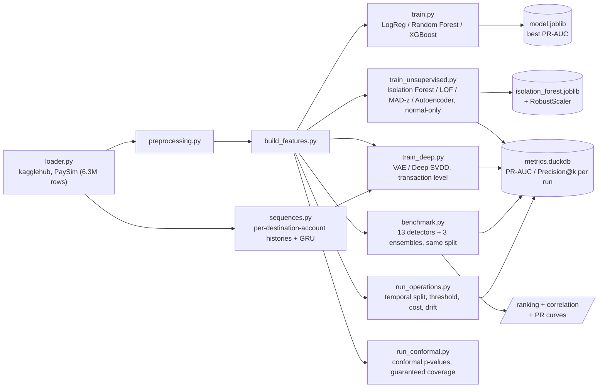

[ 🇺🇸 English ] | [ 🇨🇱 [Leer en Español](README.es.md) ]

# Bank Anomaly Detection


Fraud and anomaly detection system for mobile banking transactions, built on the synthetic **PaySim** dataset ([`ealaxi/paysim1`](https://www.kaggle.com/datasets/ealaxi/paysim1) on Kaggle), which simulates financial transactions based on a month of data from a real mobile money service in Africa.

## Summary: what was learned

Six modules, 15 transaction-level detectors, one account-level detector and three ensembles, all measured on the full PaySim dataset. The findings that survived verification:

| Finding | Where |
|---|---|
| The simplest statistical baseline isn't weak, it's **anti-informative**: ROC-AUC 0.383, below chance. Looking at each column separately fails when fraud drains balances without producing individually extreme values. | [Module 3](#module-3-detector-family-benchmark-unsupervised) |
| **The ensembles don't win.** Averaging 15 detectors when most are mediocre drags the good ones down. They help at the head of the ranking, where consensus is perfect. | [Module 3](#results) |
| **The objective matters more than the depth.** Deep SVDD beats the autoencoder by +0.12 PR-AUC on identical architecture and data; only what it optimizes changes. | [Module 4](#transaction-level-the-objective-matters-more-than-the-depth) |
| The sequential detector **finds no signal**, and two diagnostics rule out the method as the cause: it's PaySim, which picks fraud destinations without modeling mule behavior. | [Module 4](#why-that-negative-result-belongs-to-the-dataset-not-the-method) |
| **The best ranker is not the best money saver.** With 10% of frauds carrying half the amount, counting cases and counting money rank differently. | [Module 5](#results-1) |
| The best detector by PR-AUC is **undeployable**: it promises 0.1% false alarms and delivers 35%. Ranking stability and scale stability are separate properties. | [Module 5](#the-threshold-promised-versus-delivered) |
| The **conformal guarantee** fixes the threshold under exchangeability and breaks exactly like the quantile when exchangeability fails. Its contribution is making the assumption explicit, not removing it. | [Module 6](#module-6-new-methods-and-coverage-guarantees) |
| Adding methods **doesn't always add coverage**: the two new detectors produce the repository's first redundant pairs (ρ up to 0.99). | [Module 6](#adding-detectors-is-not-the-same-as-adding-coverage) |

Two methodological corrections surfaced along the way and are documented: a random split over chronologically ordered data (fixed in Module 5) and a daily PR-AUC that showed a spectacular improvement over 23 transactions (fixed with a volume filter and by switching to ROC-AUC).

## Module map

| Module | Question it answers | Entry point | Notebook |
|---|---|---|---|
| **1 — Supervised** | Can already-labeled fraud be classified? | `src/models/train.py` | — |
| **2 — Unsupervised** | What if the fraud is new and there are no labels? | `src/unsupervised/train_unsupervised.py` | [02](notebooks/02_unsupervised_anomaly_detection.ipynb) |
| **3 — Benchmark** | Which detection families are complementary, and what does each cost? | `src/unsupervised/benchmark.py` | [03](notebooks/03_benchmark_familias_anomalias.ipynb) |
| **4 — Deep and sequential** | Is the margin in the depth or in the objective? What if we look at the account's history? | `src/deep/train_deep.py` | [04](notebooks/04_modelos_profundos_y_secuencias.ipynb) |
| **5 — Operations** | Where do I cut the score, how much money does it save, and will it still work next month? | `src/operations/run_operations.py` | [05](notebooks/05_umbral_costo_y_drift.ipynb) |
| **6 — Guarantees** | Can the false-alarm rate be *guaranteed* rather than estimated? | `src/conformal/run_conformal.py` | [06](notebooks/06_metodos_nuevos_y_conformal.ipynb) |

## Honest note on validation

The numbers in this README **come from an actual run** of the pipeline on the full PaySim dataset (6,362,620 rows downloaded via `kagglehub`), not from estimates: `python -m src.unsupervised.train_unsupervised` for Module 2, `python -m src.unsupervised.benchmark` for Module 3, `python -m src.deep.train_deep` for Module 4, `python -m src.operations.run_operations` for Module 5, and `python -m src.conformal.run_conformal` for Module 6, plus **150/150 unit tests passing** (`pytest tests/`, on synthetic data, no download needed). Fit and scoring times were measured on that same machine (Windows 10, CPU) and are meant for comparing detectors *against each other*, not as an absolute hardware reference.

Two caveats you need in order to read the metrics correctly:

- **The test set is deliberately enriched.** It holds 50,000 normal transactions plus *all* 8,213 available fraudulent ones — 14.1% fraud, against PaySim's real ~0.13%. That's the only way to have enough anomalies to measure Precision@k stably, but it means these PR-AUC values **do not transfer** to production prevalence: in the real world the same model would be substantially less precise. Module 5 measures exactly that: temporal split at the real 0.23% prevalence.
- **Module 1 (supervised) was not re-run in this session.** Its metrics aren't reported as numbers here; anyone who clones the repo can generate them with `python -m src.models.train`.

## Goal

Identify fraudulent transactions within a highly imbalanced dataset (the `isFraud` class represents a tiny fraction of all transactions), evaluating different supervised modeling approaches and class-balancing techniques to maximize fraud detection while minimizing false positives.

## Project Architecture



The project follows a modular architecture that clearly separates data ingestion, preprocessing, feature engineering, and modeling, favoring reproducibility and code testability:

```
bank-anomaly-detection/
├── data/
│   ├── raw/              # Original data downloaded from Kaggle (not tracked)
│   └── processed/        # Transformed data ready for modeling (not tracked)
├── notebooks/
│   ├── 01_eda_paysim.ipynb                     # Exploratory analysis of the PaySim dataset
│   ├── 02_unsupervised_anomaly_detection.ipynb # Module 2: zero-day fraud detection
│   ├── 03_benchmark_familias_anomalias.ipynb   # Module 3: detector-family benchmark + ensembles
│   ├── 04_modelos_profundos_y_secuencias.ipynb # Module 4: VAE, Deep SVDD and sequential detector
│   ├── 05_umbral_costo_y_drift.ipynb           # Module 5: threshold, money, temporal validation
│   └── 06_metodos_nuevos_y_conformal.ipynb     # Module 6: LODA, FastABOD and conformal detection
├── src/
│   ├── data/
│   │   ├── loader.py           # Download (kagglehub) and load the PaySim dataset
│   │   └── preprocessing.py    # Cleaning and transformation of raw data
│   ├── features/
│   │   └── build_features.py   # Feature engineering for the model
│   ├── models/
│   │   ├── train.py            # Training, comparison, and model selection
│   │   ├── visualize.py        # Comparative ROC/PR curves and confusion matrices
│   │   └── predict.py          # Inference on new data
│   ├── unsupervised/            # Modules 2 and 3: unsupervised anomaly detection
│   │   ├── loader.py            # Training data (normal-only) and test data (mixed)
│   │   ├── models.py            # Isolation Forest, LOF, MAD-z statistical baseline
│   │   ├── autoencoder.py       # PyTorch Autoencoder (ReLU/GELU/Swish activations)
│   │   ├── families.py          # Module 3: PCA, GMM, Mahalanobis (MCD), kNN, OC-SVM, HBOS, ECOD
│   │   ├── ensemble.py          # Module 3: score combination (ranks, z, z-max)
│   │   ├── benchmark.py         # Module 3: all 11 families compared on the same split
│   │   ├── metrics_store.py     # Comparative metrics persistence (DuckDB)
│   │   ├── style.py             # Shared figure palette and styling
│   │   └── train_unsupervised.py  # Training, evaluation (Precision@k), and plots
│   ├── deep/                    # Module 4: deep models and sequential detection
│   │   ├── one_class.py         # VAE (ELBO) and Deep SVDD, transaction level
│   │   ├── sequences.py         # Per-destination-account histories + GRU autoencoder
│   │   └── train_deep.py        # Module 4 training, diagnostics, and plots
│   ├── operations/              # Module 5: from score to operational decision
│   │   ├── temporal.py          # Temporal split, per-period evaluation, drift
│   │   ├── thresholds.py        # Quantile, capacity, and cost-optimal thresholds
│   │   ├── costs.py             # Money metrics and break-even review cost
│   │   └── run_operations.py    # Full Module 5 run and its plots
│   ├── conformal/               # Module 6: p-values with a coverage guarantee
│   │   ├── conformal.py         # Conformal p-values, threshold, coverage report
│   │   └── run_conformal.py     # Exchangeability-versus-drift experiment
│   └── utils/                  # Shared helper functions
├── tests/                 # Unit tests (pytest): preprocessing, features, MAD baseline,
│                           # autoencoder, metrics store, families, ensembles,
│                           # deep models, sequences, thresholds, costs, temporal,
│                           # conformal detection
├── requirements.txt
├── LICENSE
├── README.md
└── README.es.md
```

Every module under `src/` exposes pure, documented functions meant to be imported both from notebooks (exploration) and scripts (production pipeline), avoiding duplicated logic between the two contexts.

## Dataset

**PaySim** is a mobile financial-transaction simulator based on aggregated data from a real mobile money service provider, extended to include injected fraudulent behavior. It includes transaction types like `CASH-IN`, `CASH-OUT`, `DEBIT`, `PAYMENT`, and `TRANSFER`, along with origin and destination balances before and after each operation.

The `isFraud` target column indicates whether a transaction was fraudulent, while `isFlaggedFraud` marks illegitimate mass transfers flagged by the simulated business rules.

## Installation

```bash
python3 -m venv .venv
source .venv/bin/activate      # On Windows: .venv\Scripts\activate
pip install -r requirements.txt
```

## Usage

Download and initial load of the dataset:

```bash
python -m src.data.loader
```

This downloads the dataset from Kaggle via `kagglehub` (requires configured Kaggle credentials), copies it to `data/raw/paysim.csv`, and prints a summary of dimensions, first rows, and the percentage distribution of the `isFraud` class.

Model training and comparison:

```bash
python -m src.models.train
```

Runs the full pipeline (load → cleaning → features → split) and trains three candidate models (Logistic Regression, Random Forest, and XGBoost), each with imbalanced-class handling (`class_weight="balanced"` / `scale_pos_weight`). Prints a `classification_report`, confusion matrix, ROC-AUC, and PR-AUC per model, saves the one with the best PR-AUC (the most informative metric for fraud, given the extreme class imbalance) to `data/processed/model.joblib`, and generates comparative ROC/Precision-Recall curves and confusion matrices in `data/processed/figures/`.

Unit tests:

```bash
pytest tests/
```

Unsupervised anomaly detection (Module 2):

```bash
python -m src.unsupervised.train_unsupervised
```

Comparative benchmark of detector families (Module 3):

```bash
python -m src.unsupervised.benchmark
```

Trains all 15 detectors on the same split and scaling, builds the three ensembles on top of their scores, prints the comparison table with metrics and timings, reports which detector pairs are redundant, and saves the ranking, PR curves, and correlation matrix to `data/processed/figures/`, plus one row per detector in the `benchmark_metrics` table of `data/processed/metrics.duckdb`.

Deep models and sequential detector (Module 4):

```bash
python -m src.deep.train_deep
```

Trains the VAE and Deep SVDD on the same split as Module 3, plus the GRU autoencoder over destination-account histories. Prints the truncation coverage and the per-step error aggregation comparison — the two diagnostics that make the sequential detector's result interpretable — and saves metrics to tables separated by unit of analysis.

Operations: threshold, cost, and temporal validation (Module 5):

```bash
python -m src.operations.run_operations
```

Retrains all 13 detectors on a **temporal** split at real prevalence, computes the break-even review cost, compares the PR-AUC ranking against the money-saved ranking, measures how far the actual false-positive rate strays from the one the threshold promised, and evaluates day-by-day degradation while filtering out periods without enough volume.

New methods and coverage guarantees (Module 6):

```bash
python -m src.conformal.run_conformal
```

Wraps the detectors in a conformal calibrator and compares the observed false-alarm rate against the guaranteed one in two scenarios: one where exchangeability holds by construction and one where evaluation moves to the later period. LODA and FastABOD join Module 3's benchmark, which grows from 13 to 15 detectors.

## Module 2: Unknown / zero-day fraud detection (unsupervised)

Module 1 trains on already-labeled fraud, so it can only recognize patterns similar to fraud that already happened before. Module 2 covers the complementary case: a genuinely new ("zero-day") fraud scheme doesn't resemble anything seen during training, and a supervised model has no reason to catch it. The approach here is to learn only the shape of normal behavior and flag anything that deviates from it as anomalous, without using a single fraud label during fitting.

**Data**: instead of downloading `mlg-ulb/creditcardfraud` via `kagglehub` (which would require additional Kaggle credentials not configured in this environment), `src/unsupervised/loader.py` reuses the PaySim data already present in `data/raw/paysim.csv` — the same `clean_data`/`build_features` functions from Module 1 — and splits it into:
- **Train**: a sample of normal transactions (`isFraud == 0`); the model never sees a fraud case while fitting.
- **Test**: a sample of normals + *all* available fraudulent transactions, to have enough real anomalies to measure performance against.

The training sample size is deliberately kept bounded (30k rows): Local Outlier Factor in *novelty* mode needs to build a neighbor index and query it for every prediction, which doesn't scale to the full dataset's 6.3M rows.

**Models** (`src/unsupervised/models.py`, `src/unsupervised/autoencoder.py`):
- **Isolation Forest** (`sklearn.ensemble.IsolationForest`) — isolates points via random partitions; anomalies require fewer partitions to become isolated.
- **Local Outlier Factor** (`sklearn.neighbors.LocalOutlierFactor`, `novelty=True`) — compares a point's local density against its nearest neighbors' density.
- **MAD-z statistical baseline** (`MADBaseline`) — a non-iterative baseline: memorizes the median and Median Absolute Deviation (MAD) per feature at fit time, then scores each row by the maximum robust z-score across its features. Robust to the heavy-tailed distribution of amounts/balances, unlike a plain mean/std z-score.
- **Autoencoder** (`src/unsupervised/autoencoder.py`, PyTorch) — a symmetric fully-connected encoder/decoder with a central bottleneck, trained only on normal transactions to minimize reconstruction MSE; the anomaly score is the reconstruction error itself (`reconstruction_error()`), higher = more anomalous. Trained and compared with three activation functions on the same architecture — **ReLU**, **GELU**, and **Swish** (`nn.SiLU`) — to illustrate their effect on reconstruction quality on this tabular dataset.

All four families expose a homogeneous continuous **Anomaly Score** (higher values = more anomalous), over features scaled with `RobustScaler` (fit on training data only) due to the strong skew of amounts and balances.

**Evaluation** (`src/unsupervised/train_unsupervised.py`): PR-AUC and Precision@k/Recall@k (k = 50, 100, 200 — "of the k most anomalous flagged transactions, how many are real fraud?", the question that matters to an analyst with limited review capacity). Generates `data/processed/figures/unsupervised_scores.png` (Anomaly Score distribution by class, Isolation Forest / LOF / MAD baseline), `data/processed/figures/unsupervised_pr_curve.png` (comparative Precision-Recall curve across all models), and `data/processed/figures/autoencoder_activations.png` (PR-AUC by activation function). Serializes Isolation Forest along with its `RobustScaler` to `data/processed/isolation_forest.joblib`, and persists PR-AUC/Precision@k/Recall@k per model and per run to a local DuckDB file (`data/processed/metrics.duckdb`, via `src/unsupervised/metrics_store.py`) for cross-run comparison.

### Model comparison (Module 2)

| Model | Type | Anomaly score | Notes |
|---|---|---|---|
| Isolation Forest | Ensemble, tree-based | `-score_samples` | Handles non-linear boundaries well, fast to train |
| Local Outlier Factor | Density-based (novelty mode) | `-score_samples` | Sensitive to local density variation |
| MAD-z baseline | Statistical, non-iterative | max robust z-score | No hyperparameters, fast, interpretable per-feature |
| Autoencoder (ReLU / GELU / Swish) | Deep learning (PyTorch) | Reconstruction MSE | Captures non-linear feature interactions; activation choice affects reconstruction quality |

### Measured results (Module 2)

| Model | PR-AUC | Precision@50 | Precision@100 | Precision@200 |
|---|---|---|---|---|
| Local Outlier Factor | **0.802** | 1.000 | 1.000 | 1.000 |
| Autoencoder (ReLU) | 0.581 | 0.960 | 0.970 | 0.975 |
| Autoencoder (Swish) | 0.574 | 0.980 | 0.990 | 0.995 |
| Autoencoder (GELU) | 0.573 | 1.000 | 1.000 | 1.000 |
| Isolation Forest | 0.549 | 0.440 | 0.550 | 0.640 |
| MAD-z baseline | 0.140 | 0.240 | 0.140 | 0.100 |

Local Outlier Factor clearly dominates with this feature set. The autoencoder's three activations land within 0.01 PR-AUC of each other (0.581 / 0.574 / 0.573): on 15-column tabular data, the choice of activation is marginal next to the choice of detector family — a point Module 3 develops.

PR-AUC, Precision@k, and Recall@k for each model/run are persisted to `data/processed/metrics.duckdb` (query it with `duckdb.connect(...)` or `src.unsupervised.metrics_store.load_latest_metrics()`).


## Module 3: Detector-family benchmark (unsupervised)

Module 2 covers three approaches plus the autoencoder. Module 3 completes the map: it adds the missing families (`src/unsupervised/families.py`), compares all of them on the same split with the same scaling (`src/unsupervised/benchmark.py`), and tests whether combining them helps at all (`src/unsupervised/ensemble.py`).

The point isn't to pile up models. Without labels you can't pick the best detector *before* deploying it, so the actionable questions are two others: **which families are genuinely complementary** (if two rank transactions almost identically, keeping both adds nothing) and **what each point of PR-AUC costs** (in production scoring runs per transaction and fitting runs once a day, so a detector that's slow to fit but fast to score is perfectly viable — and the reverse is not).

### The seven families added in this module

| Detector | Family | What it detects well |
|---|---|---|
| **PCA (reconstruction)** | Linear reconstruction | Rows outside the principal subspace — the autoencoder's **ablation** |
| **Gaussian Mixture** | Parametric density | Low-probability gaps between modes of the distribution |
| **Robust Mahalanobis (MCD)** | Robust covariance | Broken correlations between features, invisible column by column |
| **kNN (k-th distance)** | Global distance | Points far from any dense neighborhood |
| **One-Class SVM (Nyström)** | Kernel boundary | Rows outside the learned envelope of normal behavior |
| **HBOS** | Per-feature histograms | Rare values in individual columns; score decomposes per feature |
| **ECOD** | Empirical CDF tails | Extreme tails, without a single hyperparameter to tune |

`HBOS` and `ECOD` are implemented from scratch (linear cost, no extra dependency); the rest build on scikit-learn. The exact `OneClassSVM` is O(n²)–O(n³) and doesn't finish on a 30k-row set, so this uses the Nyström kernel approximation + `SGDOneClassSVM`, which solves the same problem in linear time.

The three **ensembles** address the fact that these scores live on incompatible scales (a Mahalanobis distance can't be averaged with a log-likelihood): rank average, standardized-score average, and standardized-score maximum.

### Results

| Detector | Family | PR-AUC | ROC-AUC | Precision@100 | fit (s) | score (s) |
|---|---|---|---|---|---|---|
| Gaussian Mixture | Parametric density | **0.807** | 0.948 | 0.99 | 5.27 | 0.11 |
| Local Outlier Factor | Local density | 0.802 | 0.932 | **1.00** | 0.65 | 1.12 |
| Deep SVDD | Deep one-class | 0.702 | 0.860 | **1.00** | 7.08 | 0.006 |
| Robust Mahalanobis (MCD) | Robust covariance | 0.698 | 0.896 | 0.94 | 1.24 | 0.008 |
| FastABOD | Angular geometry | 0.682 | 0.888 | **1.00** | 0.11 | 1.81 |
| Ensemble — rank average | Ensemble | 0.628 | 0.873 | **1.00** | — | 0.03 |
| Autoencoder (ReLU) | Non-linear reconstruction | 0.581 | 0.850 | 0.97 | 8.19 | 0.01 |
| kNN (k-th distance) | Global distance | 0.552 | 0.853 | 0.85 | 0.10 | 1.14 |
| Isolation Forest | Isolation | 0.549 | 0.850 | 0.55 | 0.56 | 0.40 |
| One-Class SVM (Nyström) | Kernel boundary | 0.494 | 0.830 | 0.86 | 0.35 | 0.40 |
| PCA (reconstruction) | Linear reconstruction | 0.487 | 0.822 | 0.76 | 0.003 | 0.01 |
| HBOS | Per-feature statistical | 0.480 | 0.800 | 0.59 | 0.006 | 0.02 |
| Ensemble — z average | Ensemble | 0.476 | 0.826 | 0.94 | — | 0.03 |
| Ensemble — z max | Ensemble | 0.462 | 0.851 | 0.80 | — | 0.03 |
| VAE (ELBO) | Deep density | 0.446 | 0.731 | 0.90 | 13.04 | 0.07 |
| LODA | Random projections | 0.354 | 0.776 | 0.36 | 0.05 | 0.18 |
| ECOD | Empirical CDF tails | 0.273 | 0.672 | 0.52 | 0.02 | 0.12 |
| MAD-z (baseline) | Per-feature statistical | 0.140 | 0.383 | 0.14 | 0.01 | 0.007 |


**What the numbers say:**

- **Gaussian Mixture (0.807) and LOF (0.802) tie at the top, but for different reasons.** Their Spearman correlation is only 0.41, and their PR curves cross: LOF dominates between recall 0.4 and 0.8, GMM overtakes it above 0.85. Which one you want depends on the team's review capacity, not on aggregate PR-AUC.
- **The linear ablation justifies the autoencoder, but only just.** The autoencoder (0.581) beats PCA (0.487) — the non-linearity is worth a real ~0.09 of PR-AUC. What those 0.09 cost: 9.6 s of fitting against 0.002 s, plus a PyTorch dependency. Neither one comes close to GMM.
- **The MAD-z baseline isn't just weak, it's anti-informative** (ROC-AUC 0.383, below the 0.5 of random guessing). Looking at each column separately fails here because PaySim fraud is a full drain of the origin balance: every individual value stays inside the observed range, while the heavy tails of legitimate transactions *do* produce extreme z-scores. That is exactly the argument for multivariate methods — and the reason to include Mahalanobis (0.698), which sees the same information but through the full covariance.
- **The ensembles don't win, and that is also a result.** The best of them (rank average, 0.639) lands below GMM and LOF: averaging 15 detectors when most are mediocre drags the two good ones down. An ensemble helps when its members are of comparable quality, not when best and worst differ by 0.67 of PR-AUC. With one operationally relevant exception: **Precision@100 = 1.00** for the rank average — at the head of the ranking the consensus *is* perfect, and that head is exactly where an analyst looks.

### Which detectors are redundant?


Spearman correlation between the anomaly *rankings*. Among the thirteen detectors of Modules 2 to 5, **no pair exceeds 0.9**: each family orders transactions differently and none can be dropped for pure redundancy. The closest pairs are Mahalanobis ↔ kNN (0.88) and Mahalanobis ↔ Autoencoder (0.87); the most complementary, MAD-z ↔ LOF (−0.04) and MAD-z ↔ GMM (−0.42).

That changes with the two detectors Module 6 adds: FastABOD replicates kNN at ρ = 0.99. Details in [Adding detectors is not the same as adding coverage](#adding-detectors-is-not-the-same-as-adding-coverage).


### Computational cost

The linear-cost detectors (HBOS, ECOD, MAD-z, PCA) score all 58,213 test rows in hundredths of a second and hold nothing in memory beyond a few per-feature vectors. The distance-based ones (LOF, kNN) pay ~1.1 s because every prediction queries a neighbor index against the 30,000 training rows — the factor that decides whether they're viable in an online transaction flow. The autoencoder inverts the relationship: slowest to fit (9.6 s) and among the fastest to score (0.01 s), which is the right profile for production.

## Module 4: Deep one-class models and sequential detection

Three models, each born from a specific limitation the Module 3 benchmark exposed — not from the idea of stacking architectures for their own sake.

| Model | Limitation it attacks | Unit evaluated |
|---|---|---|
| **VAE** | The best detector was a density model (GMM); the autoencoder only reconstructs | Transaction |
| **Deep SVDD** | The autoencoder barely beat its linear ablation (0.581 vs 0.487) — is the problem depth or the objective? | Transaction |
| **GRU autoencoder** | All thirteen detectors treat each row as independent; a mule account is anomalous through its *history* | **Destination account** |

The first two share split, scaling, and metrics with Module 3, so they sit in the benchmark table above. The third changes the unit of analysis and is reported separately: comparing a per-account PR-AUC against a per-transaction one would compare two different problems, not two models.

### Transaction level: the objective matters more than the depth

**Deep SVDD (0.702) beats the autoencoder (0.581)** on the same architecture, the same data, and the same scaling. The only thing that changes is what it optimizes: instead of reconstructing the input, it learns a projection that packs normal behavior inside a hypersphere and scores by distance to the center. That +0.12 jump is larger than the one separating the autoencoder from its linear PCA ablation (+0.09) — the margin was in the objective function, not in adding layers. And it comes cheap: 6.6 s to fit and **5 ms** to score all 58,213 test rows, the fastest scorer in the repository. It lands third overall, above Mahalanobis.

Deep SVDD has a silent failure mode: if the network learns to map *every* input to the center, it minimizes the objective perfectly and becomes useless — every point at the same distance, unable to rank anything. It's prevented with **bias-free layers** (the constant solution becomes unreachable) and by pushing the center's components away from the origin. A unit test verifies the score doesn't collapse to zero standard deviation.

**The VAE (0.446) loses to the plain autoencoder** and is the most expensive of the three (14.9 s). Being the deep counterpart of the best classical detector wasn't enough to inherit its advantage: the KL term pushes the latent toward a standard normal, which on heavy-tailed features ends up normalizing exactly the region that needs distinguishing.


### Numerical stability: the VAE produced NaN before it worked

Worth documenting because it's the kind of problem that only shows up on real data. After the `RobustScaler`, the tails of `errorBalanceDest` reach ~1900 and the per-row sum of squares hits 3.7e6. With the reconstruction term **summed** over the 15 columns, the loss starts in the millions, gradients explode, and the weights turn to `NaN` within the first epoch. The first run on PaySim died exactly that way — after passing cleanly on synthetic data.

Three decisions fix it, all in `src/deep/one_class.py`: the reconstruction error is **averaged** over features instead of summed (putting it on the same scale as the Module 2 autoencoder, which does converge), the log-variance is clamped to [-10, 10] so `exp()` can't overflow, and the gradient norm is clipped at 5.

### Account level: the sequential detector

Here the data representation changes, not just the model. Each destination account's ordered history is reconstructed and scored as a whole by a GRU autoencoder trained only on clean accounts. Two decisions about the data drive everything else:

- **Grouping is by `nameDest`, not `nameOrig`.** In PaySim, 99.85% of origin accounts appear exactly once and none reaches five transactions: there's no sender-side history to model. Destination accounts do accumulate — 280,200 have five or more transactions, covering 56.5% of the dataset.
- **Merchant accounts (`M`) are dropped.** All 8,213 fraudulent transactions go to `C` accounts. Leaving merchants in would hand the model the rule "every `M` is normal" and an inflated metric that measures nothing about fraud detection.

The signal that exists only in the sequence is `delta_step`: the hours between consecutive transactions into the same account. That's the cadence, and it can't be computed row by row — the repository was discarding it by dropping `nameDest`.

**Result: PR-AUC 0.099 against a 0.087 baseline.** In practice, it detects nothing.


### Why that negative result belongs to the dataset, not the method

A bad number means nothing until the explanations that depend on your own choices are ruled out. There are two, and both are measured in code (`src/deep/sequences.py`), not assumed:

**Does truncation leave the fraud outside the window?** If keeping only the 20 most recent transactions discarded the fraudulent one, the model would never have seen what it's meant to detect. `fraud_window_coverage()` answers: **3,451 of 3,838 (89.9%)** fall inside, with a median position of 7 from the end. Not that.

**Does the aggregation dilute the signal?** An account may hold a single anomalous transaction among twenty, and averaging the error across the whole sequence flattens it. `aggregate_step_errors()` compares four ways of summarizing the same per-step errors, on the same trained model:

| Aggregation | PR-AUC | ROC-AUC |
|---|---|---|
| mean (the one used) | 0.099 | 0.547 |
| per-step maximum | 0.105 | 0.564 |
| mean of the worst 3 | 0.107 | 0.569 |
| last step | 0.102 | 0.546 |

All within noise, all barely above chance. Not that either.

With both ruled out, the dataset explanation is what's left: **PaySim injects fraud with a fixed rule and picks the destination account without modeling mule behavior**, so account histories don't carry the temporal pattern the model is looking for. That's a limitation of the simulator, not of the approach. On real AML transactions — where mule accounts do have a behavioral signature — this is the family that would contribute most, and the architecture is built and tested for that data.

Metrics go to **separate tables** in `data/processed/metrics.duckdb`: `benchmark_metrics` for transaction level, `sequence_metrics` for account level. The separation is structural on purpose, so a careless `ORDER BY` can't end up comparing two different problems.

## Module 5: From ranking to operation — threshold, money, and aging

Modules 2 to 4 leave 13 detectors and a PR-AUC ranking. None of that is deployable: in production no test set arrives to be sorted — a transaction arrives and you have to say *yes* or *no*. This module covers what lies between "I have a score" and "I have a system", and it starts by fixing a methodological weakness in the earlier modules.

| | Modules 2-4 | Module 5 |
|---|---|---|
| Split | random, over chronologically ordered data | **temporal**: train on the past, evaluate on the future |
| Test prevalence | 14.1% (enriched) | **0.23%** (the period's real rate) |
| What's measured | PR-AUC, Precision@k | threshold, alerts per day, **money** |

The cut falls at `step=323`: 30,000 early normals to fit, 30,000 more held out to calibrate, and 300,000 later transactions to evaluate. The test set is **not enriched**, because this module computes thresholds, alert volumes, and money: on a set enriched to 14% those quantities would mean nothing.

### Results

| Detector | PR-AUC | ROC-AUC | Recall (count) | Recall (amount) | Optimal net savings | Actual FPR when promising 1% |
|---|---|---|---|---|---|---|
| Deep SVDD | **0.368** | 0.917 | 0.387 | 0.810 | 833 M | **0.544** |
| Gaussian Mixture | 0.263 | **0.961** | **0.464** | **0.931** | **944 M** | 0.014 |
| Robust Mahalanobis (MCD) | 0.159 | 0.893 | 0.348 | 0.871 | 912 M | 0.012 |
| kNN (k-th distance) | 0.056 | 0.867 | 0.227 | 0.749 | 854 M | 0.011 |
| VAE (ELBO) | 0.052 | 0.776 | 0.215 | 0.720 | 813 M | 0.012 |
| Autoencoder (ReLU) | 0.046 | 0.883 | 0.199 | 0.710 | 868 M | 0.018 |
| One-Class SVM (Nyström) | 0.022 | 0.853 | 0.230 | 0.744 | 815 M | 0.011 |
| PCA (reconstruction) | 0.017 | 0.840 | 0.102 | 0.508 | 805 M | 0.020 |
| Isolation Forest | 0.016 | 0.798 | 0.075 | 0.348 | 792 M | 0.019 |
| HBOS | 0.006 | 0.671 | 0.067 | 0.246 | 636 M | 0.015 |
| Local Outlier Factor | 0.005 | 0.767 | 0.000 | 0.000 | 529 M | 0.428 |
| ECOD | 0.005 | 0.649 | 0.025 | 0.147 | 546 M | 0.127 |
| MAD-z (baseline) | 0.002 | 0.391 | 0.003 | 0.019 | 18 M | 0.009 |


**What the numbers say:**

- **The best ranker is not the one that saves the most money.** Deep SVDD leads PR-AUC (0.368) but Gaussian Mixture recovers more money (944 M against 833 M) and catches 93% of the defrauded amount against 81%. With 10% of frauds concentrating 50.2% of the amount, ranking well by count and ranking well by money are two different things. The figure adds a caveat: at very small budgets (under ~300 alerts) Deep SVDD recovers more money, and GMM only overtakes beyond that — the answer depends on how much the team can review.
- **PR-AUC and ROC-AUC contradict each other, and that's not a bug.** Deep SVDD wins on PR-AUC and loses on ROC-AUC (0.917 against 0.961). PR-AUC rewards the head of the ranking; ROC-AUC looks at the whole ordering. Which one matters depends on whether the team reviews the top 100 alerts or sweeps a threshold.
- **Local Outlier Factor collapses.** It was second in Module 3; here it lands at zero recall at the operating point, with negative savings. Its ROC-AUC falls from 0.932 to 0.767 — the only detector that genuinely breaks under temporal validation.

### Comparing against Module 3 without cheating

It's tempting to put this table's PR-AUC next to Module 3's (GMM: 0.807 → 0.263) and announce a collapse. **That would be wrong:** PR-AUC depends on prevalence, and prevalence went from 14.1% to 0.23%. Much of that drop is purely mechanical.

What is comparable is ROC-AUC, which doesn't depend on prevalence. There the picture is different: most detectors hold or improve (GMM 0.948 → 0.961, Deep SVDD 0.860 → 0.917, PCA 0.822 → 0.840), and only two degrade markedly — **LOF (0.932 → 0.767) and HBOS (0.800 → 0.671)**. The random split wasn't inflating everything equally: it was selectively inflating the local-density detectors.

### The threshold: promised versus delivered

`quantile_threshold` is the only rule applicable on deployment day: since fitting uses only normal transactions, the (1-α) quantile should leave out a fraction α of legitimate traffic. **α is the promised false-positive rate.**


GMM, Mahalanobis, and kNN land on the diagonal: they promise 1% and deliver between 1.1% and 1.4%. **Deep SVDD promises 0.1% and delivers 35%** — three orders of magnitude. The best detector by PR-AUC is, as it stands, undeployable.

The natural hypothesis is overfitting: Deep SVDD *explicitly minimizes* distance-to-center over the training points, so its scores there would be optimistic by construction. If that were it, calibrating on the held-out normals would fix it.

**It doesn't** — 0.389 from training against 0.354 from the held-out set, essentially the same (dotted and solid lines overlap in the figure). And that lack of difference is the finding: since both sets come from the early period, it rules out overfitting and leaves one explanation standing — a shift in the **scale** of the score between the fitting period and the evaluation period.

What makes the case interesting is that this same detector has the most stable ranking of the four across the month. **Ordering stability and scale stability are different properties**, and you can have the first without the second — in which case no fixed threshold learned from the past will do, and recalibration against recent traffic is required.

### Before optimizing a threshold, compute the break-even cost

`break_even_review_cost` returns the expected loss per transaction: **3,375** for this period. If reviewing an alert costs less than that, the economic optimum degenerates into "review absolutely everything" and the threshold stops being a modeling decision — the problem becomes one of team capacity, not economics.

The first run used a cost of 1,000, below break-even, and several detectors' optimum came out at 300,000 alerts: review 100% of traffic. That number wasn't measuring detector quality, it was measuring the cost assumption. The reported analysis uses 5,000 (1.5x break-even) so the optimum is interior and the curve says something.

### Does the detector age?


**No — at least not over 17 days.** Daily ROC-AUC is flat for all four detectors and their relative order holds.

Getting to that answer took two measurement fixes. The first version used daily PR-AUC and showed a spectacular improvement: **PR-AUC of 1.0000 for all four detectors on the last day**. It was an artifact — PaySim's daily volume collapses from 61,859 transactions to **23**, and on 23 rows with prevalence through the roof any detector scores perfectly.

Both fixes were necessary:

- **filter out low-volume periods** (`min_samples`), which leaves 17 evaluable days out of 18;
- **use ROC-AUC instead of PR-AUC**, because daily prevalence varies and PR-AUC tracks it: a daily PR-AUC curve measures the prevalence change, not the detector's degradation.

## Module 6: New methods and coverage guarantees

Three methods, chosen for what the repository was missing rather than to pile up names. Two are detectors from families not yet represented; the third is the principled answer to the problem Module 5 left open.

| Method | Family | What it adds that wasn't there |
|---|---|---|
| **LODA** | Random-projection ensemble | Histograms over random linear combinations: captures dependencies between columns, exactly what HBOS cannot |
| **FastABOD** | Angular geometry | Measures the variance of angles instead of distances, which is what degrades in high dimensions |
| **Conformal detection** | Calibration with a guarantee | Turns *any* detector's score into a p-value with a finite-sample false-alarm bound |

All three are implemented from scratch: `src/unsupervised/families.py` for the detectors and `src/conformal/conformal.py` for the conformal wrapper.

### LODA: an ensemble of deliberately bad detectors

Each member projects the data onto a **sparse** random vector (~√d non-zero entries) and estimates the density of that one-dimensional projection with a histogram. None of them detects much on its own; the average of a hundred approximates the joint density at linear cost.

The advantage over HBOS is conceptual: HBOS builds its histograms on the original features and therefore assumes independence between columns. LODA builds them on linear combinations, so it does see dependencies — without estimating a covariance or computing a single distance. It also brings per-feature attribution for free (`feature_importance`): compare the score of projections that use feature *j* against those that don't, which lets you explain an alert to an analyst with no external method.

**Result: PR-AUC 0.354**, third from the bottom. The reason is visible in the design itself: PaySim's signal is concentrated in a few hand-built features (`errorBalanceOrig`, `errorBalanceDest`), and mixing them randomly with the rest dilutes it. LODA shines when signal is spread out; here it's concentrated, and HBOS — which looks at each column separately — finds it better.

### FastABOD: angles instead of distances

Every distance-based detector in this repository shares a theoretical problem: in high dimensions distances concentrate and the contrast they need vanishes. Angles hold up better. The intuition is geometric — standing at a point inside the cloud, everything else is seen in all directions and the angles vary a lot; standing at the edge, everything is seen toward the same side and the variance collapses.

The exact version is O(n³). This uses the paper's approximation, restricted to the *k* nearest neighbors, which brings it to O(n·k²) and makes it usable: **0.11 s to fit and 1.8 s to score 58,213 rows**.

**Result: PR-AUC 0.682, fifth place**, above the autoencoder and kNN, with perfect Precision@100. A good detector in absolute terms — and yet that isn't the interesting finding.

### Adding detectors is not the same as adding coverage

Modules 3, 4 and 5 never found a detector pair with Spearman correlation above 0.9: each family ordered transactions its own way. The two new methods produce **three redundant pairs at once**:

| Pair | Spearman |
|---|---|
| kNN ↔ **FastABOD** | **0.989** |
| kNN ↔ **LODA** | 0.916 |
| HBOS ↔ **LODA** | 0.910 |

That isn't a failure of the analysis, it's the analysis working. FastABOD replicates kNN almost point for point because **its motivation doesn't apply here**: distance concentration is a high-dimensional phenomenon, and with 15 features there's nothing to correct — the angular detector ends up ordering just like the distance one. LODA lands halfway between kNN and HBOS for the same reason that explains its low PR-AUC.

The practical reading: **deploying FastABOD alongside kNN doubles the cost without adding coverage.** That's exactly the question Module 3's correlation matrix was built to answer, and this is the first time it fires.


### Conformal detection: turning a hope into a guarantee

Module 5 left a problem unsolved. The quantile threshold *estimates* that a fraction α of legitimate traffic will cross the cut, and on PaySim that estimate is off by two orders of magnitude. Conformal detection swaps the estimate for a finite-sample guarantee. Instead of comparing the score against a quantile, it compares it against a calibration set:

```
p(x) = (1 + #{calibration scores >= score of x}) / (n_calibration + 1)
```

The +1 above and below isn't cosmetic: it's what makes the bound valid without asymptotic assumptions. If the calibration set and the new point are **exchangeable**, then for a legitimate transaction `P(p(x) <= α) <= α`, assuming nothing about the distribution or the detector. It wraps any of the 15.

`run_conformal.py` isolates the assumption with two scenarios sharing detector, fit and calibration, differing only in where the evaluated transactions come from: one where exchangeability holds by construction, and one where evaluation moves to the later period.

**The result, in one line: conformal calibration fixes the threshold when exchangeability holds, and breaks exactly like the quantile when it doesn't.**

Ratio between the observed and the guaranteed false-alarm rate (1.0 = the guarantee holds exactly; sampling noise moves it by ~10-20%):

| Detector | α | Same period | Later period |
|---|---|---|---|
| Gaussian Mixture | 0.001 | 0.73 | 0.34 |
| Gaussian Mixture | 0.010 | 0.85 | 1.37 |
| **Deep SVDD** | 0.001 | **1.07** | **353.6** |
| **Deep SVDD** | 0.010 | 0.93 | 54.2 |
| Robust Mahalanobis | 0.010 | 0.89 | 1.18 |
| LODA | 0.010 | 1.10 | 2.91 |

The Deep SVDD row is the one that matters. With calibration and evaluation from the **same period**, the guarantee holds precisely: a ratio of 1.07 where Module 5's quantile threshold gave 350. So the calibration method was never the problem — the conformal p-value solves it cleanly. With evaluation in the **later period**, the ratio climbs back to 353.

That confirms Module 5's diagnosis by an independent route: what fails isn't how the threshold is computed, it's that Deep SVDD's score scale shifts between periods. The other detectors stay within single-digit ratios in both scenarios.

Conformal detection's contribution, then, isn't removing the assumption — it's **making it explicit and measurable**: you move from "hopefully the quantile still holds" to "the guarantee is valid if and only if there's exchangeability, and here is exactly how much is lost when there isn't".


Under exchangeability the p-values of legitimate transactions are **uniform on [0,1]** — that's the statistical content of the guarantee. How far the histogram departs from uniform measures drift **without a single label**, which is the genuinely useful property in production: it gives you a drift monitor for free.

None of the four is perfectly uniform, so there is drift everywhere. What sets Deep SVDD apart isn't the overall shape but the mass piled up **near zero**: its first bin reaches a density of 24 against the 1 a uniform would give, and that left tail is exactly what determines the false-alarm rate at small α.

## The 15 detectors at a glance

All trained on normal transactions only, all following scikit-learn's `fit` / `score_samples` convention (lower = more anomalous), all comparable against each other on Module 3's split.

| Detector | Family | Module | PR-AUC | ROC-AUC | Implemented in |
|---|---|---|---|---|---|
| Gaussian Mixture | Parametric density | 3 | 0.807 | 0.948 | `unsupervised/families.py` |
| Local Outlier Factor | Local density | 2 | 0.802 | 0.932 | `unsupervised/models.py` |
| Deep SVDD | Deep one-class | 4 | 0.702 | 0.860 | `deep/one_class.py` |
| Robust Mahalanobis (MCD) | Robust covariance | 3 | 0.698 | 0.896 | `unsupervised/families.py` |
| FastABOD | Angular geometry | 6 | 0.682 | 0.888 | `unsupervised/families.py` |
| Autoencoder (ReLU/GELU/Swish) | Non-linear reconstruction | 2 | 0.581 | 0.850 | `unsupervised/autoencoder.py` |
| kNN (k-th distance) | Global distance | 3 | 0.552 | 0.853 | `unsupervised/families.py` |
| Isolation Forest | Isolation | 2 | 0.549 | 0.850 | `unsupervised/models.py` |
| One-Class SVM (Nyström) | Kernel boundary | 3 | 0.494 | 0.830 | `unsupervised/families.py` |
| PCA (reconstruction) | Linear reconstruction | 3 | 0.487 | 0.822 | `unsupervised/families.py` |
| HBOS | Per-feature statistical | 3 | 0.480 | 0.800 | `unsupervised/families.py` |
| VAE (ELBO) | Deep density | 4 | 0.446 | 0.731 | `deep/one_class.py` |
| LODA | Random projections | 6 | 0.354 | 0.776 | `unsupervised/families.py` |
| ECOD | Empirical CDF tails | 3 | 0.273 | 0.672 | `unsupervised/families.py` |
| MAD-z | Per-feature statistical | 2 | 0.140 | 0.383 | `unsupervised/models.py` |

Plus: three **ensemble** strategies (`unsupervised/ensemble.py`), a per-destination-account **GRU autoencoder** (`deep/sequences.py`, evaluated on accounts and therefore outside this table), and a **conformal** wrapper applicable to any of the fifteen (`conformal/conformal.py`).

## How to read the metrics

This repository walked into nearly every trap on this list before documenting them, so they're worth keeping at hand:

| Metric | What it answers | When it misleads |
|---|---|---|
| **PR-AUC** | Ranking quality at the head, where an analyst looks | **Depends on prevalence.** Not comparable across sets with different fraud rates — Module 5 sits at 0.23% and Module 3 at 14.1% |
| **ROC-AUC** | Quality of the full ordering | Looks optimistic under extreme imbalance; mainly useful for comparing *across* different prevalences |
| **Precision@k** | Of the k alerts the team reviews, how many are fraud | Ignores everything outside the k |
| **Value-weighted recall** | What fraction of the defrauded **money** is caught | Can be high with low count-recall, if the expensive cases are caught |
| **Net savings** | Money recovered minus review cost | Dominated by the cost assumption: below break-even the optimum degenerates into "review everything" |
| **Observed FPR vs α** | Whether the threshold delivers what it promised | Measuring it on the same period as the fit hides the drift |
| **Conformal p-value** | Same as above, but with a guaranteed bound | The guarantee is **marginal** and **conditional on exchangeability** |

## Reproducibility

The whole pipeline is deterministic: fixed seeds in every `random_state`, `torch.manual_seed` in the PyTorch models, and the same splits rebuilt from the same seed. Re-running any module reproduces the reported PR-AUC to four decimals; only fit times vary between runs.

```bash
python -m src.data.loader                    # downloads PaySim (needs Kaggle credentials)
python -m src.models.train                   # Module 1
python -m src.unsupervised.train_unsupervised  # Module 2
python -m src.unsupervised.benchmark         # Module 3 (+ Module 4's VAE and Deep SVDD)
python -m src.deep.train_deep                # Module 4
python -m src.operations.run_operations      # Module 5
python -m src.conformal.run_conformal        # Module 6
pytest tests/                                # 150 tests, no download needed
```

Every module starts by loading and cleaning the CSV's 6,362,620 rows (493 MB), which is what dominates startup time; detector fit and scoring are timed separately in Module 3's table. The unit tests run in seconds because they use synthetic data and never touch the dataset.

## Known limitations

- **PaySim is synthetic.** Fraud is injected with a fixed rule, which explains the sequential detector's null result: the simulator doesn't model mule-account behavior. This repository's numbers measure algorithms against a simulator, not expected production performance.
- **Modules 2 to 4 use a test set enriched to 14.1%** so there are enough anomalies to measure Precision@k stably. Their PR-AUC values do not transfer to real prevalence. Module 5 corrects this with natural prevalence, which is why its numbers are far lower.
- **The features are linearly dependent by construction**: the `type_*` dummies sum to 1 and the `errorBalance*` columns are exact combinations of amounts and balances. Mahalanobis handles it with a pseudo-inverse, but it's the cause of the rank-deficiency warning scikit-learn emits.
- **The review cost is a business assumption**, not data. The break-even cost (3,375 per alert) is reported so you can judge how much of the result depends on that choice.
- **Module 1 (supervised) was not re-run** in the session that produced these numbers; its metrics aren't reported.
- **Temporal degradation was measured over 17 days.** It says nothing about longer horizons, and PaySim's volume collapses right at the end of the month, leaving the final days without enough sample to evaluate.

## Tech Stack

- **pandas / numpy** — data manipulation and analysis
- **scikit-learn** — preprocessing pipelines and base models
- **xgboost** — gradient-boosting model for fraud classification
- **imbalanced-learn** — resampling techniques (SMOTE, undersampling) for class imbalance
- **matplotlib / seaborn** — exploratory visualization
- **pytorch** — Autoencoder for anomaly detection via reconstruction error
- **scipy** — Spearman correlation and ranking for the detector ensembles
- **duckdb** — local persistence of comparative metrics across runs
- **pytest** — unit tests
- **kagglehub** — programmatic dataset download from Kaggle

## License

MIT — see [LICENSE](LICENSE).

## Author

**Pablo Reyes** — [github.com/Rxyxs](https://github.com/Rxyxs)
