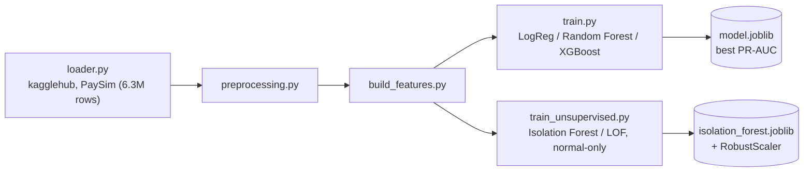

[ 🇺🇸 English ] | [ 🇨🇱 [Leer en Español](README.es.md) ]

# Bank Anomaly Detection


Fraud and anomaly detection system for mobile banking transactions, built on the synthetic **PaySim** dataset ([`ealaxi/paysim1`](https://www.kaggle.com/datasets/ealaxi/paysim1) on Kaggle), which simulates financial transactions based on a month of data from a real mobile money service in Africa.

## Honest note on validation

This README documents the project's architecture, design, and reasoning in detail, but **running the full pipeline (supervised Module 1 and unsupervised Module 2) requires downloading the PaySim dataset via `kagglehub`, which in turn requires configured Kaggle credentials** — not available in the environment where this documentation update was prepared. What *was* directly verified in this environment: **8/8 unit tests passing** (`pytest tests/`, covering `preprocessing.py` and `build_features.py` with synthetic data, no real download needed). The model metrics mentioned in the code (ROC-AUC, PR-AUC, Precision@k) are not reported here as numbers because they weren't re-run in this session — anyone who clones the repo and configures their own Kaggle credentials can generate them by following the Usage steps below.

## Goal

Identify fraudulent transactions within a highly imbalanced dataset (the `isFraud` class represents a tiny fraction of all transactions), evaluating different supervised modeling approaches and class-balancing techniques to maximize fraud detection while minimizing false positives.

## Project Architecture



The project follows a modular architecture that clearly separates data ingestion, preprocessing, feature engineering, and modeling, favoring reproducibility and code testability:

```
bank-anomaly-detection/
├── data/
│   ├── raw/              # Original data downloaded from Kaggle (not tracked)
│   └── processed/        # Transformed data ready for modeling (not tracked)
├── notebooks/
│   ├── 01_eda_paysim.ipynb                     # Exploratory analysis of the PaySim dataset
│   └── 02_unsupervised_anomaly_detection.ipynb # Module 2: zero-day fraud detection
├── src/
│   ├── data/
│   │   ├── loader.py           # Download (kagglehub) and load the PaySim dataset
│   │   └── preprocessing.py    # Cleaning and transformation of raw data
│   ├── features/
│   │   └── build_features.py   # Feature engineering for the model
│   ├── models/
│   │   ├── train.py            # Training, comparison, and model selection
│   │   ├── visualize.py        # Comparative ROC/PR curves and confusion matrices
│   │   └── predict.py          # Inference on new data
│   ├── unsupervised/            # Module 2: unsupervised anomaly detection
│   │   ├── loader.py            # Training data (normal-only) and test data (mixed)
│   │   ├── models.py            # Isolation Forest and Local Outlier Factor
│   │   └── train_unsupervised.py  # Training, evaluation (Precision@k), and plots
│   └── utils/                  # Shared helper functions
├── tests/                 # Unit tests (pytest) for preprocessing and build_features
├── requirements.txt
├── LICENSE
├── README.md
└── README.es.md
```

Every module under `src/` exposes pure, documented functions meant to be imported both from notebooks (exploration) and scripts (production pipeline), avoiding duplicated logic between the two contexts.

## Dataset

**PaySim** is a mobile financial-transaction simulator based on aggregated data from a real mobile money service provider, extended to include injected fraudulent behavior. It includes transaction types like `CASH-IN`, `CASH-OUT`, `DEBIT`, `PAYMENT`, and `TRANSFER`, along with origin and destination balances before and after each operation.

The `isFraud` target column indicates whether a transaction was fraudulent, while `isFlaggedFraud` marks illegitimate mass transfers flagged by the simulated business rules.

## Installation

```bash
python3 -m venv .venv
source .venv/bin/activate      # On Windows: .venv\Scripts\activate
pip install -r requirements.txt
```

## Usage

Download and initial load of the dataset:

```bash
python -m src.data.loader
```

This downloads the dataset from Kaggle via `kagglehub` (requires configured Kaggle credentials), copies it to `data/raw/paysim.csv`, and prints a summary of dimensions, first rows, and the percentage distribution of the `isFraud` class.

Model training and comparison:

```bash
python -m src.models.train
```

Runs the full pipeline (load → cleaning → features → split) and trains three candidate models (Logistic Regression, Random Forest, and XGBoost), each with imbalanced-class handling (`class_weight="balanced"` / `scale_pos_weight`). Prints a `classification_report`, confusion matrix, ROC-AUC, and PR-AUC per model, saves the one with the best PR-AUC (the most informative metric for fraud, given the extreme class imbalance) to `data/processed/model.joblib`, and generates comparative ROC/Precision-Recall curves and confusion matrices in `data/processed/figures/`.

Unit tests:

```bash
pytest tests/
```

Unsupervised anomaly detection (Module 2):

```bash
python -m src.unsupervised.train_unsupervised
```

## Module 2: Unknown / zero-day fraud detection (unsupervised)

Module 1 trains on already-labeled fraud, so it can only recognize patterns similar to fraud that already happened before. Module 2 covers the complementary case: a genuinely new ("zero-day") fraud scheme doesn't resemble anything seen during training, and a supervised model has no reason to catch it. The approach here is to learn only the shape of normal behavior and flag anything that deviates from it as anomalous, without using a single fraud label during fitting.

**Data**: instead of downloading `mlg-ulb/creditcardfraud` via `kagglehub` (which would require additional Kaggle credentials not configured in this environment), `src/unsupervised/loader.py` reuses the PaySim data already present in `data/raw/paysim.csv` — the same `clean_data`/`build_features` functions from Module 1 — and splits it into:
- **Train**: a sample of normal transactions (`isFraud == 0`); the model never sees a fraud case while fitting.
- **Test**: a sample of normals + *all* available fraudulent transactions, to have enough real anomalies to measure performance against.

The training sample size is deliberately kept bounded (30k rows): Local Outlier Factor in *novelty* mode needs to build a neighbor index and query it for every prediction, which doesn't scale to the full dataset's 6.3M rows.

**Models** (`src/unsupervised/models.py`):
- **Isolation Forest** (`sklearn.ensemble.IsolationForest`) — isolates points via random partitions; anomalies require fewer partitions to become isolated.
- **Local Outlier Factor** (`sklearn.neighbors.LocalOutlierFactor`, `novelty=True`) — compares a point's local density against its nearest neighbors' density.

Both expose a homogeneous continuous **Anomaly Score** (`anomaly_score()`, higher values = more anomalous) derived from `score_samples`, over features scaled with `RobustScaler` (fit on training data only) due to the strong skew of amounts and balances.

**Evaluation** (`src/unsupervised/train_unsupervised.py`): PR-AUC and Precision@k/Recall@k (k = 50, 100, 200 — "of the k most anomalous flagged transactions, how many are real fraud?", the question that matters to an analyst with limited review capacity). Generates `data/processed/figures/unsupervised_scores.png` (Anomaly Score distribution by class) and `data/processed/figures/unsupervised_pr_curve.png` (comparative Precision-Recall curve), and serializes Isolation Forest along with its `RobustScaler` to `data/processed/isolation_forest.joblib`.

## Tech Stack

- **pandas / numpy** — data manipulation and analysis
- **scikit-learn** — preprocessing pipelines and base models
- **xgboost** — gradient-boosting model for fraud classification
- **imbalanced-learn** — resampling techniques (SMOTE, undersampling) for class imbalance
- **matplotlib / seaborn** — exploratory visualization
- **pytest** — unit tests
- **kagglehub** — programmatic dataset download from Kaggle

## License

MIT — see [LICENSE](LICENSE).

## Author

**Pablo Reyes** — [github.com/Rxyxs](https://github.com/Rxyxs)
