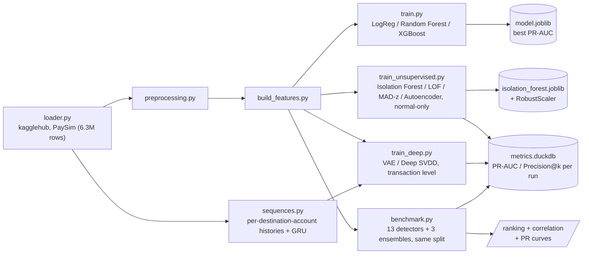

[ 🇺🇸 English ] | [ 🇨🇱 [Leer en Español](README.es.md) ]

# Bank Anomaly Detection


Fraud and anomaly detection system for mobile banking transactions, built on the synthetic **PaySim** dataset ([`ealaxi/paysim1`](https://www.kaggle.com/datasets/ealaxi/paysim1) on Kaggle), which simulates financial transactions based on a month of data from a real mobile money service in Africa.

## Honest note on validation

The numbers in this README **come from an actual run** of the pipeline on the full PaySim dataset (6,362,620 rows downloaded via `kagglehub`), not from estimates: `python -m src.unsupervised.train_unsupervised` for Module 2, `python -m src.unsupervised.benchmark` for Module 3, and `python -m src.deep.train_deep` for Module 4, plus **86/86 unit tests passing** (`pytest tests/`, on synthetic data, no download needed). Fit and scoring times were measured on that same machine (Windows 10, CPU) and are meant for comparing detectors *against each other*, not as an absolute hardware reference.

Two caveats you need in order to read the metrics correctly:

- **The test set is deliberately enriched.** It holds 50,000 normal transactions plus *all* 8,213 available fraudulent ones — 14.1% fraud, against PaySim's real ~0.13%. That's the only way to have enough anomalies to measure Precision@k stably, but it means these PR-AUC values **do not transfer** to production prevalence: in the real world the same model would be substantially less precise.
- **Module 1 (supervised) was not re-run in this session.** Its metrics aren't reported as numbers here; anyone who clones the repo can generate them with `python -m src.models.train`.

## Goal

Identify fraudulent transactions within a highly imbalanced dataset (the `isFraud` class represents a tiny fraction of all transactions), evaluating different supervised modeling approaches and class-balancing techniques to maximize fraud detection while minimizing false positives.

## Project Architecture



The project follows a modular architecture that clearly separates data ingestion, preprocessing, feature engineering, and modeling, favoring reproducibility and code testability:

```
bank-anomaly-detection/
├── data/
│   ├── raw/              # Original data downloaded from Kaggle (not tracked)
│   └── processed/        # Transformed data ready for modeling (not tracked)
├── notebooks/
│   ├── 01_eda_paysim.ipynb                     # Exploratory analysis of the PaySim dataset
│   ├── 02_unsupervised_anomaly_detection.ipynb # Module 2: zero-day fraud detection
│   ├── 03_benchmark_familias_anomalias.ipynb   # Module 3: detector-family benchmark + ensembles
│   └── 04_modelos_profundos_y_secuencias.ipynb # Module 4: VAE, Deep SVDD and sequential detector
├── src/
│   ├── data/
│   │   ├── loader.py           # Download (kagglehub) and load the PaySim dataset
│   │   └── preprocessing.py    # Cleaning and transformation of raw data
│   ├── features/
│   │   └── build_features.py   # Feature engineering for the model
│   ├── models/
│   │   ├── train.py            # Training, comparison, and model selection
│   │   ├── visualize.py        # Comparative ROC/PR curves and confusion matrices
│   │   └── predict.py          # Inference on new data
│   ├── unsupervised/            # Modules 2 and 3: unsupervised anomaly detection
│   │   ├── loader.py            # Training data (normal-only) and test data (mixed)
│   │   ├── models.py            # Isolation Forest, LOF, MAD-z statistical baseline
│   │   ├── autoencoder.py       # PyTorch Autoencoder (ReLU/GELU/Swish activations)
│   │   ├── families.py          # Module 3: PCA, GMM, Mahalanobis (MCD), kNN, OC-SVM, HBOS, ECOD
│   │   ├── ensemble.py          # Module 3: score combination (ranks, z, z-max)
│   │   ├── benchmark.py         # Module 3: all 11 families compared on the same split
│   │   ├── metrics_store.py     # Comparative metrics persistence (DuckDB)
│   │   ├── style.py             # Shared figure palette and styling
│   │   └── train_unsupervised.py  # Training, evaluation (Precision@k), and plots
│   ├── deep/                    # Module 4: deep models and sequential detection
│   │   ├── one_class.py         # VAE (ELBO) and Deep SVDD, transaction level
│   │   ├── sequences.py         # Per-destination-account histories + GRU autoencoder
│   │   └── train_deep.py        # Module 4 training, diagnostics, and plots
│   └── utils/                  # Shared helper functions
├── tests/                 # Unit tests (pytest): preprocessing, features, MAD baseline,
│                           # autoencoder, metrics store, families, ensembles,
│                           # deep models, sequences
├── requirements.txt
├── LICENSE
├── README.md
└── README.es.md
```

Every module under `src/` exposes pure, documented functions meant to be imported both from notebooks (exploration) and scripts (production pipeline), avoiding duplicated logic between the two contexts.

## Dataset

**PaySim** is a mobile financial-transaction simulator based on aggregated data from a real mobile money service provider, extended to include injected fraudulent behavior. It includes transaction types like `CASH-IN`, `CASH-OUT`, `DEBIT`, `PAYMENT`, and `TRANSFER`, along with origin and destination balances before and after each operation.

The `isFraud` target column indicates whether a transaction was fraudulent, while `isFlaggedFraud` marks illegitimate mass transfers flagged by the simulated business rules.

## Installation

```bash
python3 -m venv .venv
source .venv/bin/activate      # On Windows: .venv\Scripts\activate
pip install -r requirements.txt
```

## Usage

Download and initial load of the dataset:

```bash
python -m src.data.loader
```

This downloads the dataset from Kaggle via `kagglehub` (requires configured Kaggle credentials), copies it to `data/raw/paysim.csv`, and prints a summary of dimensions, first rows, and the percentage distribution of the `isFraud` class.

Model training and comparison:

```bash
python -m src.models.train
```

Runs the full pipeline (load → cleaning → features → split) and trains three candidate models (Logistic Regression, Random Forest, and XGBoost), each with imbalanced-class handling (`class_weight="balanced"` / `scale_pos_weight`). Prints a `classification_report`, confusion matrix, ROC-AUC, and PR-AUC per model, saves the one with the best PR-AUC (the most informative metric for fraud, given the extreme class imbalance) to `data/processed/model.joblib`, and generates comparative ROC/Precision-Recall curves and confusion matrices in `data/processed/figures/`.

Unit tests:

```bash
pytest tests/
```

Unsupervised anomaly detection (Module 2):

```bash
python -m src.unsupervised.train_unsupervised
```

Comparative benchmark of detector families (Module 3):

```bash
python -m src.unsupervised.benchmark
```

Trains all 13 detectors on the same split and scaling, builds the three ensembles on top of their scores, prints the comparison table with metrics and timings, reports which detector pairs are redundant, and saves the ranking, PR curves, and correlation matrix to `data/processed/figures/`, plus one row per detector in the `benchmark_metrics` table of `data/processed/metrics.duckdb`.

Deep models and sequential detector (Module 4):

```bash
python -m src.deep.train_deep
```

Trains the VAE and Deep SVDD on the same split as Module 3, plus the GRU autoencoder over destination-account histories. Prints the truncation coverage and the per-step error aggregation comparison — the two diagnostics that make the sequential detector's result interpretable — and saves metrics to tables separated by unit of analysis.

## Module 2: Unknown / zero-day fraud detection (unsupervised)

Module 1 trains on already-labeled fraud, so it can only recognize patterns similar to fraud that already happened before. Module 2 covers the complementary case: a genuinely new ("zero-day") fraud scheme doesn't resemble anything seen during training, and a supervised model has no reason to catch it. The approach here is to learn only the shape of normal behavior and flag anything that deviates from it as anomalous, without using a single fraud label during fitting.

**Data**: instead of downloading `mlg-ulb/creditcardfraud` via `kagglehub` (which would require additional Kaggle credentials not configured in this environment), `src/unsupervised/loader.py` reuses the PaySim data already present in `data/raw/paysim.csv` — the same `clean_data`/`build_features` functions from Module 1 — and splits it into:
- **Train**: a sample of normal transactions (`isFraud == 0`); the model never sees a fraud case while fitting.
- **Test**: a sample of normals + *all* available fraudulent transactions, to have enough real anomalies to measure performance against.

The training sample size is deliberately kept bounded (30k rows): Local Outlier Factor in *novelty* mode needs to build a neighbor index and query it for every prediction, which doesn't scale to the full dataset's 6.3M rows.

**Models** (`src/unsupervised/models.py`, `src/unsupervised/autoencoder.py`):
- **Isolation Forest** (`sklearn.ensemble.IsolationForest`) — isolates points via random partitions; anomalies require fewer partitions to become isolated.
- **Local Outlier Factor** (`sklearn.neighbors.LocalOutlierFactor`, `novelty=True`) — compares a point's local density against its nearest neighbors' density.
- **MAD-z statistical baseline** (`MADBaseline`) — a non-iterative baseline: memorizes the median and Median Absolute Deviation (MAD) per feature at fit time, then scores each row by the maximum robust z-score across its features. Robust to the heavy-tailed distribution of amounts/balances, unlike a plain mean/std z-score.
- **Autoencoder** (`src/unsupervised/autoencoder.py`, PyTorch) — a symmetric fully-connected encoder/decoder with a central bottleneck, trained only on normal transactions to minimize reconstruction MSE; the anomaly score is the reconstruction error itself (`reconstruction_error()`), higher = more anomalous. Trained and compared with three activation functions on the same architecture — **ReLU**, **GELU**, and **Swish** (`nn.SiLU`) — to illustrate their effect on reconstruction quality on this tabular dataset.

All four families expose a homogeneous continuous **Anomaly Score** (higher values = more anomalous), over features scaled with `RobustScaler` (fit on training data only) due to the strong skew of amounts and balances.

**Evaluation** (`src/unsupervised/train_unsupervised.py`): PR-AUC and Precision@k/Recall@k (k = 50, 100, 200 — "of the k most anomalous flagged transactions, how many are real fraud?", the question that matters to an analyst with limited review capacity). Generates `data/processed/figures/unsupervised_scores.png` (Anomaly Score distribution by class, Isolation Forest / LOF / MAD baseline), `data/processed/figures/unsupervised_pr_curve.png` (comparative Precision-Recall curve across all models), and `data/processed/figures/autoencoder_activations.png` (PR-AUC by activation function). Serializes Isolation Forest along with its `RobustScaler` to `data/processed/isolation_forest.joblib`, and persists PR-AUC/Precision@k/Recall@k per model and per run to a local DuckDB file (`data/processed/metrics.duckdb`, via `src/unsupervised/metrics_store.py`) for cross-run comparison.

### Model comparison (Module 2)

| Model | Type | Anomaly score | Notes |
|---|---|---|---|
| Isolation Forest | Ensemble, tree-based | `-score_samples` | Handles non-linear boundaries well, fast to train |
| Local Outlier Factor | Density-based (novelty mode) | `-score_samples` | Sensitive to local density variation |
| MAD-z baseline | Statistical, non-iterative | max robust z-score | No hyperparameters, fast, interpretable per-feature |
| Autoencoder (ReLU / GELU / Swish) | Deep learning (PyTorch) | Reconstruction MSE | Captures non-linear feature interactions; activation choice affects reconstruction quality |

### Measured results (Module 2)

| Model | PR-AUC | Precision@50 | Precision@100 | Precision@200 |
|---|---|---|---|---|
| Local Outlier Factor | **0.802** | 1.000 | 1.000 | 1.000 |
| Autoencoder (ReLU) | 0.581 | 0.960 | 0.970 | 0.975 |
| Autoencoder (Swish) | 0.574 | 0.980 | 0.990 | 0.995 |
| Autoencoder (GELU) | 0.573 | 1.000 | 1.000 | 1.000 |
| Isolation Forest | 0.549 | 0.440 | 0.550 | 0.640 |
| MAD-z baseline | 0.140 | 0.240 | 0.140 | 0.100 |

Local Outlier Factor clearly dominates with this feature set. The autoencoder's three activations land within 0.01 PR-AUC of each other (0.581 / 0.574 / 0.573): on 15-column tabular data, the choice of activation is marginal next to the choice of detector family — a point Module 3 develops.

PR-AUC, Precision@k, and Recall@k for each model/run are persisted to `data/processed/metrics.duckdb` (query it with `duckdb.connect(...)` or `src.unsupervised.metrics_store.load_latest_metrics()`).


## Module 3: Detector-family benchmark (unsupervised)

Module 2 covers three approaches plus the autoencoder. Module 3 completes the map: it adds the missing families (`src/unsupervised/families.py`), compares all of them on the same split with the same scaling (`src/unsupervised/benchmark.py`), and tests whether combining them helps at all (`src/unsupervised/ensemble.py`).

The point isn't to pile up models. Without labels you can't pick the best detector *before* deploying it, so the actionable questions are two others: **which families are genuinely complementary** (if two rank transactions almost identically, keeping both adds nothing) and **what each point of PR-AUC costs** (in production scoring runs per transaction and fitting runs once a day, so a detector that's slow to fit but fast to score is perfectly viable — and the reverse is not).

### The seven families added

| Detector | Family | What it detects well |
|---|---|---|
| **PCA (reconstruction)** | Linear reconstruction | Rows outside the principal subspace — the autoencoder's **ablation** |
| **Gaussian Mixture** | Parametric density | Low-probability gaps between modes of the distribution |
| **Robust Mahalanobis (MCD)** | Robust covariance | Broken correlations between features, invisible column by column |
| **kNN (k-th distance)** | Global distance | Points far from any dense neighborhood |
| **One-Class SVM (Nyström)** | Kernel boundary | Rows outside the learned envelope of normal behavior |
| **HBOS** | Per-feature histograms | Rare values in individual columns; score decomposes per feature |
| **ECOD** | Empirical CDF tails | Extreme tails, without a single hyperparameter to tune |

`HBOS` and `ECOD` are implemented from scratch (linear cost, no extra dependency); the rest build on scikit-learn. The exact `OneClassSVM` is O(n²)–O(n³) and doesn't finish on a 30k-row set, so this uses the Nyström kernel approximation + `SGDOneClassSVM`, which solves the same problem in linear time.

The three **ensembles** address the fact that these scores live on incompatible scales (a Mahalanobis distance can't be averaged with a log-likelihood): rank average, standardized-score average, and standardized-score maximum.

### Results

| Detector | Family | PR-AUC | ROC-AUC | Precision@100 | fit (s) | score (s) |
|---|---|---|---|---|---|---|
| Gaussian Mixture | Parametric density | **0.807** | 0.948 | 0.99 | 6.62 | 0.19 |
| Local Outlier Factor | Local density | 0.802 | 0.932 | **1.00** | 0.64 | 1.09 |
| Deep SVDD | Deep one-class | 0.702 | 0.860 | **1.00** | 6.58 | 0.005 |
| Robust Mahalanobis (MCD) | Robust covariance | 0.698 | 0.896 | 0.94 | 1.92 | 0.02 |
| Ensemble — rank average | Ensemble | 0.639 | 0.876 | **1.00** | — | 0.03 |
| Autoencoder (ReLU) | Non-linear reconstruction | 0.581 | 0.850 | 0.97 | 7.53 | 0.01 |
| kNN (k-th distance) | Global distance | 0.552 | 0.853 | 0.85 | 0.13 | 1.25 |
| Isolation Forest | Isolation | 0.549 | 0.850 | 0.55 | 0.56 | 0.41 |
| One-Class SVM (Nyström) | Kernel boundary | 0.494 | 0.830 | 0.86 | 0.43 | 0.56 |
| Ensemble — z average | Ensemble | 0.491 | 0.833 | 0.94 | — | 0.03 |
| PCA (reconstruction) | Linear reconstruction | 0.487 | 0.822 | 0.76 | 0.003 | 0.01 |
| HBOS | Per-feature statistical | 0.480 | 0.800 | 0.59 | 0.01 | 0.04 |
| Ensemble — z max | Ensemble | 0.459 | 0.835 | 0.80 | — | 0.03 |
| VAE (ELBO) | Deep density | 0.446 | 0.731 | 0.90 | 14.90 | 0.06 |
| ECOD | Empirical CDF tails | 0.273 | 0.672 | 0.52 | 0.07 | 0.27 |
| MAD-z (baseline) | Per-feature statistical | 0.140 | 0.383 | 0.14 | 0.01 | 0.01 |


**What the numbers say:**

- **Gaussian Mixture (0.807) and LOF (0.802) tie at the top, but for different reasons.** Their Spearman correlation is only 0.41, and their PR curves cross: LOF dominates between recall 0.4 and 0.8, GMM overtakes it above 0.85. Which one you want depends on the team's review capacity, not on aggregate PR-AUC.
- **The linear ablation justifies the autoencoder, but only just.** The autoencoder (0.581) beats PCA (0.487) — the non-linearity is worth a real ~0.09 of PR-AUC. What those 0.09 cost: 9.6 s of fitting against 0.002 s, plus a PyTorch dependency. Neither one comes close to GMM.
- **The MAD-z baseline isn't just weak, it's anti-informative** (ROC-AUC 0.383, below the 0.5 of random guessing). Looking at each column separately fails here because PaySim fraud is a full drain of the origin balance: every individual value stays inside the observed range, while the heavy tails of legitimate transactions *do* produce extreme z-scores. That is exactly the argument for multivariate methods — and the reason to include Mahalanobis (0.698), which sees the same information but through the full covariance.
- **The ensembles don't win, and that is also a result.** The best of them (rank average, 0.639) lands below GMM and LOF: averaging 13 detectors when most are mediocre drags the two good ones down. An ensemble helps when its members are of comparable quality, not when best and worst differ by 0.67 of PR-AUC. With one operationally relevant exception: **Precision@100 = 1.00** for the rank average — at the head of the ranking the consensus *is* perfect, and that head is exactly where an analyst looks.

### Which detectors are redundant?


Spearman correlation between the anomaly *rankings*. **No pair exceeds 0.9**: the thirteen families order transactions differently, so none can be dropped for pure redundancy. Among the Module 3 detectors the closest pairs are Mahalanobis ↔ kNN (0.88) and Mahalanobis ↔ Autoencoder (0.87); the most complementary, MAD-z ↔ LOF (−0.04) and MAD-z ↔ GMM (−0.42).


### Computational cost

The linear-cost detectors (HBOS, ECOD, MAD-z, PCA) score all 58,213 test rows in hundredths of a second and hold nothing in memory beyond a few per-feature vectors. The distance-based ones (LOF, kNN) pay ~1.1 s because every prediction queries a neighbor index against the 30,000 training rows — the factor that decides whether they're viable in an online transaction flow. The autoencoder inverts the relationship: slowest to fit (9.6 s) and among the fastest to score (0.01 s), which is the right profile for production.

## Module 4: Deep one-class models and sequential detection

Three models, each born from a specific limitation the Module 3 benchmark exposed — not from the idea of stacking architectures for their own sake.

| Model | Limitation it attacks | Unit evaluated |
|---|---|---|
| **VAE** | The best detector was a density model (GMM); the autoencoder only reconstructs | Transaction |
| **Deep SVDD** | The autoencoder barely beat its linear ablation (0.581 vs 0.487) — is the problem depth or the objective? | Transaction |
| **GRU autoencoder** | All thirteen detectors treat each row as independent; a mule account is anomalous through its *history* | **Destination account** |

The first two share split, scaling, and metrics with Module 3, so they sit in the benchmark table above. The third changes the unit of analysis and is reported separately: comparing a per-account PR-AUC against a per-transaction one would compare two different problems, not two models.

### Transaction level: the objective matters more than the depth

**Deep SVDD (0.702) beats the autoencoder (0.581)** on the same architecture, the same data, and the same scaling. The only thing that changes is what it optimizes: instead of reconstructing the input, it learns a projection that packs normal behavior inside a hypersphere and scores by distance to the center. That +0.12 jump is larger than the one separating the autoencoder from its linear PCA ablation (+0.09) — the margin was in the objective function, not in adding layers. And it comes cheap: 6.6 s to fit and **5 ms** to score all 58,213 test rows, the fastest scorer in the repository. It lands third overall, above Mahalanobis.

Deep SVDD has a silent failure mode: if the network learns to map *every* input to the center, it minimizes the objective perfectly and becomes useless — every point at the same distance, unable to rank anything. It's prevented with **bias-free layers** (the constant solution becomes unreachable) and by pushing the center's components away from the origin. A unit test verifies the score doesn't collapse to zero standard deviation.

**The VAE (0.446) loses to the plain autoencoder** and is the most expensive of the three (14.9 s). Being the deep counterpart of the best classical detector wasn't enough to inherit its advantage: the KL term pushes the latent toward a standard normal, which on heavy-tailed features ends up normalizing exactly the region that needs distinguishing.


### Numerical stability: the VAE produced NaN before it worked

Worth documenting because it's the kind of problem that only shows up on real data. After the `RobustScaler`, the tails of `errorBalanceDest` reach ~1900 and the per-row sum of squares hits 3.7e6. With the reconstruction term **summed** over the 15 columns, the loss starts in the millions, gradients explode, and the weights turn to `NaN` within the first epoch. The first run on PaySim died exactly that way — after passing cleanly on synthetic data.

Three decisions fix it, all in `src/deep/one_class.py`: the reconstruction error is **averaged** over features instead of summed (putting it on the same scale as the Module 2 autoencoder, which does converge), the log-variance is clamped to [-10, 10] so `exp()` can't overflow, and the gradient norm is clipped at 5.

### Account level: the sequential detector

Here the data representation changes, not just the model. Each destination account's ordered history is reconstructed and scored as a whole by a GRU autoencoder trained only on clean accounts. Two decisions about the data drive everything else:

- **Grouping is by `nameDest`, not `nameOrig`.** In PaySim, 99.85% of origin accounts appear exactly once and none reaches five transactions: there's no sender-side history to model. Destination accounts do accumulate — 280,200 have five or more transactions, covering 56.5% of the dataset.
- **Merchant accounts (`M`) are dropped.** All 8,213 fraudulent transactions go to `C` accounts. Leaving merchants in would hand the model the rule "every `M` is normal" and an inflated metric that measures nothing about fraud detection.

The signal that exists only in the sequence is `delta_step`: the hours between consecutive transactions into the same account. That's the cadence, and it can't be computed row by row — the repository was discarding it by dropping `nameDest`.

**Result: PR-AUC 0.099 against a 0.087 baseline.** In practice, it detects nothing.


### Why that negative result belongs to the dataset, not the method

A bad number means nothing until the explanations that depend on your own choices are ruled out. There are two, and both are measured in code (`src/deep/sequences.py`), not assumed:

**Does truncation leave the fraud outside the window?** If keeping only the 20 most recent transactions discarded the fraudulent one, the model would never have seen what it's meant to detect. `fraud_window_coverage()` answers: **3,451 of 3,838 (89.9%)** fall inside, with a median position of 7 from the end. Not that.

**Does the aggregation dilute the signal?** An account may hold a single anomalous transaction among twenty, and averaging the error across the whole sequence flattens it. `aggregate_step_errors()` compares four ways of summarizing the same per-step errors, on the same trained model:

| Aggregation | PR-AUC | ROC-AUC |
|---|---|---|
| mean (the one used) | 0.099 | 0.547 |
| per-step maximum | 0.105 | 0.564 |
| mean of the worst 3 | 0.107 | 0.569 |
| last step | 0.102 | 0.546 |

All within noise, all barely above chance. Not that either.

With both ruled out, the dataset explanation is what's left: **PaySim injects fraud with a fixed rule and picks the destination account without modeling mule behavior**, so account histories don't carry the temporal pattern the model is looking for. That's a limitation of the simulator, not of the approach. On real AML transactions — where mule accounts do have a behavioral signature — this is the family that would contribute most, and the architecture is built and tested for that data.

Metrics go to **separate tables** in `data/processed/metrics.duckdb`: `benchmark_metrics` for transaction level, `sequence_metrics` for account level. The separation is structural on purpose, so a careless `ORDER BY` can't end up comparing two different problems.

## Tech Stack

- **pandas / numpy** — data manipulation and analysis
- **scikit-learn** — preprocessing pipelines and base models
- **xgboost** — gradient-boosting model for fraud classification
- **imbalanced-learn** — resampling techniques (SMOTE, undersampling) for class imbalance
- **matplotlib / seaborn** — exploratory visualization
- **pytorch** — Autoencoder for anomaly detection via reconstruction error
- **scipy** — Spearman correlation and ranking for the detector ensembles
- **duckdb** — local persistence of comparative metrics across runs
- **pytest** — unit tests
- **kagglehub** — programmatic dataset download from Kaggle

## License

MIT — see [LICENSE](LICENSE).

## Author

**Pablo Reyes** — [github.com/Rxyxs](https://github.com/Rxyxs)
